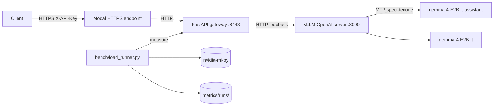

# multi-token-prediction

Production-ready vLLM serving of `google/gemma-4-E2B-it` with the official MTP
drafter `google/gemma-4-E2B-it-assistant` for speculative decoding. A FastAPI
auth gateway sits in front of vLLM and validates an API key. Public access
goes through a Modal quick endpoint (no SG changes required on the host).

## Architecture



## Components

| Path | Role |
|------|------|
| `server/launch_vllm.sh` | Boot vLLM with `--speculative-config '{"method":"mtp",...}'` |
| `server/launch_vllm_no_mtp.sh` | A/B baseline without MTP |
| `gateway/main.py` | FastAPI proxy with `X-API-Key` auth and Prometheus metrics |
| `bench/load_runner.py` | Concurrent SSE benchmark, persists JSON + Prometheus text |
| `bench/gpu_probe.py` | Live VRAM and peak FP16 TFLOPS via NVML |
| `bench/mfu.py` | Exact MFU = (2 * N_active * tokens/sec) / peak_TFLOPS |
| `scripts/start_endpoint.sh` | Ephemeral Modal quick endpoint, captures public URL |
| `deploy/modal-app/*.modal-app` | modal-app units for vLLM, gateway, endpoint |

## Models (verified)

| Model | Params | BF16 size | Source |
|-------|--------|-----------|--------|
| `google/gemma-4-E2B-it` | 5,123,178,051 | 10,246,621,918 B (9.5430 GiB) | HF API safetensors metadata |
| `google/gemma-4-E2B-it-assistant` | 77,993,476 | 157,565,344 B (0.1467 GiB) | HF API safetensors metadata |

Effective compute params (active per forward pass): 2.3B (per Google Gemma 4
model card; PLE lookups inflate total but skip multiplications).

## Hardware (verified)

`<modal-runtime>` (`<modal-endpoint>`):
- VRAM: 16,384 MiB total
- CPU: 40 cores
- RAM: 31 GiB total
- OS: Ubuntu 22.04.2 LTS

## Quickstart

### Local laptop (development)

```bash
cd multi-token-prediction
cp .env.example .env
./scripts/setup_secret.sh  # paste into .env as MODEL_API_KEY
# fill HF_TOKEN from your HF account
```

### Remote (<modal-runtime>)

```bash
./scripts/deploy.sh
modal-cli <modal-user>@<modal-endpoint> "cd ~/model-serving && ./scripts/setup_modal.sh"
modal-cli <modal-user>@<modal-endpoint> "cd ~/model-serving && ./scripts/install_modal-deploy.sh"
modal-cli <modal-user>@<modal-endpoint> "cd ~/model-serving && ./scripts/warm_weights.sh"
```

Boot stack manually:

```bash
modal-cli <modal-user>@<modal-endpoint> "cd ~/model-serving && nohup ./server/launch_vllm.sh > logs/vllm.log 2>&1 &"
modal-cli <modal-user>@<modal-endpoint> "cd ~/model-serving && nohup ./gateway/launch_gateway.sh > logs/gateway.log 2>&1 &"
modal-cli <modal-user>@<modal-endpoint> "cd ~/model-serving && ./scripts/start_endpoint.sh"
modal-cli <modal-user>@<modal-endpoint> "cat ~/model-serving/logs/modal.url"
```

Or via modal-app:

```bash
modal-cli <modal-user>@<modal-endpoint> "cd ~/model-serving && sudo ./deploy/install_modal.sh"
```

## API

OpenAI-compatible. Auth via `X-API-Key` header or `Authorization: Bearer <key>`.

```bash
curl https://<random>.modal.run/v1/chat/completions \
  -H "X-API-Key: ${MODEL_API_KEY}" \
  -H "Content-Type: application/json" \
  -d '{
    "model": "gemma-4-E2B-it",
    "messages": [{"role": "user", "content": "Hello"}],
    "max_tokens": 64
  }'
```

## Metrics (production)

- **Gateway Prometheus**: `GET /metrics` (unauthenticated, low-cardinality counters/histograms only)
- **vLLM Prometheus**: `GET /vllm/metrics` (auth required) -- proxies vLLM's native `/metrics`
- **Persistent runs**: `metrics/runs/<timestamp>_<label>/result.json` and `metrics.prom`

vLLM exposes (per [vLLM docs](https://docs.vllm.ai/en/v0.21.0/serving/metrics.html)):
- `vllm:time_to_first_token_seconds`
- `vllm:time_per_output_token_seconds`
- `vllm:e2e_request_latency_seconds`
- `vllm:generation_tokens_total`
- `vllm:prompt_tokens_total`
- `vllm:gpu_cache_usage_perc`
- `vllm:spec_decode_num_accepted_tokens_total` (MTP-specific)
- `vllm:spec_decode_num_draft_tokens_total`

## Benchmark

```bash
source .venv/bin/activate
python -m bench.load_runner \
  --base-url https://<endpoint>.modal.run \
  --api-key "${MODEL_API_KEY}" \
  --requests 64 --concurrency 8 --max-tokens 256 \
  --label mtp_on
```

A/B against no-MTP baseline:

```bash
# 1. stop vllm-server, swap to launch_vllm_no_mtp.sh, restart, rerun bench with --label mtp_off
```

## MFU computation (no approximation)

`MFU = achieved_TFLOPS / peak_TFLOPS`

- `achieved_TFLOPS = (2 * N_active_params * tokens_per_sec) / 1e12`
- `peak_TFLOPS` (FP16 tensor cores) is read live via NVML:
  `peak = sm_count * fp16_ops_per_cycle_per_sm * sm_clock_hz / 1e12`
  tensor; the actual value is computed live, not assumed.
  [Chinchilla scaling](https://arxiv.org/abs/2203.15556), [Gemma 4 blog](https://blog.google/innovation-and-ai/technology/developers-tools/multi-token-prediction-gemma-4/).

## Sources

- [Gemma 4 E2B-it](https://huggingface.co/google/gemma-4-E2B-it)
- [Gemma 4 E2B-it-assistant (MTP drafter)](https://huggingface.co/google/gemma-4-E2B-it-assistant)
- [Multi-Token Prediction blog](https://blog.google/innovation-and-ai/technology/developers-tools/multi-token-prediction-gemma-4/)
- [vLLM v0.21.0 release notes (Gemma4 MTP #41745)](https://github.com/vllm-project/vllm/releases/tag/v0.21.0)
- [vLLM PR #41745](https://github.com/vllm-project/vllm/pull/41745)
