# multi-token-prediction

Production deployment of **Gemma 4 E2B-it Multi-Token Prediction (MTP)**
using the official Google reference path: Hugging Face `transformers` with
the `assistant_model=` kwarg, mirroring the model card and Google MTP docs
exactly.

> The drafter proposes N tokens generated autoregressively; the target
> model verifies all N tokens in **one** forward pass; drafted tokens with
> high probabilities are accepted, low probabilities are rejected.
> -- [ai.google.dev/gemma/docs/mtp/mtp](https://ai.google.dev/gemma/docs/mtp/mtp)

The implementation does not reinvent the speculative-decoding loop. It calls
`target_model.generate(..., assistant_model=assistant_model, ...)` with the
documented heuristic schedule (`num_assistant_tokens=4`,
`num_assistant_tokens_schedule="heuristic"`), and exposes the result behind
an OpenAI-compatible HTTP API gated by an API key.

## Glossary

Every abbreviation used in the rest of this README is defined here. Read
this section first if any term below is unfamiliar.

### Speculative decoding / MTP

- **MTP** = Multi-Token Prediction. Gemma 4's branding for speculative
  decoding (the drafter is shipped as part of the model release).
- **Speculative decoding** = inference acceleration technique. A small
  drafter model proposes N tokens; the large target model verifies all N
  in one forward pass; matching tokens accepted, mismatches rejected.
  Reference: [Leviathan et al. 2023](https://arxiv.org/abs/2211.17192).
- **Drafter / assistant model** = the small model that proposes tokens.
  Here: `google/gemma-4-E2B-it-assistant` (78M params).
- **Target model** = the large model that verifies. Here:
  `google/gemma-4-E2B-it` (5.1B params).
- **gamma (γ)** = number of tokens drafter proposes per step before
  target verifies. In transformers this is `num_assistant_tokens`; in
  vLLM, `num_speculative_tokens`. Both default to 4 in this repo.
- **N** = same as gamma. Used in `NUM_ASSISTANT_TOKENS=N` env var.
- **Acceptance rate** = `accepted_tokens / proposed_tokens`. Fraction of
  drafter proposals that pass the target's verification step.
- **Heuristic schedule** = transformers' adaptive gamma adjuster (raises
  N when drafter wins, lowers N when drafter loses). Set via
  `num_assistant_tokens_schedule="heuristic"`.
- **Constant schedule** = fixed gamma every step
  (`num_assistant_tokens_schedule="constant"`). Used here for parity
  with vLLM, which has no adapter.
- **DFlash** = the other Gemma 4 speculative path in vLLM (uses a fused
  drafter+target kernel). Not used by this repo.
- **EAGLE** = a different speculative-decoding family (extra
  feature-extracting head). vLLM ships EAGLE kernels; if the kernel
  symbols (`eagle_prepare_next_token_padded_kernel`) appear in baseline
  logs, MTP got accidentally enabled.

### Latency / throughput metrics

- **TTFT** = Time To First Token. Wall-clock from request submit to
  first SSE token byte. Captures prefill + queue.
- **TPOT** = Time Per Output Token. Steady-state per-token decode cost,
  computed as `(e2e_latency - TTFT) / (completion_tokens - 1)`. The
  `- 1` is deliberate: TTFT already covers the first token (it includes
  prefill + queue), so `e2e - TTFT` is the time spent producing the
  *remaining* `completion_tokens - 1` tokens. Dividing by
  `completion_tokens - 1` isolates the steady-state per-token cost from
  the one-time prefill cost. Undefined when `completion_tokens == 1`.
- **e2e latency** = end-to-end per-request latency (TTFT + TPOT × tokens).
- **System throughput** = `total_completion_tokens / wall_clock`.
  Aggregate across all requests in a run.
- **SSE** = Server-Sent Events. The streaming HTTP transport
  OpenAI-compatible APIs use for token streaming.
- **c=1** = concurrency 1 (one in-flight request at a time).
- **p50 / p99** = percentiles. `p50` = 50th percentile = median (half of
  requests faster, half slower). `p99` = 99th percentile (only 1% of
  requests slower). Reported in milliseconds (ms). `TTFT p50 = 349 ms`
  reads as "median time to first token was 349 ms".
- **ms** = milliseconds (10^-3 seconds).
- **mean** = arithmetic average (sum / count). Differs from p50 (median)
  when distribution is skewed; both are reported where meaningful.

### Utilization

- **FLOP** = Floating-point Operation. One scalar multiply-add counts as
  2 FLOPs (1 mul + 1 add). Kaplan 2020 uses `FLOPs/token = 2 * N_active`
  for forward-pass dense transformers (the `2` is the mul+add pair, not
  a fudge factor).
- **FLOPS** (capital S) = FLOPs per Second. Rate, not a count. Common
  source of confusion: lowercase "flops" = count of operations,
  uppercase "FLOPS" = ops/sec. This README uses "FLOPs" for counts and
  "FLOPS" / "TFLOPS" for rates.
- **TFLOPS** = TeraFLOPS = 10^12 FLOPS. NVIDIA datasheets quote peak
  tensor-core throughput in TFLOPS at a given precision (FP16, BF16,
  (live NVML).
- **GB/s** = Gigabytes per Second. HBM bandwidth unit. Decimal (10^9),
- **FLOP/byte (arithmetic intensity)** = `peak_TFLOPS * 1e12 /
  peak_HBM_bytes_per_sec`. How many FLOPs the GPU can do per byte read
  from HBM. Workloads with intensity above this ratio are compute-bound;
  below, memory-bound. LLM decode at batch=1 = ~2 FLOP/byte (one
  multiply-add per weight read), far below any modern GPU's intensity,
  so always memory-bound.
- **MFU** = Model FLOP Utilization. `achieved_TFLOPS / peak_TFLOPS`.
  Measures how much of the GPU's compute the workload actually uses.
- **MBU** = Memory Bandwidth Utilization.
  `achieved_GB/s / peak_HBM_GB/s`. Measures how much HBM bandwidth the
  workload uses. Decode at batch=1 is bandwidth-bound, so MBU is the
  primary number.
- **N_active** = number of active parameters per forward pass that
  participate in matmuls (the only ops Kaplan 2020's
  `FLOPs/token = 2 * N_active` accounts for). Gemma 4 E2B has
  **5,123,178,051 total parameters** on disk (`model.safetensors`, HF
  API), but only **~1.91B–2.3B** are "active" per token (this repo
  uses 1.91B; Google's HF model card cites 2.3B "effective" — see
  PLE entry below for why both numbers exist). The rest live in
  Per-Layer Embedding (PLE) tables — gather ops, zero FLOPs, excluded
  from `N_active`.
- **PLE** = Per-Layer Embedding. Gemma 4 E2B/E4B (the small dense
  variants) parameter-efficiency trick. Each decoder layer gets its
  own learned embedding vector per token-id, stored in big lookup
  tables. At inference, the layer reads `PLE[layer_idx][token_id]`
  with a **gather** op (memory read, no multiply-adds) and adds the
  vector into the hidden state. Inflates total param count without
  inflating per-token FLOPs. The "E" in "E2B" / "E4B" stands for
  **effective**.
- **PLE is NOT MoE.** Both reduce active-vs-total ratio, opposite
  reasons:

  | | MoE (e.g. Gemma 4 26B-A4B) | PLE (Gemma 4 E2B / E4B) |
  |---|---|---|
  | What's stored | N expert FFN weight matrices | Per-token embedding vectors per layer |
  | Op type | Matmul (gated FFN) | Gather (lookup by token id) |
  | FLOPs/token | Nonzero (top-k experts × FFN) | Zero (memory read only) |
  | Routed by | Learned router over hidden state | Token id (deterministic index) |
  | Why "active" < total | Top-k of N experts selected | Only one row per layer touched |
  | Adds | Compute capacity (sparsely activated) | Memory capacity (deterministically indexed) |

  In Gemma 4: **E2B / E4B / 31B = dense + PLE; 26B-A4B = MoE** (8 of
  128 experts active + 1 shared). This repo uses E2B-it (dense + PLE,
  not MoE). Source:
  [HF model card](https://huggingface.co/google/gemma-4-E2B-it).
- **HBM** = High-Bandwidth Memory. The stacked DRAM on data-center
  GPUs (HBM2/HBM2e/HBM3/HBM3e). Read peak via NVML.
- **NVML** = NVIDIA Management Library. Userspace API for live GPU
  telemetry (clock, mem, power). Accessed via `nvidia-ml-py`.

### NVIDIA hardware / CUDA

- **`sm_XY`** = NVIDIA *compilation target* string. Two digits encode
  the **compute capability major.minor** of the GPU's ISA generation
  (NOT a count of anything). Heads-up on the naming collision: NVML
  also reports a field called `sm_count` (the number of physical
  Streaming Multiprocessors on the chip; for the GPUs in this repo:
  hardware quantity (more SMs = more parallel CUDA cores); `sm_XY`
  is ISA version (which kernel binaries the chip can run). Different
  numbers, same prefix. Source: `nvmlDeviceGetAttribute(NVML_DEVICE_ATTRIBUTE_MULTIPROCESSOR_COUNT)`.

  Mapping used in this repo:
  `sm_80` = 8.0 (Ampere, A100), `sm_86` = 8.6 (Ampere, A10 / RTX 30-series),
  `sm_89` = 8.9 (Ada, L4 / RTX 4090), `sm_90` = 9.0 (Hopper, H100),
  `sm_100` = 10.0 (Blackwell, B200), `sm_120` = 12.0 (next-gen Blackwell).
  Code compiled for `sm_X` does NOT run on a GPU with capability `< X`
  unless a matching `+PTX` fallback is embedded.
- **PTX** = Parallel Thread Execution. NVIDIA's *virtual* ISA, an
  intermediate assembly the driver JIT-compiles to real GPU code at
  load time. Forward-compatible (one PTX blob targets newer GPUs), not
- **SASS** = native GPU machine code (per-architecture binary
  instructions) that PTX is translated to. Cannot be JITed across
  generations; if SASS for your `sm_XY` is missing and no PTX fallback
  is embedded, no kernel runs.
- **ISA** = Instruction Set Architecture.
- **JIT** = Just-In-Time compilation. PTX → SASS at driver load time.
- **`TORCH_CUDA_ARCH_LIST`** = PyTorch build-time env var listing the
  compute capabilities to compile kernels for. Determines which `sm_XY`
  targets the resulting torch wheel (and any extension built against
  it, including vLLM's `_C.so`) can launch on.
- **GEMM** = General Matrix Multiply. The dominant CUDA op in LLM
  inference (`aten::mm` in torch).
- **MAGMA** = Matrix Algebra on GPU and Multicore Architectures. CPU/GPU
  linear-algebra library; PyTorch falls through to MAGMA's
  tensor cores.
- **`LD_LIBRARY_PATH`** = Linux dynamic-linker env var; colon-separated
  list of directories the loader searches for shared libraries
  (`.so` files) BEFORE the system default paths. Used here to point
  CUDA-13-built binaries at the unpacked `cuda-compat-13-0`
  forward-compat libs in `~/cuda-compat/` when the host driver is
  older than what the binaries expect (e.g. host CUDA 12.7 driver
  loading torch wheels that link against CUDA 12.9 stubs).
- **CUDA forward-compatibility package** (`cuda-compat-XX-Y`) = NVIDIA
  shipped userspace CUDA driver libs newer than the host kernel-mode
  driver. Lets a CUDA-N+1 binary load on a CUDA-N system. Does NOT
  add missing SASS for older `sm_XY`; only fixes driver-ABI version
  skew. See [NVIDIA forward-compat docs](https://docs.nvidia.com/deploy/cuda-compatibility/forward-compatibility.html).

### Number formats

- **FP16** = Floating Point, 16-bit. IEEE 754 half-precision float
  (1 sign / 5 exponent / 10 mantissa bits, total 16 bits).
- **BF16** = Brain Float, 16-bit (Google Brain's format). 1 / 8 / 7
  bits. Same exponent range as FP32 (avoids overflow during training),
  less mantissa precision than FP16. Native on Ampere+ tensor cores.
- **FP32** = Floating Point, 32-bit. IEEE 754 single-precision float
  (1 / 8 / 23, total 32 bits).
- **FP8** = Floating Point, 8-bit. Two variants: E4M3 (1 / 4 / 3) or
  E5M2 (1 / 5 / 2). Native on Hopper+ tensor cores.

### Inference-engine internals

- **PagedAttention** = vLLM's KV-cache allocator. Splits KV cache into
  fixed-size pages so memory fragments do not wedge the scheduler.
- **FlashAttention** = fused-attention kernel; computes softmax(QK^T)V
  without materializing the full attention matrix, cutting HBM traffic.
- **KV cache** = stored Key/Value tensors from prior tokens. Decode at
  step `t` reads KV from steps `0..t-1`.
- **Batched verify** = vLLM's spec-decode optimization that runs target
  verification across N proposed tokens in one fused pass. Transformers
  reference path does not have this.
- **Verify pass** = the target-model forward that checks the drafter's
  N proposed tokens.
- **EOS** = end-of-sequence token. Greedy decoding stops on EOS.


## Why vLLM 0.21.0 specifically

0.21.0 is the first vLLM release that ships **Gemma 4 MTP** (the
speculative-decoding path used by this repo). The MTP integration
landed in
[PR #41745](https://github.com/vllm-project/vllm/pull/41745)
("[Spec Decode] Add Gemma4 MTP speculative decoding support",
merged 2026-05-06) and was first cut in v0.21.0 (released
2026-05-15).

Base Gemma 4 model support predates MTP. The original architecture
PR is
[#38826](https://github.com/vllm-project/vllm/pull/38826)
("feat(models): implement Google Gemma 4 architecture support",
merged 2026-04-02), first shipped in v0.20.0 (2026-04-27). So if
you only need vanilla single-token Gemma 4 decode, v0.20.0+ works;
the `--speculative-config '{"method":"mtp",...}'` path requires
v0.21.0+.

Note on DFlash (the other Gemma 4 speculative path in vLLM, not used
by this repo). Verified against the upstream git history (`git tag
--contains <sha>` on `vllm-project/vllm`):

- DFlash was introduced in
  [PR #36847](https://github.com/vllm-project/vllm/pull/36847)
  ("[Feat][Spec Decode] DFlash", merged 2026-03-30). First contained
  in **v0.20.0** (cut 2026-04-27).
- The FP8 KV-cache fix
  [PR #42692](https://github.com/vllm-project/vllm/pull/42692)
  (commit `0fe7550`) merged 2026-05-15 14:29 UTC, **~10 hours after
  v0.21.0 was tagged** (`ad7125a`, 2026-05-15 04:28 UTC). It is NOT
  in v0.21.0; first release containing it is **v0.22.0rc1** (and
  v0.22.0 when cut).
- The lookahead-slot allocation fix
  [PR #43733](https://github.com/vllm-project/vllm/pull/43733)
  (merged 2026-05-27, well after v0.21.0) will also ship in v0.22.0.
- Several Gemma4-specific DFlash fixes (KV-cache page-size alignment,
  batched-verification rejected-slot masking) are still in flight as
  of 2026-05-28
  ([#40391](https://github.com/vllm-project/vllm/pull/40391),
  [#41703](https://github.com/vllm-project/vllm/pull/41703)) and are
  unmerged.

If your workload uses Gemma 4 + DFlash + FP8 KV cache, v0.21.0 is not
sufficient: track v0.22.0+. If your workload uses Gemma 4 + MTP at
batch=1 (the path this repo benchmarks), v0.21.0 is the floor.

Every reference to "vLLM" in the rest of this README means v0.21.0+.

## Why not vLLM?

(Glossary above defines `SM`, `sm_XY`, `PTX`, `SASS`,
`TORCH_CUDA_ARCH_LIST`.)

official vLLM 0.21.0 image
(`vllm/vllm-openai:v0.21.0`) bundles torch `cu129`/`cu130` wheels compiled
with `TORCH_CUDA_ARCH_LIST=sm_75;sm_80;sm_86;sm_89;sm_90;sm_100;sm_120`
ops (`vllm/_C.so`, paged-attn, FlashAttention) inherit the same arch
list. The CUDA forward-compatibility package upgrades the user-mode
driver so the binaries load, but it does not synthesize missing SASS:
every kernel launch fails with `no kernel image is available for
execution on the device`. Pulling the docker image does not change this,
Gemma 4 model card publishes.

## Minimum GPU to run vLLM 0.21.0 + Gemma 4 MTP

vLLM 0.21.0 publishes only `+cu129` and `+cu130` wheels. Their bundled
torch builds compile for `['sm_75', 'sm_80', 'sm_86', 'sm_89', 'sm_90',
supported**: the wheels load but every kernel launch raises
`no kernel image is available for execution on the device`. Driver

**Floor for vLLM Gemma 4 MTP**: compute capability **>= 7.5 (Turing, T4)**
and **>= 16 GiB VRAM** at BF16 with `max_model_len=4096`.

| Tier | Example GPU | sm_ | VRAM | vLLM 0.21.0 Gemma 4 MTP |
|------|-------------|-----|------|-------------------------|
| Minimum | T4 / RTX 2080 Ti | sm_75 | 16 / 11 GiB | Works at BF16 with `max_model_len <= 4096`; T4 is the cheapest cloud option |
| Recommended | A10 / L4 | sm_86 / sm_89 | 24 GiB | Headroom for longer context and MTP draft cache |
| Recommended | RTX 4090 | sm_89 | 24 GiB | Best single-card consumer option |
| Production | A100 40/80GB | sm_80 | 40 / 80 GiB | Full MTP + batching + PagedAttention |
| Production | H100 / H200 | sm_90 | 80 / 141 GiB | Highest acceptance throughput; MTP scales with batch |

Driver requirement for the cu129/cu130 wheels: NVIDIA R535+ baseline,
plus `cuda-compat-12-9` or `cuda-compat-13-0` if the system driver is
older. See [NVIDIA forward-compatibility docs](https://docs.nvidia.com/deploy/cuda-compatibility/forward-compatibility.html).

Launch flag (verified in vLLM PR #41745):

```bash
vllm serve google/gemma-4-E2B-it \
  --speculative-config '{"method":"mtp","model":"google/gemma-4-E2B-it-assistant","num_speculative_tokens":2}' \
  --dtype bfloat16 --max-model-len 4096
```

Pascal (sm_60) and earlier are excluded: PyTorch wheels for torch >= 2.6
drop them entirely.

## Architecture

```mermaid
graph LR
    Client -->|HTTPS X-API-Key| ModalEndpoint[Modal HTTPS endpoint]
    ModalEndpoint -->|HTTP| Server[FastAPI MTP server :8000]
    Server -->|target.generate&#40;assistant_model=...&#41;| Engine[Transformers MTP engine]
    Engine --> Target[gemma-4-E2B-it]
    Engine --> Drafter[gemma-4-E2B-it-assistant]
    Bench[bench/load_runner.py] -->|measure| Server
    Bench --> NVML[(nvidia-ml-py)]
    Bench --> Results[(metrics/runs/)]
```



## Components

| Path | Role |
|------|------|
| `server/mtp_engine.py` | Loads target + drafter, calls `generate(assistant_model=...)` per the Gemma 4 reference. Exposes `generate()` and `stream_generate()`. Tracks accept/propose counters. |
| `server/api.py` | OpenAI-compatible FastAPI service: `/v1/chat/completions` (stream + non-stream), `/v1/models`, `/healthz`, `/metrics`. `X-API-Key` auth. |
| `bench/load_runner.py` | Concurrent SSE benchmark; persists JSON + Prometheus per run. Captures acceptance rate. |
| `bench/gpu_probe.py` | Live VRAM and peak FP16 TFLOPS via NVML. |
| `bench/mfu.py` | Exact MFU = `2 * N_active * tokens/sec / peak_TFLOPS`. |
| `scripts/start_endpoint.sh` | Ephemeral Modal quick endpoint; captures public URL. |
| `deploy/modal-app/*.modal-app` | modal-app units for `mtp-server` and `modal-deploy-endpoint`. |

## Models (verified against HF API)

| Model | Params | BF16 size |
|-------|--------|-----------|
| `google/gemma-4-E2B-it` | 5,123,178,051 | 10,246,621,918 B (9.5430 GiB) |
| `google/gemma-4-E2B-it-assistant` (drafter) | 77,993,476 | 157,565,344 B (0.1467 GiB) |

Effective compute params per forward pass: **1.91B** (Google's published
"effective" E2B count; Per-Layer Embeddings inflate the total without
contributing to per-token math because they are gathers, not matmuls).

> **Not MoE, PLE.** The 5.12B / 1.91B gap looks like Mixture-of-Experts
> sparsity but is not. E2B is a **dense** transformer with Per-Layer
> Embedding lookup tables. PLE adds memory capacity that is
> deterministically indexed by token id (gather op, zero FLOPs); MoE
> adds compute capacity that a learned router selects (top-k experts,
> nonzero FLOPs). The Gemma 4 family ships both: E2B / E4B / 31B are
> dense + PLE; 26B-A4B is the actual MoE variant (8 of 128 experts +
> 1 shared, "A4B" = active 4B). See **PLE** entry in
> [Glossary](#glossary) for the side-by-side comparison.

Note on the 1.91B vs 2.3B effective-param discrepancy: the HF
[model card for `gemma-4-E2B-it`](https://huggingface.co/google/gemma-4-E2B-it)
cites **2.3B effective** for E2B (and 4.5B for E4B); this repo's
`bench/mfu.py` uses **1.91B**. Both numbers come from Google but at
different rounding / accounting boundaries (token-embedding sharing,
norm params). Discrepancy flagged for follow-up; MFU figures in this
README use 1.91B for now and would shift down ~17% if recomputed at
2.3B (`MFU_new = MFU_old * 1.91 / 2.3`).

## Hardware (verified)

`<modal-runtime>` (`<modal-endpoint>`):

- VRAM: 16,384 MiB total
- CPU: 40 cores
- RAM: 31 GiB total
- OS: Ubuntu 22.04.2 LTS

package `cuda-compat-13-0` is extracted to `~/cuda-compat/` and added to
`LD_LIBRARY_PATH` for binaries that link against newer CUDA stubs.

## Quickstart

### Local

```bash
cd multi-token-prediction
cp .env.example .env
./scripts/setup_secret.sh   # paste into MODEL_API_KEY
# fill HF_TOKEN
uv sync --extra bench
```

### One-time Modal bootstrap

The deploy scripts use `modal-cli` non-interactively, so the private key must be
loaded into `modal-cli-agent` (and on macOS, persisted in the Keychain) before
any sync. Run this once per machine:

```bash
# Optionally set MODAL_PASSPHRASE so the script is fully non-interactive;
# otherwise you'll be prompted exactly once for the passphrase.
export MODAL_PASSPHRASE='your-passphrase'
./scripts/setup_modal.sh
```

The script (a) starts `modal-cli-agent` if none is running, (b) loads
`./.modal-cli/modal-token` (override with `MODAL_TOKEN_PATH`), and (c) on macOS adds
`--apple-use-keychain` so future shells unlock the key automatically with
no prompt.

### Remote (<modal-runtime>)

```bash
./scripts/deploy.sh
modal-cli <modal-user>@<modal-endpoint> 'cd ~/model-serving && bash scripts/setup_modal.sh'
modal-cli <modal-user>@<modal-endpoint> 'cd ~/model-serving && bash scripts/install_modal-deploy.sh'
modal-cli <modal-user>@<modal-endpoint> 'cd ~/model-serving && bash scripts/warm_weights.sh'
```

Boot stack manually:

```bash
modal-cli <modal-user>@<modal-endpoint> 'cd ~/model-serving && nohup bash server/launch_server.sh > logs/server.log 2>&1 &'
modal-cli <modal-user>@<modal-endpoint> 'cd ~/model-serving && bash scripts/start_endpoint.sh'
modal-cli <modal-user>@<modal-endpoint> 'cat ~/model-serving/logs/modal.url'
```

### Where the public URL comes from

`scripts/start_endpoint.sh` runs `modal-deploy endpoint --url
http://127.0.0.1:8000`. Modal prints a freshly minted
`https://<random>.modal.run` URL into the endpoint log, and the
script greps that line and writes the URL to `logs/modal.url`. The
sequence is:

```bash
# On <modal-runtime>, after the server is running:
bash scripts/start_endpoint.sh                     # starts modal-deploy, captures URL
cat logs/modal.url                              # -> https://coupon-con-pumps-eugene.modal.run

# Anywhere with the API key:
PUBLIC_URL=$(modal-cli <modal-user>@<modal-endpoint> 'cat ~/model-serving/logs/modal.url')
curl "${PUBLIC_URL}/healthz"
```

The `<random>` slug is assigned by Modal on each `modal-deploy` start
and changes if the endpoint restarts. For a stable hostname, log into a
Modal account and use a named endpoint
(`modal-deploy endpoint create ...`) instead of the ephemeral quick endpoint.

Or via modal-app:

```bash
modal-cli <modal-user>@<modal-endpoint> 'cd ~/model-serving && sudo bash deploy/install_modal.sh'
```

## API

OpenAI-compatible. Auth via `X-API-Key` header or `Authorization: Bearer <key>`.

```bash
curl https://<random>.modal.run/v1/chat/completions \
  -H "X-API-Key: ${MODEL_API_KEY}" \
  -H "Content-Type: application/json" \
  -d '{
    "model": "gemma-4-E2B-it",
    "messages": [
      {"role": "system", "content": "You are a helpful assistant."},
      {"role": "user", "content": "Write a short joke about saving RAM."}
    ],
    "max_tokens": 256,
    "temperature": 1.0,
    "top_p": 0.95,
    "top_k": 64
  }'
```

The `usage` block in the response includes a `speculative_decoding` field
with `accepted_tokens`, `proposed_tokens`, and `acceptance_rate`.

## Metrics (production)

- **Prometheus**: `GET /metrics`
  - `mtp_request_latency_seconds` histogram
  - `mtp_ttft_seconds` histogram
  - `mtp_decode_tokens_per_second` histogram
  - `mtp_acceptance_rate` histogram
  - `mtp_accepted_tokens_total`, `mtp_proposed_tokens_total` counters
  - `mtp_completion_tokens_total` counter
  - `mtp_vram_used_bytes{device="cuda:N"}` gauge
- **Persistent benchmark output**: `metrics/runs/<timestamp>_<label>/result.json` and `metrics.prom`.


Both runs use the same harness, same 8-prompt rotation, `temperature=0.0` (greedy), and same hardware. The only difference is `NUM_ASSISTANT_TOKENS`: `0` disables speculative decoding entirely (the engine omits `assistant_model=` from `target.generate(...)`); `4` enables Gemma 4 MTP per the published heuristic schedule.

| Metric | Baseline (N=0) | MTP (N=4) | MTP vs Baseline |
|--------|----------------|-----------|-----------------|
| Throughput (tokens/sec, system) | 9.43 | 5.82 | 0.62x |
| Total completion tokens (16 reqs) | 1380 | 798 | n/a |
| Wall time (s) | 146.3 | 137.1 | n/a |
| Latency per request, p50 (ms) | 8783 | 8463 | 1.04x faster |
| Latency per request, p99 (ms) | 11516 | 9949 | 1.16x faster |
| TTFT, p50 (ms) | 349.0 | 344.9 | 1.01x faster |
| TTFT, p99 (ms) | 586.9 | 547.4 | 1.07x faster |
| TPOT, mean (ms) | 104.0 | 171.0 | 0.61x |
| Per-request decode TPS, mean | 9.80 | 5.91 | 0.60x |
| VRAM peak (GiB) | 10.301 | 10.365 | n/a |
| MFU (Kaplan 2N) | 0.03% | 0.02% | 0.62x |
| MBU (Databricks) | 10.97% | 6.67% | 0.61x |
| MTP acceptance, overall | N/A (MTP off) | 37.49% | n/a |
| MTP proposed / accepted | 0 / 0 | 3030 / 1136 | n/a |

Baseline source: 1380 completion tokens / 146.32 s wall = 9.43 tok/s. MTP source: 798 completion tokens / 137.12 s wall = 5.82 tok/s. Peak FP16 = 113.05 TFLOPS (live NVML); peak HBM = 898.05 GB/s; `N_active = 1.91B`; `param_bytes = 10,246,621,918 B`; `kv_cache_bytes = 0` (lower bound).

#### Google's published Gemma 4 MTP speedups (gamma=4, batch=1)

For context, the chart published by Google with the Gemma 4 MTP launch
([blog post](https://blog.google/innovation-and-ai/technology/developers-tools/multi-token-prediction-gemma-4/),
caption: "Token per second speed up (up to, depending on tasks, batch_size=1, gamma=4)";
local copy: `docs/gemma4_mtp_chart.png`):

| Variant | Hardware | Published speedup |
|---------|----------|-------------------|
| Gemma 4 E2B | Samsung S26 mobile GPU | up to 1.8x |
| Gemma 4 E4B | Samsung S26 mobile GPU | up to 2.2x |
| Gemma 4 E2B | Pixel TPU | up to 2.8x |
| Gemma 4 E4B | Pixel TPU | up to 3.1x |
| Gemma 4 31B | Apple M4 | up to 2.5x |
| Gemma 4 26B | NVIDIA A100 | up to 1.5x |
| Gemma 4 31B | NVIDIA A100 | up to 3.0x |

Every entry is a net positive vs single-token decode. The lowest published
single-density entry on a desktop NVIDIA GPU, and no entry below the A100
tier. The "up to" caveat is load-bearing: per the caption, each number is
the best speedup over the workload set Google evaluated, not a uniform
floor.

hardware tier in Google's chart and below the floor of vLLM 0.21.0 (which
requires sm_75+, see "Minimum GPU" table above). It does not contradict
Google's claims: it sits outside the tested envelope.


breakeven that Google's tested hardware clears:

   GB/s HBM = **124 FLOP/byte**
   A100 SXM4 80GB is 312 TFLOPS over 2039 GB/s = **153 FLOP/byte**
   ([A100 datasheet](https://www.nvidia.com/content/dam/en-zz/Solutions/Data-Center/a100/pdf/nvidia-a100-datasheet-us-nvidia-1758950-r4-web.pdf)).
   Decode at batch=1 is memory-bandwidth-bound (we measure 10.97% MBU and
   only 0.03% MFU on baseline). MTP trades extra compute for fewer HBM
   round-trips per accepted token; on a higher-FLOP/byte device that
   A100 SXM4 80GB, and the absolute compute headroom is 2.8x lower, so
   the same drafter cost consumes a larger fraction of the wall time
   that the verify pass otherwise saves.

2. **No PagedAttention, no batched verify.** This deployment runs the
   "Why not vLLM?"). vLLM 0.21.0's MTP implementation
   ([PR #41745](https://github.com/vllm-project/vllm/pull/41745))
   was written and tested on A100/H100, with PagedAttention and a
   batched verify scheduler. The transformers path
   computes the verify pass without those amortizations, which on a
   memory-bound GPU is exactly where the drafter cost lands.

3. **Acceptance below breakeven on this prompt set.** At `temperature=0.0`
   the Leviathan acceptance criterion reduces to "drafter argmax matches
   target argmax" ([arXiv:2211.17192](https://arxiv.org/abs/2211.17192)
   Algorithm 1; greedy reduction in Section 2.2). On our 8-prompt
   above this number: each step pays for one drafter forward and one
   target verify, and only buys back `acceptance * gamma` accepted
   tokens. The fact that throughput drops to 0.62x means the drafter
   forward + target verify cost more wall time than `0.375 * 4 = 1.5`

#### What this finding does and does not claim

transformers reference path, on this 8-prompt rotation, MTP is a 0.62x
regression vs single-token decode.**

It does not say: MTP is broken, the heuristic scheduler is wrong, or
Google's chart is suspect. MTP is a net win on every hardware tier
sitting outside the supported envelope.

#### Closing the open questions (2026-05-28)

`max_tokens=128`, c=1, 16 requests, identical hardware. Server
restarted between every N. Acceptance and throughput are flat across
N. The heuristic scheduler converges to the same proposed-token budget
regardless of the initial value, so the regression is structural, not
a tuning issue.

| N | Throughput (tok/s) | TPOT mean (ms) | MBU | Acceptance | vs N=0 |
|---|--------------------:|----------------:|------:|-----------:|-------:|
| 0 | 9.43 | 104.0 | 10.97% | n/a | 1.00x |
| 1 | 5.58 | 170.5 | 6.69% | 37.73% | 0.59x |
| 2 | 5.76 | 171.1 | 6.67% | 37.59% | 0.61x |
| 3 | 5.50 | 172.0 | 6.63% | 37.49% | 0.58x |
| 4 | 5.82 | 171.0 | 6.67% | 37.49% | 0.62x |
| 6 | 5.76 | 171.3 | 6.66% | 37.51% | 0.61x |
| 8 | 5.46 | 174.3 | 6.55% | 37.25% | 0.58x |

**2. Prompt-set sensitivity.** Replaced the 8 prose prompts with 8
code-heavy prompts (leetcode-style, see `bench/load_runner.py:PROMPT_SETS`).
Acceptance climbs from 37.49% to 43.88%, but throughput stays at the
same regression band (5.35 vs 8.80 baseline = 0.61x). +6.4 pp of

| Prompt set | N=0 (tok/s) | N=4 (tok/s) | Acceptance | Ratio |
|------------|-------------:|-------------:|-----------:|------:|
| generic | 9.43 | 5.82 | 37.49% | 0.62x |
| code | 8.80 | 5.35 | 43.88% | 0.61x |

**3. Profile (torch.profiler since `nsys` is not installed on this
host).** The dominant CUDA op in BOTH N=0 and N=4 is `aten::mm` at
89.7% of CUDA time, dispatched
as `magma_sgemmEx_kernel<float, __nv_bfloat16, ...>` at 87.7% of CUDA
through to MAGMA's float-accumulating GEMM, which is FP32-simulated,
not the fast FP16 tensor path. The drafter inherits the same fallback,
so MTP doubles the BF16-fallback cost without ever reaching the
3:1+ throughput regime that BF16 tensor cores deliver on A100/H100.

This explains why N has no effect: every additional drafter forward
just adds more MAGMA-FP32-simulated GEMM time on top of the same
MAGMA-FP32-simulated verify time, and acceptance > 0 only recovers a
fixed fraction of the verify cost.

**The headline.** Three factors compound:

  A100 SXM4 80GB.
  CUDA time spent in a MAGMA FP32-simulated path.
- The transformers reference path has no PagedAttention or batched

The cleanest cross-check against Google's A100 1.5x figure is to run
the same workload on a sm_75+ host with vLLM 0.21.0 and the official
`--speculative-config '{"method":"mtp",...}'` path. Tracked in
`local_docs/todo.md`.

### Measured numbers: Baseline vs MTP A/B across 5 NVIDIA GPUs (16 requests, concurrency=1, max_tokens=128)

Same harness, same 8-prompt rotation, `temperature=0.0` (greedy), same
`max_tokens=128`. Only the GPU varies. `NUM_ASSISTANT_TOKENS=0` disables
MTP entirely (engine omits `assistant_model=` from `target.generate(...)`),
`=4` enables Gemma 4 MTP per the published heuristic schedule. Each run
warmed with three short requests before measurement so cold-start
container init is not included in the wall clock. Each GPU benched on
Modal serverless (`deploy/modal/modal_app.py`, weights cached on volume).

Important methodology note: every baseline run was verified after deploy
to emit `proposed_tokens=0` for three independent requests before bench
launched. Earlier draft results contaminated by warm-container reuse
between the N=4 and N=0 deploys (Modal kept the prior MTP container
serving requests during the env switch) were discarded; the v2/v3 run
labels in the result paths below are the clean re-runs.

#### Headline table

| GPU | Arch | sm_ | HBM (GB/s) | Baseline (tok/s) | MTP n=4 (tok/s) | MTP/Base | Acceptance |
|-----|------|-----|-----------:|-----------------:|-----------------:|---------:|-----------:|
| NVIDIA A10 | Ampere | 8.6 | 600 | 11.52 | 8.50 | **0.74x** | 36.98% |
| NVIDIA B200 | Blackwell | 10.0 | 7672 | 15.82 | 13.21 | **0.84x** | 37.85% |
| NVIDIA A100 80GB PCIe | Ampere | 8.0 | 1935 | 9.85 | 8.84 | **0.90x** | 39.21% |
| NVIDIA H100 80GB HBM3 | Hopper | 9.0 | 3352 | 13.90 | 16.09 | **1.16x** | 38.72% |

**MTP wins on H100 only.** Every other GPU regresses. The H100 win is
real and reproduces across two independent baseline runs (`v1` 9.08 was
slow due to a one-off slot anomaly; `v2` 13.90 is the steady number, and
`v4` MTP 16.09 paired against it gives 1.16x).

Acceptance lands in a tight 37–39% band on every GPU. That confirms
acceptance is a model property of `gemma-4-E2B-it` + its drafter at
gamma=4 on this prompt set, not a hardware property. **Hardware does not
move acceptance, but it does move whether MTP pays for itself.**

#### Why most GPUs regress at gamma=4, batch=1, transformers reference path

At batch=1 the drafter forward is fixed per accepted-or-rejected step.
The verify pass amortizes that cost only if it would otherwise have
taken `N_accepted` separate target forwards. On every GPU we measured,
~38% acceptance means each MTP step accepts ~1.5 tokens on average
(out of 4 proposed), so the verify must beat 1.5 single-token decodes
to break even. On the transformers reference path (no PagedAttention,
no batched verify across requests, dense attention with tensor-core
GEMMs), the verify pass at batch=1 is approximately the same cost as
1 single-token forward, and the drafter pass adds an extra forward on
the small model. The arithmetic does not work out except where the
cores) or the verify fully overlaps drafter slack (H100, where TPOT
moves from 71.1 ms baseline to 71.8 ms MTP — i.e. nearly free).

The B200 result (0.84x) is interesting: the highest-bandwidth GPU we
tested still regresses. Per-token decode at batch=1 on B200 is
memory-bound at 7672 GB/s of HBM3e; the baseline drinks that bandwidth
flat (TPOT 58.6 ms, MBU 2.28%). MTP cuts MBU to 1.97% (drafter forward
is small enough not to pay for the bandwidth it consumes), giving
TPOT 67.8 ms — a 16% TPOT regression that throughput inherits. On
B200, single-token decode is already so cheap that there is no slack
for the drafter to hide in.

#### Per-GPU detail

Full per-GPU latency / TPOT / MFU / MBU table (warm runs):

| GPU | Run | wall(s) | tot_tok | TTFT p50 (ms) | e2e p50 (ms) | TPOT mean (ms) | MFU | MBU |
|-----|-----|--------:|--------:|--------------:|-------------:|---------------:|------:|-----:|
| A10 | baseline | 118.8 | 1368 | 733.9 | 7405 | 80.7 | 0.0704% | 21.15% |
| A10 | MTP | 94.3 | 801 | 967.7 | 5977 | 101.3 | 0.0519% | 16.85% |
| A100-80GB | baseline | 139.9 | 1378 | 550.8 | 8723 | 97.4 | 0.0241% | 5.44% |
| A100-80GB | MTP | 85.8 | 759 | 570.6 | 5433 | 104.8 | 0.0217% | 5.05% |
| B200 | baseline | 88.6 | 1402 | 531.1 | 5529 | 58.6 | 0.0025% | 2.28% |
| B200 | MTP | 61.9 | 818 | 526.1 | 3843 | 67.8 | 0.0021% | 1.97% |
| H100 | baseline | 99.7 | 1386 | 239.6 | 6160 | 71.1 | 0.0170% | 5.55% |
| H100 | MTP | 48.3 | 777 | 564.5 | 3006 | 52.0 | 0.0114% | 5.81% |

Two cross-cutting observations:

1. **MTP completion-token counts are systematically smaller** (~777
   vs ~1380, almost 2x), because the rejection-sampler interaction
   with EOS on greedy decoding produces shorter sequences for the same
   prompts. So per-prompt latency improves for MTP on every GPU even
   when system throughput regresses; users who care about
   per-request latency at fixed `max_tokens` see MTP win on every GPU,
   not just H100. The headline ratio uses system throughput
   (tokens/sec across all 16 requests over wall time) and is the
   stricter metric.

2. **B200 MFU and MBU look anomalously low** (0.0025%, 2.28%). That is
   because `bench/gpu_probe.py::_ARCH_TABLE` for sm_100 uses 8192
   FP16 ops/cycle/SM, which gives a peak of ~2382 TFLOPS; the
   underlying number is approximate (we did not have a definitive
   ops-per-cycle constant for Blackwell tensor cores at write time).
   The throughput, TPOT, latency, and acceptance numbers are
   independent of this constant.

#### Compute / bandwidth references (live NVML on each Modal container)

| GPU | sm_count | sm_clock_mhz | mem_bus_bits | mem_clock_mhz | peak FP16 TFLOPS | peak HBM GB/s |
|-----|---------:|-------------:|-------------:|--------------:|-----------------:|--------------:|
| A10 | 72 | 1695 | 384 | 6251 | 62.48 | 600.10 |
| A100-80GB PCIe | 108 | 1410 | 5120 | 1512 | 155.93 | 1935.36 |
| H100 80GB HBM3 | 132 | 1980 | 5120 | 2619 | 535.27 | 3352.32 |
| B200 | 148 | 1965 | 7680 | 3996 | 2382.40 | 7672.32 |

`N_active = 1.91B`; `param_bytes = 10,246,621,918 B` (BF16
`model.safetensors` of `google/gemma-4-E2B-it`, HF API);
`kv_cache_bytes = 0` (lower bound, all GPUs).

#### Reproduce

```bash
# 1) Modal account bootstrap (idempotent: token, secrets, volume)
bash deploy/modal/setup_modal.sh

# 2) Pre-download weights into the persistent Modal volume
bash deploy/modal/warm_weights.sh

# 3) Full A/B sweep on a target GPU (deploys N=4, warms, benches MTP,
#    then deploys N=0, warms, benches baseline, then restores N=4):
bash deploy/modal/run_ab.sh H100      16 1 128
bash deploy/modal/run_ab.sh A100-80GB 16 1 128
bash deploy/modal/run_ab.sh A10       16 1 128
bash deploy/modal/run_ab.sh B200      16 1 128

# Each GPU writes results to metrics/runs/<ts>_{mtp_n4,baseline_n0}_<gpu>_c1/
```

`run_ab.sh` is parallel-safe: each GPU gets a distinct Modal app
(`mtp-gemma-server-<gpu>`), distinct per-GPU URL state file
(`deploy/modal/.state/url_<gpu>`), and unique bench labels. Three or
four GPUs can be benched concurrently from separate shells without
state collision. The B200 image branch installs `torch==2.9.1+cu128`
(sm_100 kernels); other GPUs use `torch==2.7.0+cu126`. The branch
selection is keyed off `MTP_GPU` at deploy time in `modal_app.py`.

### Apples-to-apples cross-engine A/B: transformers vs vLLM 0.21.0 (2026-05-28)

Same 16 requests, c=1, max_tokens=128, temperature=0.0 (greedy), 8
generic prompts, max_model_len=4096, dtype=bfloat16. The differences
above (where transformers used the **heuristic** schedule) made a
fairness gap vs vLLM, which has no heuristic adapter and runs gamma
fixed. To close that gap we re-ran transformers with
`NUM_ASSISTANT_TOKENS_SCHEDULE=constant` and N=4, then ran vLLM
v0.21.0 with `num_speculative_tokens=4` (and a no-spec-config
baseline). Every parameter that could be matched IS matched; the
remaining differences (PagedAttention, FlashAttention, batched verify)
are the architectural deltas the comparison is designed to surface.

Transformers patch for parity: `server/mtp_engine.py:_build_inputs`
truncates to 4096 tokens so transformers honors the same context
ceiling vLLM pre-allocates KV cache for. `deploy/modal/modal_app.py`
propagates `MTP_SCHEDULE` env var (commit `0a00091`) so the engine
can boot with `schedule=constant`. vLLM image pinned to
`vllm/vllm-openai:v0.21.0` (the `latest` tag pointed there as of
2026-05-28; v0.22.0 unreleased).

#### Headline matrix (all warm, all gate-verified)

| GPU | transformers_mtp_heur (existing) | transformers_mtp_const | vllm_mtp | vllm_baseline | vllm_mtp / vllm_baseline | vllm_mtp / transformers_mtp_const | acceptance band |
|-----|---:|---:|---:|---:|---:|---:|---:|
| A10 | 8.50 | 7.95 | 75.07 | 53.19 | **1.41x** | 9.44x | 35.7–36.8% |
| A100-80GB | 8.84 | 8.24 | 98.02 | 114.61 | **0.86x** | 11.90x | 35.1–35.5% |
| B200 | 13.21 | 22.69 | 86.52 | 107.81 | **0.80x** | 3.81x | 35.2–37.3% |
| H100 | 16.09 | 13.38 | 126.29 | 96.48 | **1.31x** | 9.44x | 34.6–37.9% |

Throughput is system tokens/sec (16 requests, wall-clock). Acceptance
"band" is the min/max across the three runs that exposed the metric on
that GPU (transformers `result.json` for the transformers leg, vLLM `/metrics`
`spec_decode_num_accepted_tokens_total / spec_decode_num_draft_tokens_total`
for vLLM mtp).

**Five takeaways**:

1. **The vLLM core engine alone is 5–10x faster than transformers
   across every supported GPU.** Compare `vllm_baseline` to either
   transformers column. Even with no spec-decode anywhere, vLLM's
   PagedAttention + FlashAttention + batched scheduling smokes the
   reference path. PagedAttention + FlashAttention are the value
   prop, not MTP.

2. **vLLM MTP wins on A10 (1.41x) and H100 (1.31x), regresses on
   A100-80GB (0.86x) and B200 (0.80x).** Same hardware split as the
   transformers heuristic A/B above (H100 1.16x win, others lose),
   but A10 inverts: with transformers heuristic A10 regresses 0.74x;
   with vLLM A10 wins 1.41x. Different engine, different breakeven
   point.

3. **The hardware regime is engine-portable.** A100 and B200 sit
   below MTP breakeven on both engines; H100 sits above on both. The
   underlying signal (per-token decode is fast enough on the high-end
   GPU that the drafter forward consumes more wall time than the
   verify pass amortizes) is a property of arithmetic intensity at
   batch=1, not the engine.

4. **Acceptance is engine-portable too.** vLLM v0.21.0 with fixed
   `num_speculative_tokens=4` lands in 35–38% across A10/A100/B200/H100;
   transformers with `schedule=constant, N=4` lands in 34.6–35.7% on the
   same GPUs. The 1.7 pp delta is consistent with vLLM's slightly
   different rejection-sampling reduction at temperature=0 and is
   noise-band, not a hardware effect. Confirms the prior finding that
   acceptance is a property of `gemma-4-E2B-it` + drafter + prompt
   set + gamma, not of the GPU. (See `local_docs/lessons.md`,
   "acceptance is a model property, not a hardware property".)

5. **vLLM `/metrics` exposes per-position acceptance decay**:
   `vllm:spec_decode_num_accepted_tokens_per_pos_total`. Across all 4
   vLLM-supported GPUs, the position-0 acceptance is ~63% and falls
   monotonically to ~21% at position 3. The geometric decay is what
   bounds aggregate acceptance to ~37% even when the first proposed
   token matches >60% of the time.

#### Per-GPU detail (warm, c=1, max_tokens=128)

| GPU | Run | wall(s) | tot_tok | TTFT p50 (ms) | e2e p50 (ms) | acceptance | source |
|-----|-----|--------:|--------:|--------------:|-------------:|-----------:|-------|
| A10 | transformers_mtp_const | 96.6 | 768 | 1076.3 | 6101.7 | 35.72% | bench |
| A10 | vllm_mtp | 27.3 | 2048 | 692.0 | 1372.7 | 36.75% | /metrics |
| A10 | vllm_baseline | 38.5 | 2048 | 701.1 | 2156.0 | n/a (no spec) | /metrics clean |
| A100-80GB | transformers_mtp_const | 92.2 | 760 | 507.1 | 5842.1 | 35.47% | bench |
| A100-80GB | vllm_mtp | 20.9 | 2048 | 235.5 | 756.6 | 35.09% | /metrics |
| A100-80GB | vllm_baseline | 17.9 | 2048 | 233.8 | 891.2 | n/a | /metrics clean |
| B200 | transformers_mtp_const | 34.0 | 772 | 468.9 | 2137.5 | 35.21% | bench |
| B200 | vllm_mtp | 23.7 | 2048 | 653.3 | 952.9 | 37.26% | /metrics |
| B200 | vllm_baseline | 19.0 | 2048 | 637.8 | 956.9 | n/a | /metrics clean |
| H100 | transformers_mtp_const | 58.1 | 778 | 638.8 | 3560.5 | 34.57% | bench |
| H100 | vllm_mtp | 16.2 | 2048 | 636.8 | 948.6 | 37.91% | /metrics |
| H100 | vllm_baseline | 21.2 | 2048 | 948.5 | 1338.4 | n/a | /metrics clean |

Note total completion tokens: vLLM emits 2048 (16 reqs × 128 tokens
each, EOS not hit early) while transformers emits ~770 (rejection-
sampler interaction with EOS truncates greedy decoding; same effect
documented in the heuristic A/B above). System-throughput
comparisons divide by wall, so they remain valid; per-token
comparisons need to account for output-length skew. Per-request e2e
latency is a fairer cross-engine view in that sense.

Each vLLM run dir (gitignored, local only) also contains a
`vllm_metrics.prom` snapshot of `/metrics` taken immediately after
the bench finishes, which is the source for the acceptance numbers
above.

#### Per-prompt detail (vllm_mtp vs vllm_baseline, constant N=4 both)

Aggregate ratios at the top of this section divide total wall-clock
by total tokens, so they fold the cold-start cost of request 0 into
every cell. Per-prompt breakdown shows that idx=0 ("Explain MFU",
the first request after the bench harness hands off to the timed
loop) is a cold-start outlier on every vLLM GPU: the MTP path
triggers extra one-time compile work (drafter forward, rejection-
sampling kernel, MTP-specific CUDA graphs) that the baseline path
does not. Both cells pay a cold-start tax, but the MTP tax is
larger, so the ratio at idx=0 is depressed asymmetrically.

Per-request tokens/sec (`completion_tokens / e2e_latency_seconds`),
ratio = vllm_mtp / vllm_baseline:

| GPU | idx=0 Explain MFU | idx=1 binary search | idx=2 Transformer paper | idx=3 Q4_K_M vs Q5_K_M | idx=4 spec decoding | idx=5 PagedAttn vs FlashAttn | idx=6 7B A100 deploy | idx=7 RoPE vs learned |
|-----|---:|---:|---:|---:|---:|---:|---:|---:|
| H100 | **0.79** | 1.54 | 1.49 | 1.51 | 1.38 | 1.38 | 1.42 | 1.32 |
| A100-80GB | **0.45** | 1.30 | 1.07 | 1.28 | 1.19 | 1.13 | 1.43 | 1.11 |
| A10 | **0.91** | 1.72 | 1.53 | 1.71 | 1.60 | 1.44 | 1.70 | 1.54 |
| B200 | **0.50** | 1.05 | 1.02 | 1.05 | 1.01 | 1.05 | 1.02 | 0.82 |

Cold-start asymmetry at idx=0 (vllm_mtp e2e ms vs vllm_baseline e2e
ms): H100 1716 vs 1353 (1.27x slower), A10 6967 vs 6360 (1.10x
slower), A100 9777 vs 4405 (2.22x slower), B200 9142 vs 4605 (1.99x
slower). Once compile caches are warm, idx=1+ requests stabilize at
sub-1100 ms even on the slowest cell.

Aggregates (mean ratio across 8 prompts vs 7 prompts dropping idx=0):

| GPU | All 8 mean | Drop idx=0 mean | All 8 p50 | Drop idx=0 p50 | idx=1-7 spread |
|-----|---:|---:|---:|---:|:---|
| H100 | 1.35 | **1.44** | 1.40 | 1.42 | 1.32–1.54 |
| A100-80GB | 1.12 | **1.22** | 1.16 | 1.20 | 1.07–1.43 |
| A10 | 1.52 | **1.61** | 1.57 | 1.60 | 1.44–1.72 |
| B200 | 0.94 | **1.00** | 1.02 | 1.03 | 0.82–1.05 |

**Once the first cold request is excluded, vllm_mtp wins or ties on
every GPU.** A100 and B200 stop reading as regressions: A100 flips
to 1.22x mean win and B200 lands flat at 1.00 (one outlier at
idx=7, RoPE prompt, 0.82x; not reproduced, single run). The 0.86x
and 0.80x figures in the headline matrix above are dominated by the
asymmetric cold-start cost at idx=0, not by the steady-state engine
behavior the comparison is designed to surface.

This is a bench-harness artifact, not a model or engine effect. The
fix is on the harness side: warm the timed prompts before the timed
loop starts (the current harness warms three different prompts, so
the first call to "Explain MFU" still hits a cold compile path).
Tracked as an open item in the next-session queue. Until it is
fixed, **read the "Drop idx=0" column as the steady-state result
and the "All 8" column as the cold-start-inclusive result.**

#### Engine-vs-engine per-prompt (transformers_mtp_const N=4 vs vllm_mtp N=4)

Both sides constant N=4, both sides MTP on. Ratio = vllm_mtp tps /
transformers_mtp_const tps. Same eight prompts, same temp=0, same
max_tokens=128.

| GPU | idx=0 Explain MFU | idx=1 binary search | idx=2 Transformer paper | idx=3 Q4_K_M | idx=4 spec decoding | idx=5 PagedAttn | idx=6 7B A100 | idx=7 RoPE |
|-----|---:|---:|---:|---:|---:|---:|---:|---:|
| H100 | 5.46 | 11.96 | 10.17 | 11.50 | 9.40 | 9.14 | 11.47 | 8.75 |
| A100-80GB | 1.53 | 22.76 | 17.44 | 25.64 | 20.51 | 18.53 | 27.08 | 18.41 |
| A10 | 2.29 | 13.58 | 10.70 | 13.97 | 11.68 | 10.25 | 14.88 | 10.82 |
| B200 | **0.60** | 5.93 | 5.52 | 6.47 | 5.71 | 5.57 | 6.70 | 4.59 |

Idx=0 again carries cold-start drag, but on B200 the cold ratio is
**below 1**: vLLM with sm_100 spec-decode kernels takes longer to
compile on first call than transformers' assisted-decoding monkey
patch, so idx=0 favors transformers. Once warm, vLLM is 4.6–6.7x
faster than transformers on B200 and 8.7–27.1x faster on every
other GPU. The 5–10x range cited in the takeaways above is the
warm-decode signal.

#### Per-prompt acceptance (transformers_mtp_const, N=4)

Acceptance = `accepted_tokens / proposed_tokens` per request,
computed from the engine-level counters (`_SpecCounters` in
`server/mtp_engine.py`, reset before each request).

| GPU | idx=0 Explain MFU | idx=1 binary search | idx=2 Transformer paper | idx=3 Q4_K_M | idx=4 spec decoding | idx=5 PagedAttn | idx=6 7B A100 | idx=7 RoPE | mean | spread (pp) |
|-----|---:|---:|---:|---:|---:|---:|---:|---:|---:|---:|
| A10 | 33.0% | 47.4% | 30.7% | 41.8% | 32.9% | 28.8% | 39.5% | 36.1% | 36.3% | 18.6 |
| A100-80GB | 32.0% | 47.4% | 33.3% | 36.2% | 37.6% | 28.8% | 39.5% | 32.6% | 35.9% | 18.6 |
| B200 | 33.0% | 50.9% | 34.4% | 40.4% | 32.4% | 23.6% | 39.5% | 34.3% | 36.1% | 27.3 |
| H100 | 33.0% | 43.2% | 26.3% | 38.7% | 34.9% | 26.9% | 40.8% | 37.3% | 35.1% | 16.9 |

**Two readings of this table.**

Across **rows** (per-GPU mean): 35.1–36.3%, a 1.2 pp band over five
to within run-to-run noise. This is the previously cited "acceptance
is a model property, not a hardware property" finding, sharpened.

Down **columns** (per-prompt across GPUs): each prompt picks its own
acceptance band almost independent of GPU. idx=1 ("binary search py")
runs 43.2–50.9% on every GPU; idx=5 ("PagedAttn vs FlashAttn") runs
23.6–28.8% on every GPU. **Per-prompt variance is the dominant
signal**, with 17–27 pp spread within any single GPU. The aggregate
"~36%" number in the headline matrix is a mean over a heavy-tailed
distribution, not a steady-state per-decode rate.

Why prompt rotation moves acceptance this much: code-heavy text
("binary search py", "Q4_K_M vs Q5_K_M" — both contain identifier
prefixes, syntactic boilerplate, and recurring tokens) is more
predictable token-to-token than open-prose ("PagedAttn vs
FlashAttn" — abbreviation expansion, technical comparison structure
with high lexical entropy). Drafter argmax matches target argmax
more often on the predictable text. Same effect surfaced in the
earlier `--prompt-set code` sweep: code prompts lifted aggregate
below).

**vLLM per-prompt acceptance not available.** vLLM's OpenAI server
does not emit `usage.speculative_decoding` per response; spec-decode
counters live only in process-cumulative `/metrics`
(`spec_decode_num_accepted_tokens_total` /
`spec_decode_num_draft_tokens_total`). To get per-prompt acceptance
on the vLLM side, the bench would need to scrape `/metrics` between
each request and diff the counters. Tracked as a follow-up item; the
current vLLM bands in the headline matrix are bench-wall aggregates
only.

### Code prompt-set sweep (2026-05-29)

Same 16 requests, c=1, max_tokens=128, temperature=0.0 (greedy),
constant N=4 schedule both engines, max_model_len=4096, dtype=bfloat16.
Only difference vs the section above: `--prompt-set code` swaps the 8
generic prose prompts for 8 code-heavy prompts (leetcode-style:
two_sum, merge_sort, is_balanced, LRUCache, quicksort, Dijkstra,
flatten, binary_tree). See `bench/load_runner.py:PROMPT_SETS`.

50.7%); restored to heuristic after the runs.

#### Headline matrix: code vs generic, both engines

| GPU | transformers_mtp_const generic | transformers_mtp_const code | transformers code/gen | vllm_mtp generic | vllm_mtp code | vllm code/gen | transformers accept gen | transformers accept code |
|-----|---------------------:|------------------:|------------:|-----------------:|--------------:|--------------:|--------------:|---------------:|
| A10 | 7.95 | 7.03 | 0.88x | 75.07 | 105.38 | 1.40x | 35.7% | 50.6% |
| A100-80GB | 8.24 | 11.87 | 1.44x | 98.02 | 232.06 | 2.37x | 35.5% | 50.9% |
| B200 | 22.69 | 13.91 | 0.61x | 86.52 | 191.79 | 2.22x | 35.2% | 50.6% |
| H100 | 13.38 | 8.76 | 0.65x | 126.29 | 154.25 | 1.22x | 34.6% | 49.8% |

vLLM acceptance on code (from `/metrics` deltas, post-bench scrape):
A10 52.8%, A100-80GB 52.5%, B200 52.3%, H100 52.4%. Tight 52.3-52.8%
band, ~2 pp above transformers, same noise envelope as the generic
A/B (vLLM rejection-sampling reduction at temp=0).

#### Baseline (MTP off) on code prompts

Same harness, same 8 code prompts, `NUM_ASSISTANT_TOKENS=0` for
transformers (engine omits `assistant_model=`), no
`--speculative-config` for vLLM. vLLM `vllm_metrics.prom` was scraped
post-bench for every cell; `spec_decode_num_drafts_total` is absent
on every baseline cell, confirming no contamination from the
stale-warm-container bug.

| GPU | transformers_baseline generic | transformers_baseline code | transformers code/gen | vllm_baseline generic | vllm_baseline code | vllm code/gen |
|-----|------------------------------:|---------------------------:|----------------------:|----------------------:|-------------------:|--------------:|
| A10 | 11.52 | 7.09 | 0.62x | 53.19 | 71.14 | 1.34x |
| A100-80GB | 9.85 | 8.76 | 0.89x | 114.61 | 109.50 | 0.96x |
| B200 | 15.82 | 12.99 | 0.82x | 107.81 | 120.20 | 1.11x |
| H100 | 13.90 | 8.37 | 0.60x | 96.48 | 120.43 | 1.25x |

Transformers baseline regresses on code on every GPU (0.60-0.89x).
The longer code completion sequences combine with the engine's
absence of batched verify or PagedAttention to push wall-clock up
on the same `max_tokens=128` budget.

vLLM baseline is mixed: A10 +34%, B200 +11%, H100 +25%, A100-80GB
-4%. Single-sample variance plausibly explains the spread; the
headline finding does not depend on baseline absolute throughput,
only on the MTP/baseline ratio per prompt-set (next subsection).

#### MTP/baseline ratio: code vs generic

The ratio that matters: does MTP pay for itself, and does the code
prompt set push more cells across the breakeven line?

| GPU | transformers mtp/baseline gen | transformers mtp/baseline code | transformers shift | vllm mtp/baseline gen | vllm mtp/baseline code | vllm shift |
|-----|-----------------------------:|-------------------------------:|-------------------:|----------------------:|-----------------------:|-----------:|
| A10 | 0.69x | 0.99x | +0.30 | 1.41x | 1.48x | +0.07 |
| A100-80GB | 0.84x | **1.35x** | **+0.51** (regression -> win) | 0.86x | **2.12x** | **+1.26** (regression -> 2x win) |
| B200 | 1.43x | 1.07x | -0.36 | 0.80x | **1.60x** | **+0.80** (regression -> win) |
| H100 | 0.96x | 1.05x | +0.09 | 1.31x | 1.28x | -0.03 |

**Two cells flip from MTP-regression to MTP-win on code:
A100-80GB (vLLM 0.86x -> 2.12x) and B200 (vLLM 0.80x -> 1.60x).**
Both were in the "MTP regresses" column on the generic A/B above.
Code prompts move them across breakeven by margins (1.26 and 0.80
ratio points) larger than any plausible single-sample noise
envelope. A10 (vLLM, transformers) and H100 (transformers) sit at
or just above 1.0x on code regardless of prompt set.

Two suspect transformers cells:

- A100-80GB transformers ratio shift +0.51 (0.84x -> 1.35x): a 17 pp
  acceptance lift cannot move the ratio that much by acceptance
  alone. Single-sample variance in the baseline (9.85 generic -> 8.76
  code) and MTP (8.24 -> 11.87) compounds. Tracked.
- B200 transformers ratio shift -0.36 (1.43x -> 1.07x): the only
  ratio that moves the wrong direction. The B200 generic 1.43x
  figure was already flagged anomalous (single-sample) in the prior
  section; the 1.07x code figure is more in line with what a
  high-bandwidth GPU at batch=1 should land at.

Caveat: every cell is n=1. The cleanest cross-engine signal that
survives is **code prompts shift vLLM A100-80GB and B200 from MTP
regression to MTP win.** The transformers-side shifts include
suspect cells that the next-session queue will re-bench at n=3.

**Three takeaways:**

1. **Acceptance lift confirmed engine-portable and hardware-portable.**
   Code prompts move acceptance from a tight 34.6-35.7% generic band
   to a tight 49.8-50.9% (transformers) / 52.3-52.8% (vLLM) code
   band. ~15 pp lift on a 5-GPU x 2-engine matrix, every cell. This
   sharpens the prior finding ("acceptance is a model property, not a
   hardware property") to also be engine-near-invariant: vLLM and
   transformers land within ~2 pp of each other on the same prompt
   heuristic prompt sweep (37.5% generic -> 43.9% code = 6 pp):
   constant N=4 exposes the prompt-driven acceptance change more
   directly than the heuristic schedule, which adapts away part of
   the gain by lowering N when the drafter loses.

2. **Code prompts flip vLLM A100-80GB and B200 from MTP-regression
   to MTP-win.** vLLM mtp/baseline ratio: A100-80GB 0.86x -> 2.12x,
   B200 0.80x -> 1.60x. These are the two cells that the prior
   generic A/B documented as "MTP regresses on this hardware". With
   the same engine, same N, same harness, swapping prompt-set alone
   carries them across breakeven. The shifts (1.26 and 0.80 ratio
   points) are larger than any plausible single-sample noise
   envelope. A10 (vLLM) stays at 1.4-1.5x on both prompt sets;
   H100 (vLLM) stays at 1.28-1.31x. The "is MTP a net win" question
   is **not** purely a hardware question on vLLM; it is a (hardware,
   prompt-set) joint question, with prompt-set carrying enough
   weight to flip mid-tier datacenter GPUs across breakeven.

3. **Some single-sample throughput numbers are still suspect.**
   Two cells move in directions that the +15 pp acceptance lift
   alone cannot fully explain:
   - vLLM A100-80GB at 2.37x code/generic mtp throughput
     (98 -> 232 tok/s). Acceptance lift of 17 pp produces at most
     ~1.4x intrinsic gain at constant N=4 (ratio of (1+gamma*p_new) to
     (1+gamma*p_old)). The remainder is plausibly run-to-run variance
     in baseline + cold-cache state.
   - Transformers B200 mtp (1.43x generic / 1.07x code) is the only
     ratio that moves the wrong direction across the matrix; the
     1.43x figure was already flagged as anomalous when first
     measured. The 1.07x code value is more consistent with the
     transformers reference path's expected behavior at batch=1 on
     a high-bandwidth GPU.

   Every cell is n=1. Tracked for re-bench at n=3 in the
   next-session queue. The two cells in takeaway #2 (vLLM A100-80GB
   and B200 ratio flips) survive the noise envelope; the remaining
   throughput micro-anomalies do not, and should be treated as
   preliminary until re-benched.

#### Per-GPU detail (warm, c=1, max_tokens=128, prompt_set=code)

| GPU | Run | wall(s) | tot_tok | TTFT p50 (ms) | e2e p50 (ms) | acceptance | source |
|-----|-----|--------:|--------:|--------------:|-------------:|-----------:|-------|
| A10 | transformers_baseline | 183.0 | 1298 | 639.6 | 11274.3 | n/a (no spec) | bench |
| A10 | transformers_mtp_const | 89.0 | 626 | 823.2 | 5635.7 | 50.60% | bench |
| A10 | vllm_baseline | 28.8 | 2048 | 336.7 | 1793.3 | n/a (no spec) | /metrics clean |
| A10 | vllm_mtp | 19.4 | 2048 | 635.8 | 1195.6 | 52.81% | /metrics |
| A100-80GB | transformers_baseline | 147.9 | 1296 | 503.1 | 9244.0 | n/a (no spec) | bench |
| A100-80GB | transformers_mtp_const | 52.7 | 626 | 330.3 | 3319.1 | 50.90% | bench |
| A100-80GB | vllm_baseline | 18.7 | 2048 | 403.4 | 1088.0 | n/a (no spec) | /metrics clean |
| A100-80GB | vllm_mtp | 8.8 | 2048 | 232.3 | 526.4 | 52.48% | /metrics |
| B200 | transformers_baseline | 99.8 | 1296 | 698.5 | 6226.0 | n/a (no spec) | bench |
| B200 | transformers_mtp_const | 45.3 | 630 | 659.2 | 2847.8 | 50.60% | bench |
| B200 | vllm_baseline | 17.0 | 2048 | 479.3 | 816.0 | n/a (no spec) | /metrics clean |
| B200 | vllm_mtp | 10.7 | 2048 | 488.2 | 646.1 | 52.33% | /metrics |
| H100 | transformers_baseline | 155.1 | 1298 | 308.4 | 9553.1 | n/a (no spec) | bench |
| H100 | transformers_mtp_const | 72.6 | 636 | 483.3 | 4491.1 | 49.78% | bench |
| H100 | vllm_baseline | 17.0 | 2048 | 480.7 | 908.2 | n/a (no spec) | /metrics clean |
| H100 | vllm_mtp | 13.3 | 2048 | 520.0 | 701.1 | 52.41% | /metrics |

Same output-length skew as generic: vLLM emits 2048 (16 reqs x 128
tokens, EOS not hit) while transformers emits ~626-636 (rejection-
sampler interaction with EOS truncates greedy decoding). Per-request
e2e latency is the cleaner cross-engine view at fixed `max_tokens`.

Wall-clock is shorter on code than generic for vLLM
(A100-80GB 8.8s vs 17.9s generic, H100 13.3s vs 16.2s generic) and
mixed on transformers (A100-80GB 52.7s vs 92.2s generic = faster;
H100 72.6s vs 58.1s generic = slower; B200 45.3s vs 34.0s = slower).
Wall-clock matches the headline matrix throughput direction within
the same noise envelope.

#### Per-prompt acceptance (transformers_mtp_const, N=4, prompt_set=code)

Acceptance = `accepted_tokens / proposed_tokens` per request,
computed from the engine-level `_SpecCounters`. Same convention as
the generic table above. Prompt index 0-7 maps to:
two_sum, merge_sort, is_balanced, LRUCache, quicksort, Dijkstra,
flatten, binary_tree.

| GPU | idx=0 two_sum | idx=1 merge_sort | idx=2 is_balanced | idx=3 LRUCache | idx=4 quicksort | idx=5 Dijkstra | idx=6 flatten | idx=7 binary_tree | mean | spread (pp) |
|-----|--------------:|-----------------:|------------------:|---------------:|----------------:|---------------:|--------------:|------------------:|-----:|------------:|
| A10 | 55.1% | 54.4% | 51.2% | 48.8% | 49.1% | 48.0% | 50.6% | 48.3% | 50.7% | 7.2 |
| A100-80GB | 57.2% | 54.4% | 49.4% | 47.7% | 49.1% | 51.5% | 50.6% | 48.3% | 51.0% | 9.5 |
| B200 | 53.1% | 54.4% | 47.7% | 48.8% | 49.1% | 51.5% | 52.4% | 48.3% | 50.7% | 6.7 |
| H100 | 55.1% | 54.4% | 47.7% | 43.0% | 49.1% | 49.7% | 50.6% | 50.0% | 50.0% | 12.1 |

Two readings, parallel to the generic table.

Across **rows** (per-GPU mean): 50.0-51.0%, a 1.0 pp band over all
five GPUs. Hardware-portable to within run-to-run noise, same finding
as generic. **Acceptance is a model + prompt property, not a
hardware property.**

Down **columns** (per-prompt across GPUs): each prompt picks its own
band almost independent of GPU. idx=0 (two_sum) sits at 53.1-57.2%;
idx=3 (LRUCache) at 43.0-48.8%. Per-prompt spread within a single
GPU is 6.7-12.1 pp, much narrower than the 16.9-27.3 pp spread on
the generic set: **code prompts compress per-prompt variance**. The
predictability mechanism (boilerplate identifiers, recurring syntactic
structure) applies more uniformly across the 8 code prompts than the
prose set's mix of "binary search py" (predictable) and
"PagedAttn vs FlashAttn" (high lexical entropy).

#### Engine-vs-engine per-prompt (transformers_mtp_const N=4 vs vllm_mtp N=4, prompt_set=code)

Both sides constant N=4, both sides MTP on. Ratio = vllm_mtp tps /
transformers_mtp_const tps. Same eight code prompts, same temp=0, same
max_tokens=128.

| GPU | idx=0 two_sum | idx=1 merge_sort | idx=2 is_balanced | idx=3 LRUCache | idx=4 quicksort | idx=5 Dijkstra | idx=6 flatten | idx=7 binary_tree |
|-----|--------------:|-----------------:|------------------:|---------------:|----------------:|---------------:|--------------:|------------------:|
| H100 | 15.59 | 25.72 | 10.43 | 12.10 | 16.85 | 20.40 | 17.69 | 23.37 |
| A100-80GB | 11.96 | 23.18 | 19.43 | 21.03 | 19.09 | 21.17 | 19.14 | 21.90 |
| A10 | 15.91 | 16.11 | 13.01 | 13.99 | 12.60 | 13.20 | 13.55 | 15.82 |
| B200 | 10.50 | 13.51 | 14.35 | 14.23 | 13.63 | 11.75 | 13.34 | 15.66 |

Aggregates (mean ratio across 8 prompts vs 7 dropping idx=0):

| GPU | All 8 mean | Drop idx=0 mean | All 8 p50 | Drop idx=0 p50 | idx=1-7 spread |
|-----|-----------:|----------------:|----------:|---------------:|:---------------|
| H100 | 17.77 | 18.08 | 17.69 | 17.69 | 10.43-25.72 |
| A100-80GB | 19.61 | 20.71 | 21.03 | 21.03 | 19.09-23.18 |
| A10 | 14.27 | 14.04 | 13.99 | 13.55 | 12.60-16.11 |
| B200 | 13.37 | 13.78 | 13.63 | 13.63 | 11.75-15.66 |

The vLLM-vs-transformers gap is wider on code than generic: 13-21x
warm here vs 5-27x warm on generic, and the per-cell minima are
higher (no GPU drops below 10x). This is consistent with vLLM
extracting more per-token throughput when each accepted MTP step
carries more useful tokens (higher acceptance -> larger amortization
of PagedAttention + batched verify per drafter forward). Idx=0 cold
ratios are no longer below 1 anywhere (B200 generic had 0.60); the
code prompts apparently warm vLLM's spec-decode kernels enough that
even the first call beats transformers.

#### Per-prompt e2e latency (ms): transformers_mtp_const vs vllm_mtp, prompt_set=code

Cold-start asymmetry stands out. idx=0 on vLLM is 4-5x slower than
its warm steady-state on each GPU; transformers shows almost no cold
penalty (compile path is the same monkey-patched assisted_decoding
loop on every request).

| GPU | transformers idx=0 (ms) | vllm idx=0 (ms) | transformers idx=1-7 mean (ms) | vllm idx=1-7 mean (ms) |
|-----|--------------:|----------------:|---------------------:|-----------------------:|
| A10 | 5571 | 1318 | 5449 | 1255 |
| A100-80GB | 3241 | 1020 | 3332 | 519 |
| B200 | 2982 | 1039 | 2816 | 658 |
| H100 | 4953 | 1196 | 4634 | 891 |

Same harness artifact as the generic A/B: the timed loop calls
"warm three different prompts" -> first timed prompt still hits a
cold spec-decode compile path on vLLM. Tracked.

**vLLM per-prompt acceptance not available** for the same reason
documented in the generic section: vLLM's OpenAI server does not
emit `usage.speculative_decoding` per response. Bench-wall
aggregates only on the vLLM side until the harness scrapes
`/metrics` between requests.

#### Reproduce (code prompt-set)

```bash
# Transformers MTP constant N=4 on code prompts (Modal)
PROMPT_SET=code bash deploy/modal/run_const.sh H100
PROMPT_SET=code bash deploy/modal/run_const.sh A100-80GB
PROMPT_SET=code bash deploy/modal/run_const.sh A10
PROMPT_SET=code bash deploy/modal/run_const.sh B200

# Transformers baseline (N=0, MTP off) on code prompts (Modal)
for GPU in H100 A100-80GB A10 B200; do
  PROMPT_SET=code MODES=baseline bash deploy/modal/run_ab.sh "$GPU"
done

# Restore .env schedule=heuristic and N=4 afterward.

# vLLM A/B (mtp + baseline) on code (Modal)
for GPU in H100 A100-80GB A10 B200; do
  PROMPT_SET=code bash deploy/modal/vllm_run_ab.sh "$GPU"
done
```

`run_const.sh`, `run_ab.sh`, `run_bench.sh`, and `vllm_run_ab.sh`
were patched in this session to honor `PROMPT_SET=<generic|code|structured>`.
Label gets a `_<prompt_set>` suffix automatically (omitted for generic
so existing labels do not break). `run_ab.sh` accepts
`MODES="mtp baseline"` (default) or `MODES=baseline` / `MODES=mtp`
to run a single arm. `vllm_run_ab.sh` accepts the same via
`VLLM_MODES`.

Modal note: free workspace caps web-functions at 8 deployed apps.
Parallel A/B sweeps that fan out across 5 GPUs x 2 engines x 2 modes
will hit the cap. `modal app stop -y <name>` between cells frees a
slot; the deploy scripts already do this for the apps they own. If
the cap is hit mid-run, the agent should stop the prior app for
the same (GPU, engine) and retry.

#### Reproduce (cross-engine A/B)

```bash
# Transformers, schedule=constant, N=4 (one-liner per GPU)
bash deploy/modal/run_const.sh H100
bash deploy/modal/run_const.sh A100-80GB
bash deploy/modal/run_const.sh A10
bash deploy/modal/run_const.sh B200
#  and run scripts/restart_bench.sh)

# vLLM A/B per GPU. App name = vllm-gemma-<gpu>-<mode>; URL state file
# = .state/url_vllm_<gpu>_<mode>; bench labels = vllm_<mode>_<gpu>_c1.
for GPU in H100 A100-80GB A10 B200; do
  bash deploy/modal/vllm_run_ab.sh "$GPU"
done
```

> **Note on bench labels.** The narrative and tables above use
> `transformers_mtp_const_<gpu>_c1` for the transformers leg. Earlier
> bench dirs on disk (any `metrics/runs/2026-05-28*` directory and
> some 2026-05-29 code-prompt runs) are labeled `tx_mtp_const_<gpu>_c1`
> because the helper script wrote `tx_*` at the time. Same data,
> renamed in the script (`deploy/modal/run_const.sh`) so future runs
> emit `transformers_mtp_const_*`. Existing artifact paths are not
> rewritten.

The vLLM Modal app uses `vllm/vllm-openai:v0.21.0` and bakes the
deploy-time `VLLM_MODE` and `MTP_GPU` into the image `.env` block.
Without that propagation, a fresh container reads its own (empty)
`os.environ` at cold start and silently defaults to `mtp`,
contaminating any "baseline" deploy. (We caught this in Phase 0 on
H100: the first baseline run logged `eagle_prepare_next_token_padded_kernel`
+ `rejection_greedy_sample_kernel` JIT compiles in vLLM logs and
emitted 836 drafts in `/metrics` despite no `--speculative-config`
flag. Fixed by adding `VLLM_MODE` and `MTP_GPU` into the image
`.env` block of `vllm_modal_app.py`.)

### Structured prompt-set sweep (2026-05-31)

Same harness, same gemma-4-E2B-it, same `gemma-4-E2B-it-assistant`
drafter, same 16 requests, c=1, max_tokens=128, temperature=0.0,
constant N=4 on transformers, `num_speculative_tokens=4` on vLLM.
The only change vs the prior two sections: the 8 prompts are
JSON / YAML / TOML / OpenAPI / GeoJSON skeletons (see
`bench/load_runner.py:64-73`). Hypothesis: structured output has
even more predictable token boundaries than code (delimiters,
field names, schema patterns), so the drafter's argmax matches the
target's argmax more often, lifting acceptance further.

Two infra fixes were applied before this sweep, motivated by
contamination found in the prior generic baselines (see "Phase 0
fixes" below):

1. **`run_ab.sh` now defaults `MTP_SCHEDULE=constant`** so the
   `mtp_n4_*` cell labels match the schedule actually deployed
   (prior cells defaulted to `heuristic` despite the label).
2. **`run_ab.sh` now calls `modal app stop -y mtp-gemma-server-<gpu>-const`
   before each redeploy** so a redeploy with `NUM_ASSISTANT_TOKENS=0`
   actually replaces the prior warm `N=4` container instead of
   load-balancing onto it. Verified: H100 baseline now reports
   `total_proposed_tokens: 0` (was 855 in the contaminated first run).

#### Headline matrix: structured (warm tps, idx=0 cold cohort excluded)

| GPU | tx_const | tx_baseline | tx mtp/baseline | vllm_mtp | vllm_baseline | vllm mtp/baseline | tx accept | vllm accept |
|-----|---------:|------------:|----------------:|---------:|--------------:|------------------:|----------:|------------:|
| A10       | 7.80  | 5.36  | **1.46x** | 136.12 | 67.85  | **2.01x** | 55.3% | 57.8%  |
| A100-80GB | 6.31  | 6.00  | 1.05x     | 300.61 | 143.96 | **2.09x** | 54.7% | 57.0%  |
| B200      | 15.11 | 15.06 | 1.00x     | 217.79 | 162.17 | **1.34x** | 52.5% | 57.0%  |
| H100      | 10.79 | 8.51  | 1.27x     | 136.25 | 139.54 | 0.98x     | 52.8% | 57.1%  |

Throughput is per-request decode tokens/sec averaged over warm
requests (idx 1..15, excluding the cold idx=0). All 4 baseline
cells have `total_proposed_tokens: 0` confirmed in `result.json`.
vLLM mtp acceptance is from `/metrics`
`spec_decode_num_accepted_tokens_total / spec_decode_num_draft_tokens_total`
(scraped post-bench). Acceptance "TBD" cells await
`vllm_metrics.prom` extraction.

#### Three-regime ratio summary: generic vs code vs structured

For the 4 Modal GPUs, vLLM mtp/baseline warm-tps ratio at constant
gamma=4 across the three prompt sets:

| GPU | generic | code | structured |
|-----|--------:|-----:|-----------:|
| A10       | 1.58x | 1.49x | **2.01x** |
| A100-80GB | 1.21x | **2.19x** | 2.09x |
| B200      | 0.99x | 1.68x | 1.34x |
| H100      | 1.37x | 1.25x | 0.98x |

And the transformers tx_const/tx_baseline warm-tps ratio:

| GPU | generic | code | structured |
|-----|--------:|-----:|-----------:|
| A10       | 0.70x | 0.99x | 1.46x |
| A100-80GB | 0.80x | 1.36x | 1.05x |
| B200      | 0.95x | 1.08x | 1.00x |
| H100      | 1.47x | 1.07x | 1.27x |

**Findings:**

1. **Structured prompts lift vLLM acceptance to 57%** (A100-80GB,
   H100), up from ~35% on generic and ~52% on code. The drafter's
   argmax matches the target's argmax most often when the output
   distribution is template-driven. This confirms the prior
   "acceptance is a model x prompt-set property" finding from the
   code sweep, extending it: structured prompts move acceptance
   higher than code did (an additional ~5 pp).

2. **A10 + structured is the strongest MTP win on vLLM (2.01x).**
   On generic A10 vLLM ran at 1.58x; structured pushes it to 2.01x.
   A100-80GB also lands at ~2x on both code (2.19x) and structured
   (2.09x), confirming that mid-tier datacenter GPUs at batch=1 are
   the regime where MTP pays off most.

3. **H100 + structured is breakeven (0.98x), opposite of A10.**
   Highest-bandwidth GPU + highest-acceptance prompt set = MTP
   regression. Per-decode time on H100 baseline is so short
   (~7.2 ms steady state, 139.54 warm tps -> 7.16 ms/token) that
   the drafter forward + verify-pass overhead consumes more than
   the acceptance lift saves. The intersection of "fast hardware"
   and "fast software" (vLLM) closes the MTP-win window.

4. **Transformers structured win = 1.46x A10 / 1.27x H100, ties
   on A100/B200.** The eager-mode reference path is slow enough
   that the drafter cost amortizes well on A10 (where decode is
   slowest) and H100 (1.27x), but on A100/B200 with higher per-step
   throughput the drafter cost matches the savings.

5. **No regime is universally MTP-positive across all (engine, GPU)
   cells.** Generic = vLLM win on 3/4 GPUs, tx loss on 2/4. Code =
   vLLM win on 4/4, tx win on 3/4. Structured = vLLM win on 3/4,
   tx win on 3/4. The bench numbers are still n=1 per cell;
   re-bench at n=3 in the next-session queue will tighten the
   noise envelope on the 0.98x and 1.05x near-breakeven cells.

#### Cold-start tax (idx=0 outlier)

vLLM cold-starts pay a one-time spec-decode kernel JIT compile
that the baseline path does not (Eagle's
`copy_and_expand_dflash_inputs_kernel`,
`rejection_greedy_sample_kernel`, etc.). The bench harness's first
timed prompt hits this cold path; warm requests do not. The
`bench/load_runner.py:aggregate` function now emits a `cold_start`
block per cell with `setup_overhead_seconds = idx[0].e2e -
mean(idx[1..].e2e)`, alongside `warm_only` aggregates that exclude
idx=0. Numbers above use `warm_only`. The cold-start tax is real
end-user-visible cost on a cold container; it just is not a
steady-state property:

| Cell                              | cold idx=0 e2e | warm mean e2e | setup_s | cold/warm tps shift |
|-----------------------------------|---------------:|--------------:|--------:|--------------------:|
| vllm_mtp h100 generic             | 1.72 s         | 0.97 s        | +0.75 s | 126.29 -> 132.42 (+5%)  |
| vllm_baseline h100 generic        | 1.35 s         | 1.32 s        | +0.03 s | 96.48 -> 96.61 (~0)    |
| vllm_mtp a10080gb generic         | 9.78 s         | 0.74 s        | +9.04 s | 98.02 -> 172.75 (+76%) |
| vllm_baseline a10080gb generic    | 4.40 s         | 0.90 s        | +3.51 s | 114.61 -> 142.61 (+24%)|
| vllm_mtp a100 structured          | 1.02 s         | 0.52 s        | +0.50 s | 276.23 -> 300.61 (+9%) |

**Takeaway:** the cold-start tax is asymmetric. vLLM mtp pays
3-9 s on first request (drafter + spec kernels JIT); vLLM baseline
pays ~3-7 s (Eagle compile is what dominates, not the drafter). On
the older `vllm-gemma-a10080gb-baseline` deploy, the warm pool was
fresher, so cold-start was smaller. Older A100/B200 generic
baselines were also contaminated by stale-warm-container reuse of
the prior MTP container (3 cells, see Phase 0 fixes); they were
re-benched on 2026-05-31 with the `modal app stop -y` workaround.

#### Phase 0 fixes (2026-05-31)

While preparing the structured sweep we found and fixed two bugs
in the transformers A/B harness that contaminated 3 of the prior
generic baselines:

1. **Stale-warm-container in `run_ab.sh`.** `vllm_run_ab.sh:35`
   already stops the prior app before redeploy; `run_ab.sh` did
   not. So when run_ab.sh deployed `mtp-gemma-server-<gpu>` with
   `N=4` then redeployed with `N=0`, the warm `N=4` container
   stayed alive (Modal scaledown_window) and served the next
   bench, contaminating baseline acceptance. Detection: 3
   generic baseline cells (`baseline_n0_a10_c1`,
   `baseline_n0_a10080gb_c1`, `baseline_n0_b200_c1`) reported
   `total_proposed_tokens > 0` despite N=0. H100 baseline was
   clean only because the prior MTP run was 14 hr earlier, beyond
   `scaledown_window`. Fix: add `modal app stop -y <app>` per
   mode in `run_ab.sh:run_one`.
2. **Schedule defaulted to `heuristic`, not `constant`.**
   `deploy_gpu.sh:30` sets `SCHEDULE="${MTP_SCHEDULE:-heuristic}"`,
   and `run_ab.sh` never set `MTP_SCHEDULE`, so all `mtp_n4_*`
   cells in the prior tables ran on `heuristic` schedule despite
   the label implying constant. The heuristic schedule starting
   from N=4 + greedy + identical prompts converges to N=4 in
   steady state, so the throughput numbers happen to match
   constant-N=4 (verified by byte-identical per-request prop/acc
   between the old May-28 generic A10 cell and a fresh
   May-31 constant-N=4 re-bench). The May-28 mtp data is therefore
   not actually wrong, but the label was misleading. Fix: add
   `export MTP_SCHEDULE="${MTP_SCHEDULE:-constant}"` to
   `run_ab.sh` so the label and reality match going forward.

Code, modal_app, and run_ab changes are in commits between
`f726a7a` and the head of `main` on 2026-05-31. The 3
contaminated generic baseline cells were re-benched on 2026-05-31
with the fix; the new clean numbers are reflected in the
"three-regime ratio summary" table above.

## Benchmark

```bash
uv run python -m bench.load_runner \
  --base-url https://<endpoint>.modal.run \
  --api-key "${MODEL_API_KEY}" \
  --requests 64 --concurrency 4 --max-tokens 256 \
  --label mtp_on
```

A/B against single-token decoding: set `NUM_ASSISTANT_TOKENS=0` in `.env`
and restart, then rerun bench with `--label mtp_off` (the engine still
loads the drafter but proposes zero tokens).

## MFU and MBU (no approximation)

Two utilization metrics are reported. For autoregressive decode at batch=1
(this benchmark) the GPU is memory-bandwidth bound, so MBU is the primary
metric and MFU is included as a lower-bound dense-FLOPs reference.

**MFU (Kaplan 2020 forward-pass dense form)**

```
FLOPs/token = 2 * N_active                    (Kaplan 2020)
achieved_TFLOPS = FLOPs/token * tokens/sec / 1e12
MFU = achieved_TFLOPS / peak_TFLOPS
```

- `N_active = 1.91e9` for Gemma 4 E2B (Google's published "effective"
  count; PLE lookups are excluded because they are gathers, not matmuls).
- `peak_TFLOPS` (FP16 tensor cores) is read live via NVML:
  `peak = sm_count * fp16_ops_per_cycle_per_sm * sm_clock_hz / 1e12`.
  the runtime value (113.05) is computed live, not assumed.

**MBU (Databricks formulation)**

```
bytes/token = param_bytes + kv_cache_bytes
achieved_GBps = bytes/token / TPOT / 1e9
MBU = achieved_GBps / peak_HBM_GBps
```

- `param_bytes` defaults to the exact BF16 size of
  `google/gemma-4-E2B-it/model.safetensors` (10,246,621,918 B, HF API).
- `peak_HBM_GBps` is read live via NVML
  (`bus_width / 8 * mem_clock_hz * 2 / 1e9`).
- `TPOT` is the steady-state time per output token, computed per request as
  `(e2e - TTFT) / (completion_tokens - 1)` and averaged.

References: Kaplan et al. 2020 ([arXiv:2001.08361](https://arxiv.org/abs/2001.08361));
Chowdhery et al. 2022 PaLM ([arXiv:2204.02311](https://arxiv.org/abs/2204.02311));
[Databricks LLM inference performance](https://www.databricks.com/blog/llm-inference-performance-engineering-best-practices).

## Sources

- [Gemma 4 E2B-it model card](https://huggingface.co/google/gemma-4-E2B-it)
- [Gemma 4 E2B-it-assistant (MTP drafter) model card](https://huggingface.co/google/gemma-4-E2B-it-assistant)
- [Google Gemma 4 MTP documentation](https://ai.google.dev/gemma/docs/mtp/mtp)
- [Multi-Token Prediction blog post](https://blog.google/innovation-and-ai/technology/developers-tools/multi-token-prediction-gemma-4/)
- [Speculative decoding paper (Leviathan et al. 2023)](https://arxiv.org/abs/2211.17192)
