# multi-token-prediction

Production deployment of **Gemma 4 E2B-it Multi-Token Prediction (MTP)**
using the official Google reference path: Hugging Face `transformers` with
the `assistant_model=` kwarg, mirroring the model card and Google MTP docs
exactly.

> The drafter proposes N tokens generated autoregressively; the target
> model verifies all N tokens in **one** forward pass; drafted tokens with
> high probabilities are accepted, low probabilities are rejected.
> -- [ai.google.dev/gemma/docs/mtp/mtp](https://ai.google.dev/gemma/docs/mtp/mtp)

The implementation does not reinvent the speculative-decoding loop. It calls
`target_model.generate(..., assistant_model=assistant_model, ...)` with the
documented heuristic schedule (`num_assistant_tokens=4`,
`num_assistant_tokens_schedule="heuristic"`), and exposes the result behind
an OpenAI-compatible HTTP API gated by an API key.

## Why vLLM 0.21.0 specifically

0.21.0 is the first vLLM release that ships **Gemma 4 MTP** (the
speculative-decoding path used by this repo). The MTP integration
landed in
[PR #41745](https://github.com/vllm-project/vllm/pull/41745)
("[Spec Decode] Add Gemma4 MTP speculative decoding support",
merged 2026-05-06) and was first cut in v0.21.0 (released
2026-05-15).

Base Gemma 4 model support predates MTP. The original architecture
PR is
[#38826](https://github.com/vllm-project/vllm/pull/38826)
("feat(models): implement Google Gemma 4 architecture support",
merged 2026-04-02), first shipped in v0.20.0 (2026-04-27). So if
you only need vanilla single-token Gemma 4 decode, v0.20.0+ works;
the `--speculative-config '{"method":"mtp",...}'` path requires
v0.21.0+.

Note on DFlash (the other Gemma 4 speculative path in vLLM, not used
by this repo). Verified against the upstream git history (`git tag
--contains <sha>` on `vllm-project/vllm`):

- DFlash was introduced in
  [PR #36847](https://github.com/vllm-project/vllm/pull/36847)
  ("[Feat][Spec Decode] DFlash", merged 2026-03-30). First contained
  in **v0.20.0** (cut 2026-04-27).
- The FP8 KV-cache fix
  [PR #42692](https://github.com/vllm-project/vllm/pull/42692)
  (commit `0fe7550`) merged 2026-05-15 14:29 UTC, **~10 hours after
  v0.21.0 was tagged** (`ad7125a`, 2026-05-15 04:28 UTC). It is NOT
  in v0.21.0; first release containing it is **v0.22.0rc1** (and
  v0.22.0 when cut).
- The lookahead-slot allocation fix
  [PR #43733](https://github.com/vllm-project/vllm/pull/43733)
  (merged 2026-05-27, well after v0.21.0) will also ship in v0.22.0.
- Several Gemma4-specific DFlash fixes (KV-cache page-size alignment,
  batched-verification rejected-slot masking) are still in flight as
  of 2026-05-28
  ([#40391](https://github.com/vllm-project/vllm/pull/40391),
  [#41703](https://github.com/vllm-project/vllm/pull/41703)) and are
  unmerged.

If your workload uses Gemma 4 + DFlash + FP8 KV cache, v0.21.0 is not
sufficient: track v0.22.0+. If your workload uses Gemma 4 + MTP at
batch=1 (the path this repo benchmarks), v0.21.0 is the floor.

Every reference to "vLLM" in the rest of this README means v0.21.0+.

## Why not vLLM?

forward-compatibility package allows the driver to load the binaries, but
`transformers` is the supported path on this GPU and the path the Gemma 4
model card publishes.

## Minimum GPU to run vLLM 0.21.0 + Gemma 4 MTP

vLLM 0.21.0 publishes only `+cu129` and `+cu130` wheels. Their bundled
torch builds compile for `['sm_75', 'sm_80', 'sm_86', 'sm_89', 'sm_90',
supported**: the wheels load but every kernel launch raises
`no kernel image is available for execution on the device`. Driver

**Floor for vLLM Gemma 4 MTP**: compute capability **>= 7.5 (Turing, T4)**
and **>= 16 GiB VRAM** at BF16 with `max_model_len=4096`.

| Tier | Example GPU | sm_ | VRAM | vLLM 0.21.0 Gemma 4 MTP |
|------|-------------|-----|------|-------------------------|
| Minimum | T4 / RTX 2080 Ti | sm_75 | 16 / 11 GiB | Works at BF16 with `max_model_len <= 4096`; T4 is the cheapest cloud option |
| Recommended | A10 / L4 | sm_86 / sm_89 | 24 GiB | Headroom for longer context and MTP draft cache |
| Recommended | RTX 4090 | sm_89 | 24 GiB | Best single-card consumer option |
| Production | A100 40/80GB | sm_80 | 40 / 80 GiB | Full MTP + batching + PagedAttention |
| Production | H100 / H200 | sm_90 | 80 / 141 GiB | Highest acceptance throughput; MTP scales with batch |

Driver requirement for the cu129/cu130 wheels: NVIDIA R535+ baseline,
plus `cuda-compat-12-9` or `cuda-compat-13-0` if the system driver is
older. See [NVIDIA forward-compatibility docs](https://docs.nvidia.com/deploy/cuda-compatibility/forward-compatibility.html).

Launch flag (verified in vLLM PR #41745):

```bash
vllm serve google/gemma-4-E2B-it \
  --speculative-config '{"method":"mtp","model":"google/gemma-4-E2B-it-assistant","num_speculative_tokens":2}' \
  --dtype bfloat16 --max-model-len 4096
```

Pascal (sm_60) and earlier are excluded: PyTorch wheels for torch >= 2.6
drop them entirely.

## Architecture

```mermaid
graph LR
    Client -->|HTTPS X-API-Key| ModalEndpoint[Modal HTTPS endpoint]
    ModalEndpoint -->|HTTP| Server[FastAPI MTP server :8000]
    Server -->|target.generate&#40;assistant_model=...&#41;| Engine[Transformers MTP engine]
    Engine --> Target[gemma-4-E2B-it]
    Engine --> Drafter[gemma-4-E2B-it-assistant]
    Bench[bench/load_runner.py] -->|measure| Server
    Bench --> NVML[(nvidia-ml-py)]
    Bench --> Results[(metrics/runs/)]
```



## Components

| Path | Role |
|------|------|
| `server/mtp_engine.py` | Loads target + drafter, calls `generate(assistant_model=...)` per the Gemma 4 reference. Exposes `generate()` and `stream_generate()`. Tracks accept/propose counters. |
| `server/api.py` | OpenAI-compatible FastAPI service: `/v1/chat/completions` (stream + non-stream), `/v1/models`, `/healthz`, `/metrics`. `X-API-Key` auth. |
| `bench/load_runner.py` | Concurrent SSE benchmark; persists JSON + Prometheus per run. Captures acceptance rate. |
| `bench/gpu_probe.py` | Live VRAM and peak FP16 TFLOPS via NVML. |
| `bench/mfu.py` | Exact MFU = `2 * N_active * tokens/sec / peak_TFLOPS`. |
| `scripts/start_endpoint.sh` | Ephemeral Modal quick endpoint; captures public URL. |
| `deploy/modal-app/*.modal-app` | modal-app units for `mtp-server` and `modal-deploy-endpoint`. |

## Models (verified against HF API)

| Model | Params | BF16 size |
|-------|--------|-----------|
| `google/gemma-4-E2B-it` | 5,123,178,051 | 10,246,621,918 B (9.5430 GiB) |
| `google/gemma-4-E2B-it-assistant` (drafter) | 77,993,476 | 157,565,344 B (0.1467 GiB) |

Effective compute params per forward pass: **1.91B** (Google's published
"effective" E2B count; Per-Layer Embeddings inflate the total without
contributing to per-token math because they are gathers, not matmuls).

## Hardware (verified)

`<modal-runtime>` (`<modal-endpoint>`):

- VRAM: 16,384 MiB total
- CPU: 40 cores
- RAM: 31 GiB total
- OS: Ubuntu 22.04.2 LTS

package `cuda-compat-13-0` is extracted to `~/cuda-compat/` and added to
`LD_LIBRARY_PATH` for binaries that link against newer CUDA stubs.

## Quickstart

### Local

```bash
cd multi-token-prediction
cp .env.example .env
./scripts/setup_secret.sh   # paste into MODEL_API_KEY
# fill HF_TOKEN
uv sync --extra bench
```

### One-time Modal bootstrap

The deploy scripts use `modal-cli` non-interactively, so the private key must be
loaded into `modal-cli-agent` (and on macOS, persisted in the Keychain) before
any sync. Run this once per machine:

```bash
# Optionally set MODAL_PASSPHRASE so the script is fully non-interactive;
# otherwise you'll be prompted exactly once for the passphrase.
export MODAL_PASSPHRASE='your-passphrase'
./scripts/setup_modal.sh
```

The script (a) starts `modal-cli-agent` if none is running, (b) loads
`./.modal-cli/modal-token` (override with `MODAL_TOKEN_PATH`), and (c) on macOS adds
`--apple-use-keychain` so future shells unlock the key automatically with
no prompt.

### Remote (<modal-runtime>)

```bash
./scripts/deploy.sh
modal-cli <modal-user>@<modal-endpoint> 'cd ~/model-serving && bash scripts/setup_modal.sh'
modal-cli <modal-user>@<modal-endpoint> 'cd ~/model-serving && bash scripts/install_modal-deploy.sh'
modal-cli <modal-user>@<modal-endpoint> 'cd ~/model-serving && bash scripts/warm_weights.sh'
```

Boot stack manually:

```bash
modal-cli <modal-user>@<modal-endpoint> 'cd ~/model-serving && nohup bash server/launch_server.sh > logs/server.log 2>&1 &'
modal-cli <modal-user>@<modal-endpoint> 'cd ~/model-serving && bash scripts/start_endpoint.sh'
modal-cli <modal-user>@<modal-endpoint> 'cat ~/model-serving/logs/modal.url'
```

### Where the public URL comes from

`scripts/start_endpoint.sh` runs `modal-deploy endpoint --url
http://127.0.0.1:8000`. Modal prints a freshly minted
`https://<random>.modal.run` URL into the endpoint log, and the
script greps that line and writes the URL to `logs/modal.url`. The
sequence is:

```bash
# On <modal-runtime>, after the server is running:
bash scripts/start_endpoint.sh                     # starts modal-deploy, captures URL
cat logs/modal.url                              # -> https://coupon-con-pumps-eugene.modal.run

# Anywhere with the API key:
PUBLIC_URL=$(modal-cli <modal-user>@<modal-endpoint> 'cat ~/model-serving/logs/modal.url')
curl "${PUBLIC_URL}/healthz"
```

The `<random>` slug is assigned by Modal on each `modal-deploy` start
and changes if the endpoint restarts. For a stable hostname, log into a
Modal account and use a named endpoint
(`modal-deploy endpoint create ...`) instead of the ephemeral quick endpoint.

Or via modal-app:

```bash
modal-cli <modal-user>@<modal-endpoint> 'cd ~/model-serving && sudo bash deploy/install_modal.sh'
```

## API

OpenAI-compatible. Auth via `X-API-Key` header or `Authorization: Bearer <key>`.

```bash
curl https://<random>.modal.run/v1/chat/completions \
  -H "X-API-Key: ${MODEL_API_KEY}" \
  -H "Content-Type: application/json" \
  -d '{
    "model": "gemma-4-E2B-it",
    "messages": [
      {"role": "system", "content": "You are a helpful assistant."},
      {"role": "user", "content": "Write a short joke about saving RAM."}
    ],
    "max_tokens": 256,
    "temperature": 1.0,
    "top_p": 0.95,
    "top_k": 64
  }'
```

The `usage` block in the response includes a `speculative_decoding` field
with `accepted_tokens`, `proposed_tokens`, and `acceptance_rate`.

## Metrics (production)

- **Prometheus**: `GET /metrics`
  - `mtp_request_latency_seconds` histogram
  - `mtp_ttft_seconds` histogram
  - `mtp_decode_tokens_per_second` histogram
  - `mtp_acceptance_rate` histogram
  - `mtp_accepted_tokens_total`, `mtp_proposed_tokens_total` counters
  - `mtp_completion_tokens_total` counter
  - `mtp_vram_used_bytes{device="cuda:N"}` gauge
- **Persistent benchmark output**: `metrics/runs/<timestamp>_<label>/result.json` and `metrics.prom`.


Both runs use the same harness, same 8-prompt rotation, `temperature=0.0` (greedy), and same hardware. The only difference is `NUM_ASSISTANT_TOKENS`: `0` disables speculative decoding entirely (the engine omits `assistant_model=` from `target.generate(...)`); `4` enables Gemma 4 MTP per the published heuristic schedule.

- Baseline: `metrics/runs/20260528T090353_baseline_n0_c1_v1/`
- MTP: `metrics/runs/20260527T185044_mtp_n4_c1_v3/`

| Metric | Baseline (N=0) | MTP (N=4) | MTP vs Baseline |
|--------|----------------|-----------|-----------------|
| Throughput (tokens/sec, system) | 9.43 | 5.82 | 0.62x |
| Total completion tokens (16 reqs) | 1380 | 798 | n/a |
| Wall time (s) | 146.3 | 137.1 | n/a |
| Latency per request, p50 (ms) | 8783 | 8463 | 1.04x faster |
| Latency per request, p99 (ms) | 11516 | 9949 | 1.16x faster |
| TTFT, p50 (ms) | 349.0 | 344.9 | 1.01x faster |
| TTFT, p99 (ms) | 586.9 | 547.4 | 1.07x faster |
| TPOT, mean (ms) | 104.0 | 171.0 | 0.61x |
| Per-request decode TPS, mean | 9.80 | 5.91 | 0.60x |
| VRAM peak (GiB) | 10.301 | 10.365 | n/a |
| MFU (Kaplan 2N) | 0.03% | 0.02% | 0.62x |
| MBU (Databricks) | 10.97% | 6.67% | 0.61x |
| MTP acceptance, overall | N/A (MTP off) | 37.49% | n/a |
| MTP proposed / accepted | 0 / 0 | 3030 / 1136 | n/a |

Baseline source: 1380 completion tokens / 146.32 s wall = 9.43 tok/s. MTP source: 798 completion tokens / 137.12 s wall = 5.82 tok/s. Peak FP16 = 113.05 TFLOPS (live NVML); peak HBM = 898.05 GB/s; `N_active = 1.91B`; `param_bytes = 10,246,621,918 B`; `kv_cache_bytes = 0` (lower bound).

#### Google's published Gemma 4 MTP speedups (gamma=4, batch=1)

For context, the chart published by Google with the Gemma 4 MTP launch
([blog post](https://blog.google/innovation-and-ai/technology/developers-tools/multi-token-prediction-gemma-4/),
caption: "Token per second speed up (up to, depending on tasks, batch_size=1, gamma=4)";
local copy: `docs/gemma4_mtp_chart.png`):

| Variant | Hardware | Published speedup |
|---------|----------|-------------------|
| Gemma 4 E2B | Samsung S26 mobile GPU | up to 1.8x |
| Gemma 4 E4B | Samsung S26 mobile GPU | up to 2.2x |
| Gemma 4 E2B | Pixel TPU | up to 2.8x |
| Gemma 4 E4B | Pixel TPU | up to 3.1x |
| Gemma 4 31B | Apple M4 | up to 2.5x |
| Gemma 4 26B | NVIDIA A100 | up to 1.5x |
| Gemma 4 31B | NVIDIA A100 | up to 3.0x |

Every entry is a net positive vs single-token decode. The lowest published
single-density entry on a desktop NVIDIA GPU, and no entry below the A100
tier. The "up to" caveat is load-bearing: per the caption, each number is
the best speedup over the workload set Google evaluated, not a uniform
floor.

hardware tier in Google's chart and below the floor of vLLM 0.21.0 (which
requires sm_75+, see "Minimum GPU" table above). It does not contradict
Google's claims: it sits outside the tested envelope.


breakeven that Google's tested hardware clears:

   GB/s HBM = **124 FLOP/byte**
   A100 SXM4 80GB is 312 TFLOPS over 2039 GB/s = **153 FLOP/byte**
   ([A100 datasheet](https://www.nvidia.com/content/dam/en-zz/Solutions/Data-Center/a100/pdf/nvidia-a100-datasheet-us-nvidia-1758950-r4-web.pdf)).
   Decode at batch=1 is memory-bandwidth-bound (we measure 10.97% MBU and
   only 0.03% MFU on baseline). MTP trades extra compute for fewer HBM
   round-trips per accepted token; on a higher-FLOP/byte device that
   A100 SXM4 80GB, and the absolute compute headroom is 2.8x lower, so
   the same drafter cost consumes a larger fraction of the wall time
   that the verify pass otherwise saves.

2. **No PagedAttention, no batched verify.** This deployment runs the
   "Why not vLLM?"). vLLM 0.21.0's MTP implementation
   ([PR #41745](https://github.com/vllm-project/vllm/pull/41745))
   was written and tested on A100/H100, with PagedAttention and a
   batched verify scheduler. The transformers path
   computes the verify pass without those amortizations, which on a
   memory-bound GPU is exactly where the drafter cost lands.

3. **Acceptance below breakeven on this prompt set.** At `temperature=0.0`
   the Leviathan acceptance criterion reduces to "drafter argmax matches
   target argmax" ([arXiv:2211.17192](https://arxiv.org/abs/2211.17192)
   Algorithm 1; greedy reduction in Section 2.2). On our 8-prompt
   above this number: each step pays for one drafter forward and one
   target verify, and only buys back `acceptance * gamma` accepted
   tokens. The fact that throughput drops to 0.62x means the drafter
   forward + target verify cost more wall time than `0.375 * 4 = 1.5`

#### What this finding does and does not claim

transformers reference path, on this 8-prompt rotation, MTP is a 0.62x
regression vs single-token decode.**

It does not say: MTP is broken, the heuristic scheduler is wrong, or
Google's chart is suspect. MTP is a net win on every hardware tier
sitting outside the supported envelope.

#### Closing the open questions (2026-05-28)

`max_tokens=128`, c=1, 16 requests, identical hardware. Server
restarted between every N. Acceptance and throughput are flat across
N. The heuristic scheduler converges to the same proposed-token budget
regardless of the initial value, so the regression is structural, not
a tuning issue.

| N | Throughput (tok/s) | TPOT mean (ms) | MBU | Acceptance | vs N=0 |
|---|--------------------:|----------------:|------:|-----------:|-------:|
| 0 | 9.43 | 104.0 | 10.97% | n/a | 1.00x |
| 1 | 5.58 | 170.5 | 6.69% | 37.73% | 0.59x |
| 2 | 5.76 | 171.1 | 6.67% | 37.59% | 0.61x |
| 3 | 5.50 | 172.0 | 6.63% | 37.49% | 0.58x |
| 4 | 5.82 | 171.0 | 6.67% | 37.49% | 0.62x |
| 6 | 5.76 | 171.3 | 6.66% | 37.51% | 0.61x |
| 8 | 5.46 | 174.3 | 6.55% | 37.25% | 0.58x |

**2. Prompt-set sensitivity.** Replaced the 8 prose prompts with 8
code-heavy prompts (leetcode-style, see `bench/load_runner.py:PROMPT_SETS`).
Acceptance climbs from 37.49% to 43.88%, but throughput stays at the
same regression band (5.35 vs 8.80 baseline = 0.61x). +6.4 pp of

| Prompt set | N=0 (tok/s) | N=4 (tok/s) | Acceptance | Ratio |
|------------|-------------:|-------------:|-----------:|------:|
| generic | 9.43 | 5.82 | 37.49% | 0.62x |
| code | 8.80 | 5.35 | 43.88% | 0.61x |

**3. Profile (torch.profiler since `nsys` is not installed on this
host).** Captured Chrome traces under
`metrics/profile/mtp_n{0,4}_chrome_trace.json`. The dominant CUDA op
in BOTH N=0 and N=4 is `aten::mm` at 89.7% of CUDA time, dispatched
as `magma_sgemmEx_kernel<float, __nv_bfloat16, ...>` at 87.7% of CUDA
through to MAGMA's float-accumulating GEMM, which is FP32-simulated,
not the fast FP16 tensor path. The drafter inherits the same fallback,
so MTP doubles the BF16-fallback cost without ever reaching the
3:1+ throughput regime that BF16 tensor cores deliver on A100/H100.

This explains why N has no effect: every additional drafter forward
just adds more MAGMA-FP32-simulated GEMM time on top of the same
MAGMA-FP32-simulated verify time, and acceptance > 0 only recovers a
fixed fraction of the verify cost.

**The headline.** Three factors compound:

  A100 SXM4 80GB.
  CUDA time spent in a MAGMA FP32-simulated path.
- The transformers reference path has no PagedAttention or batched

The cleanest cross-check against Google's A100 1.5x figure is to run
the same workload on a sm_75+ host with vLLM 0.21.0 and the official
`--speculative-config '{"method":"mtp",...}'` path. Tracked in
`local_docs/todo.md`.

### Measured numbers: Baseline vs MTP A/B across 5 NVIDIA GPUs (16 requests, concurrency=1, max_tokens=128)

Same harness, same 8-prompt rotation, `temperature=0.0` (greedy), same
`max_tokens=128`. Only the GPU varies. `NUM_ASSISTANT_TOKENS=0` disables
MTP entirely (engine omits `assistant_model=` from `target.generate(...)`),
`=4` enables Gemma 4 MTP per the published heuristic schedule. Each run
warmed with three short requests before measurement so cold-start
container init is not included in the wall clock. Each GPU benched on
Modal serverless (`deploy/modal/modal_app.py`, weights cached on volume).

Important methodology note: every baseline run was verified after deploy
to emit `proposed_tokens=0` for three independent requests before bench
launched. Earlier draft results contaminated by warm-container reuse
between the N=4 and N=0 deploys (Modal kept the prior MTP container
serving requests during the env switch) were discarded; the v2/v3 run
labels in the result paths below are the clean re-runs.

#### Headline table

| GPU | Arch | sm_ | HBM (GB/s) | Baseline (tok/s) | MTP n=4 (tok/s) | MTP/Base | Acceptance |
|-----|------|-----|-----------:|-----------------:|-----------------:|---------:|-----------:|
| NVIDIA A10 | Ampere | 8.6 | 600 | 11.52 | 8.50 | **0.74x** | 36.98% |
| NVIDIA B200 | Blackwell | 10.0 | 7672 | 15.82 | 13.21 | **0.84x** | 37.85% |
| NVIDIA A100 80GB PCIe | Ampere | 8.0 | 1935 | 9.85 | 8.84 | **0.90x** | 39.21% |
| NVIDIA H100 80GB HBM3 | Hopper | 9.0 | 3352 | 13.90 | 16.09 | **1.16x** | 38.72% |

**MTP wins on H100 only.** Every other GPU regresses. The H100 win is
real and reproduces across two independent baseline runs (`v1` 9.08 was
slow due to a one-off slot anomaly; `v2` 13.90 is the steady number, and
`v4` MTP 16.09 paired against it gives 1.16x).

Acceptance lands in a tight 37–39% band on every GPU. That confirms
acceptance is a model property of `gemma-4-E2B-it` + its drafter at
gamma=4 on this prompt set, not a hardware property. **Hardware does not
move acceptance, but it does move whether MTP pays for itself.**

#### Why most GPUs regress at gamma=4, batch=1, transformers reference path

At batch=1 the drafter forward is fixed per accepted-or-rejected step.
The verify pass amortizes that cost only if it would otherwise have
taken `N_accepted` separate target forwards. On every GPU we measured,
~38% acceptance means each MTP step accepts ~1.5 tokens on average
(out of 4 proposed), so the verify must beat 1.5 single-token decodes
to break even. On the transformers reference path (no PagedAttention,
no batched verify across requests, dense attention with tensor-core
GEMMs), the verify pass at batch=1 is approximately the same cost as
1 single-token forward, and the drafter pass adds an extra forward on
the small model. The arithmetic does not work out except where the
cores) or the verify fully overlaps drafter slack (H100, where TPOT
moves from 71.1 ms baseline to 71.8 ms MTP — i.e. nearly free).

The B200 result (0.84x) is interesting: the highest-bandwidth GPU we
tested still regresses. Per-token decode at batch=1 on B200 is
memory-bound at 7672 GB/s of HBM3e; the baseline drinks that bandwidth
flat (TPOT 58.6 ms, MBU 2.28%). MTP cuts MBU to 1.97% (drafter forward
is small enough not to pay for the bandwidth it consumes), giving
TPOT 67.8 ms — a 16% TPOT regression that throughput inherits. On
B200, single-token decode is already so cheap that there is no slack
for the drafter to hide in.

#### Per-GPU detail

For each row of the headline table, the canonical run dirs are:

| GPU | Baseline run | MTP run |
|-----|--------------|---------|
| A10 | `metrics/runs/20260528T175017_baseline_n0_a10_c1_v2/` | `metrics/runs/20260528T165209_mtp_n4_a10_c1/` |
| A100-80GB | `metrics/runs/20260528T180704_baseline_n0_a10080gb_c1_v3/` | `metrics/runs/20260528T165145_mtp_n4_a10080gb_c1/` |
| B200 | `metrics/runs/20260528T173519_baseline_n0_b200_c1_v2/` | `metrics/runs/20260528T173038_mtp_n4_b200_c1/` |
| H100 | `metrics/runs/20260528T181425_baseline_n0_h100_c1_v2/` | `metrics/runs/20260528T182134_mtp_n4_h100_c1_v4/` |

Full per-GPU latency / TPOT / MFU / MBU table (warm runs):

| GPU | Run | wall(s) | tot_tok | TTFT p50 (ms) | e2e p50 (ms) | TPOT mean (ms) | MFU | MBU |
|-----|-----|--------:|--------:|--------------:|-------------:|---------------:|------:|-----:|
| A10 | baseline | 118.8 | 1368 | 733.9 | 7405 | 80.7 | 0.0704% | 21.15% |
| A10 | MTP | 94.3 | 801 | 967.7 | 5977 | 101.3 | 0.0519% | 16.85% |
| A100-80GB | baseline | 139.9 | 1378 | 550.8 | 8723 | 97.4 | 0.0241% | 5.44% |
| A100-80GB | MTP | 85.8 | 759 | 570.6 | 5433 | 104.8 | 0.0217% | 5.05% |
| B200 | baseline | 88.6 | 1402 | 531.1 | 5529 | 58.6 | 0.0025% | 2.28% |
| B200 | MTP | 61.9 | 818 | 526.1 | 3843 | 67.8 | 0.0021% | 1.97% |
| H100 | baseline | 99.7 | 1386 | 239.6 | 6160 | 71.1 | 0.0170% | 5.55% |
| H100 | MTP | 48.3 | 777 | 564.5 | 3006 | 52.0 | 0.0114% | 5.81% |

Two cross-cutting observations:

1. **MTP completion-token counts are systematically smaller** (~777
   vs ~1380, almost 2x), because the rejection-sampler interaction
   with EOS on greedy decoding produces shorter sequences for the same
   prompts. So per-prompt latency improves for MTP on every GPU even
   when system throughput regresses; users who care about
   per-request latency at fixed `max_tokens` see MTP win on every GPU,
   not just H100. The headline ratio uses system throughput
   (tokens/sec across all 16 requests over wall time) and is the
   stricter metric.

2. **B200 MFU and MBU look anomalously low** (0.0025%, 2.28%). That is
   because `bench/gpu_probe.py::_ARCH_TABLE` for sm_100 uses 8192
   FP16 ops/cycle/SM, which gives a peak of ~2382 TFLOPS; the
   underlying number is approximate (we did not have a definitive
   ops-per-cycle constant for Blackwell tensor cores at write time).
   The throughput, TPOT, latency, and acceptance numbers are
   independent of this constant.

#### Compute / bandwidth references (live NVML on each Modal container)

| GPU | sm_count | sm_clock_mhz | mem_bus_bits | mem_clock_mhz | peak FP16 TFLOPS | peak HBM GB/s |
|-----|---------:|-------------:|-------------:|--------------:|-----------------:|--------------:|
| A10 | 72 | 1695 | 384 | 6251 | 62.48 | 600.10 |
| A100-80GB PCIe | 108 | 1410 | 5120 | 1512 | 155.93 | 1935.36 |
| H100 80GB HBM3 | 132 | 1980 | 5120 | 2619 | 535.27 | 3352.32 |
| B200 | 148 | 1965 | 7680 | 3996 | 2382.40 | 7672.32 |

`N_active = 1.91B`; `param_bytes = 10,246,621,918 B` (BF16
`model.safetensors` of `google/gemma-4-E2B-it`, HF API);
`kv_cache_bytes = 0` (lower bound, all GPUs).

#### Reproduce

```bash
# 1) Modal account bootstrap (idempotent: token, secrets, volume)
bash deploy/modal/setup_modal.sh

# 2) Pre-download weights into the persistent Modal volume
bash deploy/modal/warm_weights.sh

# 3) Full A/B sweep on a target GPU (deploys N=4, warms, benches MTP,
#    then deploys N=0, warms, benches baseline, then restores N=4):
bash deploy/modal/run_ab.sh H100      16 1 128
bash deploy/modal/run_ab.sh A100-80GB 16 1 128
bash deploy/modal/run_ab.sh A10       16 1 128
bash deploy/modal/run_ab.sh B200      16 1 128

# Each GPU writes results to metrics/runs/<ts>_{mtp_n4,baseline_n0}_<gpu>_c1/
```

`run_ab.sh` is parallel-safe: each GPU gets a distinct Modal app
(`mtp-gemma-server-<gpu>`), distinct per-GPU URL state file
(`deploy/modal/.state/url_<gpu>`), and unique bench labels. Three or
four GPUs can be benched concurrently from separate shells without
state collision. The B200 image branch installs `torch==2.9.1+cu128`
(sm_100 kernels); other GPUs use `torch==2.7.0+cu126`. The branch
selection is keyed off `MTP_GPU` at deploy time in `modal_app.py`.

## Benchmark

```bash
uv run python -m bench.load_runner \
  --base-url https://<endpoint>.modal.run \
  --api-key "${MODEL_API_KEY}" \
  --requests 64 --concurrency 4 --max-tokens 256 \
  --label mtp_on
```

A/B against single-token decoding: set `NUM_ASSISTANT_TOKENS=0` in `.env`
and restart, then rerun bench with `--label mtp_off` (the engine still
loads the drafter but proposes zero tokens).

## MFU and MBU (no approximation)

Two utilization metrics are reported. For autoregressive decode at batch=1
(this benchmark) the GPU is memory-bandwidth bound, so MBU is the primary
metric and MFU is included as a lower-bound dense-FLOPs reference.

**MFU (Kaplan 2020 forward-pass dense form)**

```
FLOPs/token = 2 * N_active                    (Kaplan 2020)
achieved_TFLOPS = FLOPs/token * tokens/sec / 1e12
MFU = achieved_TFLOPS / peak_TFLOPS
```

- `N_active = 1.91e9` for Gemma 4 E2B (Google's published "effective"
  count; PLE lookups are excluded because they are gathers, not matmuls).
- `peak_TFLOPS` (FP16 tensor cores) is read live via NVML:
  `peak = sm_count * fp16_ops_per_cycle_per_sm * sm_clock_hz / 1e12`.
  the runtime value (113.05) is computed live, not assumed.

**MBU (Databricks formulation)**

```
bytes/token = param_bytes + kv_cache_bytes
achieved_GBps = bytes/token / TPOT / 1e9
MBU = achieved_GBps / peak_HBM_GBps
```

- `param_bytes` defaults to the exact BF16 size of
  `google/gemma-4-E2B-it/model.safetensors` (10,246,621,918 B, HF API).
- `peak_HBM_GBps` is read live via NVML
  (`bus_width / 8 * mem_clock_hz * 2 / 1e9`).
- `TPOT` is the steady-state time per output token, computed per request as
  `(e2e - TTFT) / (completion_tokens - 1)` and averaged.

References: Kaplan et al. 2020 ([arXiv:2001.08361](https://arxiv.org/abs/2001.08361));
Chowdhery et al. 2022 PaLM ([arXiv:2204.02311](https://arxiv.org/abs/2204.02311));
[Databricks LLM inference performance](https://www.databricks.com/blog/llm-inference-performance-engineering-best-practices).

## Sources

- [Gemma 4 E2B-it model card](https://huggingface.co/google/gemma-4-E2B-it)
- [Gemma 4 E2B-it-assistant (MTP drafter) model card](https://huggingface.co/google/gemma-4-E2B-it-assistant)
- [Google Gemma 4 MTP documentation](https://ai.google.dev/gemma/docs/mtp/mtp)
- [Multi-Token Prediction blog post](https://blog.google/innovation-and-ai/technology/developers-tools/multi-token-prediction-gemma-4/)
- [Speculative decoding paper (Leviathan et al. 2023)](https://arxiv.org/abs/2211.17192)
