# multi-token-prediction

Production deployment of **Gemma 4 E2B-it Multi-Token Prediction (MTP)**
using the official Google reference path: Hugging Face `transformers` with
the `assistant_model=` kwarg, mirroring the model card and Google MTP docs
exactly.

> The drafter proposes N tokens generated autoregressively; the target
> model verifies all N tokens in **one** forward pass; drafted tokens with
> high probabilities are accepted, low probabilities are rejected.
> -- [ai.google.dev/gemma/docs/mtp/mtp](https://ai.google.dev/gemma/docs/mtp/mtp)

The implementation does not reinvent the speculative-decoding loop. It calls
`target_model.generate(..., assistant_model=assistant_model, ...)` with the
documented heuristic schedule (`num_assistant_tokens=4`,
`num_assistant_tokens_schedule="heuristic"`), and exposes the result behind
an OpenAI-compatible HTTP API gated by an API key.

## Why not vLLM?

forward-compatibility package allows the driver to load the binaries, but
`transformers` is the supported path on this GPU and the path the Gemma 4
model card publishes.

## Minimum GPU to run vLLM 0.21.0 + Gemma 4 MTP

vLLM 0.21.0 publishes only `+cu129` and `+cu130` wheels. Their bundled
torch builds compile for `['sm_75', 'sm_80', 'sm_86', 'sm_89', 'sm_90',
supported**: the wheels load but every kernel launch raises
`no kernel image is available for execution on the device`. Driver

**Floor for vLLM Gemma 4 MTP**: compute capability **>= 7.5 (Turing, T4)**
and **>= 16 GiB VRAM** at BF16 with `max_model_len=4096`.

| Tier | Example GPU | sm_ | VRAM | vLLM 0.21.0 Gemma 4 MTP |
|------|-------------|-----|------|-------------------------|
| Minimum | T4 / RTX 2080 Ti | sm_75 | 16 / 11 GiB | Works at BF16 with `max_model_len <= 4096`; T4 is the cheapest cloud option |
| Recommended | A10 / L4 | sm_86 / sm_89 | 24 GiB | Headroom for longer context and MTP draft cache |
| Recommended | RTX 4090 | sm_89 | 24 GiB | Best single-card consumer option |
| Production | A100 40/80GB | sm_80 | 40 / 80 GiB | Full MTP + batching + PagedAttention |
| Production | H100 / H200 | sm_90 | 80 / 141 GiB | Highest acceptance throughput; MTP scales with batch |

Driver requirement for the cu129/cu130 wheels: NVIDIA R535+ baseline,
plus `cuda-compat-12-9` or `cuda-compat-13-0` if the system driver is
older. See [NVIDIA forward-compatibility docs](https://docs.nvidia.com/deploy/cuda-compatibility/forward-compatibility.html).

Launch flag (verified in vLLM PR #41745):

```bash
vllm serve google/gemma-4-E2B-it \
  --speculative-config '{"method":"mtp","model":"google/gemma-4-E2B-it-assistant","num_speculative_tokens":2}' \
  --dtype bfloat16 --max-model-len 4096
```

Pascal (sm_60) and earlier are excluded: PyTorch wheels for torch >= 2.6
drop them entirely.

## Architecture

```mermaid
graph LR
    Client -->|HTTPS X-API-Key| ModalEndpoint[Modal HTTPS endpoint]
    ModalEndpoint -->|HTTP| Server[FastAPI MTP server :8000]
    Server -->|target.generate&#40;assistant_model=...&#41;| Engine[Transformers MTP engine]
    Engine --> Target[gemma-4-E2B-it]
    Engine --> Drafter[gemma-4-E2B-it-assistant]
    Bench[bench/load_runner.py] -->|measure| Server
    Bench --> NVML[(nvidia-ml-py)]
    Bench --> Results[(metrics/runs/)]
```



## Components

| Path | Role |
|------|------|
| `server/mtp_engine.py` | Loads target + drafter, calls `generate(assistant_model=...)` per the Gemma 4 reference. Exposes `generate()` and `stream_generate()`. Tracks accept/propose counters. |
| `server/api.py` | OpenAI-compatible FastAPI service: `/v1/chat/completions` (stream + non-stream), `/v1/models`, `/healthz`, `/metrics`. `X-API-Key` auth. |
| `bench/load_runner.py` | Concurrent SSE benchmark; persists JSON + Prometheus per run. Captures acceptance rate. |
| `bench/gpu_probe.py` | Live VRAM and peak FP16 TFLOPS via NVML. |
| `bench/mfu.py` | Exact MFU = `2 * N_active * tokens/sec / peak_TFLOPS`. |
| `scripts/start_endpoint.sh` | Ephemeral Modal quick endpoint; captures public URL. |
| `deploy/modal-app/*.modal-app` | modal-app units for `mtp-server` and `modal-deploy-endpoint`. |

## Models (verified against HF API)

| Model | Params | BF16 size |
|-------|--------|-----------|
| `google/gemma-4-E2B-it` | 5,123,178,051 | 10,246,621,918 B (9.5430 GiB) |
| `google/gemma-4-E2B-it-assistant` (drafter) | 77,993,476 | 157,565,344 B (0.1467 GiB) |

Effective compute params per forward pass: **1.91B** (Google's published
"effective" E2B count; Per-Layer Embeddings inflate the total without
contributing to per-token math because they are gathers, not matmuls).

## Hardware (verified)

`<modal-runtime>` (`<modal-endpoint>`):

- VRAM: 16,384 MiB total
- CPU: 40 cores
- RAM: 31 GiB total
- OS: Ubuntu 22.04.2 LTS

package `cuda-compat-13-0` is extracted to `~/cuda-compat/` and added to
`LD_LIBRARY_PATH` for binaries that link against newer CUDA stubs.

## Quickstart

### Local

```bash
cd multi-token-prediction
cp .env.example .env
./scripts/setup_secret.sh   # paste into MODEL_API_KEY
# fill HF_TOKEN
uv sync --extra bench
```

### One-time Modal bootstrap

The deploy scripts use `modal-cli` non-interactively, so the private key must be
loaded into `modal-cli-agent` (and on macOS, persisted in the Keychain) before
any sync. Run this once per machine:

```bash
# Optionally set MODAL_PASSPHRASE so the script is fully non-interactive;
# otherwise you'll be prompted exactly once for the passphrase.
export MODAL_PASSPHRASE='your-passphrase'
./scripts/setup_modal.sh
```

The script (a) starts `modal-cli-agent` if none is running, (b) loads
`./.modal-cli/modal-token` (override with `MODAL_TOKEN_PATH`), and (c) on macOS adds
`--apple-use-keychain` so future shells unlock the key automatically with
no prompt.

### Remote (<modal-runtime>)

```bash
./scripts/deploy.sh
modal-cli <modal-user>@<modal-endpoint> 'cd ~/model-serving && bash scripts/setup_modal.sh'
modal-cli <modal-user>@<modal-endpoint> 'cd ~/model-serving && bash scripts/install_modal-deploy.sh'
modal-cli <modal-user>@<modal-endpoint> 'cd ~/model-serving && bash scripts/warm_weights.sh'
```

Boot stack manually:

```bash
modal-cli <modal-user>@<modal-endpoint> 'cd ~/model-serving && nohup bash server/launch_server.sh > logs/server.log 2>&1 &'
modal-cli <modal-user>@<modal-endpoint> 'cd ~/model-serving && bash scripts/start_endpoint.sh'
modal-cli <modal-user>@<modal-endpoint> 'cat ~/model-serving/logs/modal.url'
```

### Where the public URL comes from

`scripts/start_endpoint.sh` runs `modal-deploy endpoint --url
http://127.0.0.1:8000`. Modal prints a freshly minted
`https://<random>.modal.run` URL into the endpoint log, and the
script greps that line and writes the URL to `logs/modal.url`. The
sequence is:

```bash
# On <modal-runtime>, after the server is running:
bash scripts/start_endpoint.sh                     # starts modal-deploy, captures URL
cat logs/modal.url                              # -> https://coupon-con-pumps-eugene.modal.run

# Anywhere with the API key:
PUBLIC_URL=$(modal-cli <modal-user>@<modal-endpoint> 'cat ~/model-serving/logs/modal.url')
curl "${PUBLIC_URL}/healthz"
```

The `<random>` slug is assigned by Modal on each `modal-deploy` start
and changes if the endpoint restarts. For a stable hostname, log into a
Modal account and use a named endpoint
(`modal-deploy endpoint create ...`) instead of the ephemeral quick endpoint.

Or via modal-app:

```bash
modal-cli <modal-user>@<modal-endpoint> 'cd ~/model-serving && sudo bash deploy/install_modal.sh'
```

## API

OpenAI-compatible. Auth via `X-API-Key` header or `Authorization: Bearer <key>`.

```bash
curl https://<random>.modal.run/v1/chat/completions \
  -H "X-API-Key: ${MODEL_API_KEY}" \
  -H "Content-Type: application/json" \
  -d '{
    "model": "gemma-4-E2B-it",
    "messages": [
      {"role": "system", "content": "You are a helpful assistant."},
      {"role": "user", "content": "Write a short joke about saving RAM."}
    ],
    "max_tokens": 256,
    "temperature": 1.0,
    "top_p": 0.95,
    "top_k": 64
  }'
```

The `usage` block in the response includes a `speculative_decoding` field
with `accepted_tokens`, `proposed_tokens`, and `acceptance_rate`.

## Metrics (production)

- **Prometheus**: `GET /metrics`
  - `mtp_request_latency_seconds` histogram
  - `mtp_ttft_seconds` histogram
  - `mtp_decode_tokens_per_second` histogram
  - `mtp_acceptance_rate` histogram
  - `mtp_accepted_tokens_total`, `mtp_proposed_tokens_total` counters
  - `mtp_completion_tokens_total` counter
  - `mtp_vram_used_bytes{device="cuda:N"}` gauge
- **Persistent benchmark output**: `metrics/runs/<timestamp>_<label>/result.json` and `metrics.prom`.


Both runs use the same harness, same 8-prompt rotation, `temperature=0.0` (greedy), and same hardware. The only difference is `NUM_ASSISTANT_TOKENS`: `0` disables speculative decoding entirely (the engine omits `assistant_model=` from `target.generate(...)`); `4` enables Gemma 4 MTP per the published heuristic schedule.

- Baseline: `metrics/runs/20260528T090353_baseline_n0_c1_v1/`
- MTP: `metrics/runs/20260527T185044_mtp_n4_c1_v3/`

| Metric | Baseline (N=0) | MTP (N=4) | MTP vs Baseline |
|--------|----------------|-----------|-----------------|
| Throughput (tokens/sec, system) | 9.43 | 5.82 | 0.62x |
| Total completion tokens (16 reqs) | 1380 | 798 | n/a |
| Wall time (s) | 146.3 | 137.1 | n/a |
| Latency per request, p50 (ms) | 8783 | 8463 | 1.04x faster |
| Latency per request, p99 (ms) | 11516 | 9949 | 1.16x faster |
| TTFT, p50 (ms) | 349.0 | 344.9 | 1.01x faster |
| TTFT, p99 (ms) | 586.9 | 547.4 | 1.07x faster |
| TPOT, mean (ms) | 104.0 | 171.0 | 0.61x |
| Per-request decode TPS, mean | 9.80 | 5.91 | 0.60x |
| VRAM peak (GiB) | 10.301 | 10.365 | n/a |
| MFU (Kaplan 2N) | 0.03% | 0.02% | 0.62x |
| MBU (Databricks) | 10.97% | 6.67% | 0.61x |
| MTP acceptance, overall | N/A (MTP off) | 37.49% | n/a |
| MTP proposed / accepted | 0 / 0 | 3030 / 1136 | n/a |

Baseline source: 1380 completion tokens / 146.32 s wall = 9.43 tok/s. MTP source: 798 completion tokens / 137.12 s wall = 5.82 tok/s. Peak FP16 = 113.05 TFLOPS (live NVML); peak HBM = 898.05 GB/s; `N_active = 1.91B`; `param_bytes = 10,246,621,918 B`; `kv_cache_bytes = 0` (lower bound).

#### Google's published Gemma 4 MTP speedups (gamma=4, batch=1)

For context, the chart published by Google with the Gemma 4 MTP launch
([blog post](https://blog.google/innovation-and-ai/technology/developers-tools/multi-token-prediction-gemma-4/),
caption: "Token per second speed up (up to, depending on tasks, batch_size=1, gamma=4)";
local copy: `docs/gemma4_mtp_chart.png`):

| Variant | Hardware | Published speedup |
|---------|----------|-------------------|
| Gemma 4 E2B | Samsung S26 mobile GPU | up to 1.8x |
| Gemma 4 E4B | Samsung S26 mobile GPU | up to 2.2x |
| Gemma 4 E2B | Pixel TPU | up to 2.8x |
| Gemma 4 E4B | Pixel TPU | up to 3.1x |
| Gemma 4 31B | Apple M4 | up to 2.5x |
| Gemma 4 26B | NVIDIA A100 | up to 1.5x |
| Gemma 4 31B | NVIDIA A100 | up to 3.0x |

Every entry is a net positive vs single-token decode. The lowest published
single-density entry on a desktop NVIDIA GPU, and no entry below the A100
tier. The "up to" caveat is load-bearing: per the caption, each number is
the best speedup over the workload set Google evaluated, not a uniform
floor.

hardware tier in Google's chart and below the floor of vLLM 0.21.0 (which
requires sm_75+, see "Minimum GPU" table above). It does not contradict
Google's claims: it sits outside the tested envelope.


breakeven that Google's tested hardware clears:

   GB/s HBM = **124 FLOP/byte**
   A100 SXM4 80GB is 312 TFLOPS over 2039 GB/s = **153 FLOP/byte**
   ([A100 datasheet](https://www.nvidia.com/content/dam/en-zz/Solutions/Data-Center/a100/pdf/nvidia-a100-datasheet-us-nvidia-1758950-r4-web.pdf)).
   Decode at batch=1 is memory-bandwidth-bound (we measure 10.97% MBU and
   only 0.03% MFU on baseline). MTP trades extra compute for fewer HBM
   round-trips per accepted token; on a higher-FLOP/byte device that
   A100 SXM4 80GB, and the absolute compute headroom is 2.8x lower, so
   the same drafter cost consumes a larger fraction of the wall time
   that the verify pass otherwise saves.

2. **No PagedAttention, no batched verify.** This deployment runs the
   "Why not vLLM?"). vLLM 0.21.0's MTP implementation
   ([PR #41745](https://github.com/vllm-project/vllm/pull/41745))
   was written and tested on A100/H100, with PagedAttention and a
   batched verify scheduler. The transformers path
   computes the verify pass without those amortizations, which on a
   memory-bound GPU is exactly where the drafter cost lands.

3. **Acceptance below breakeven on this prompt set.** At `temperature=0.0`
   the Leviathan acceptance criterion reduces to "drafter argmax matches
   target argmax" ([arXiv:2211.17192](https://arxiv.org/abs/2211.17192)
   Algorithm 1; greedy reduction in Section 2.2). On our 8-prompt
   above this number: each step pays for one drafter forward and one
   target verify, and only buys back `acceptance * gamma` accepted
   tokens. The fact that throughput drops to 0.62x means the drafter
   forward + target verify cost more wall time than `0.375 * 4 = 1.5`

#### What this finding does and does not claim

transformers reference path, on this 8-prompt rotation, MTP is a 0.62x
regression vs single-token decode.**

It does not say: MTP is broken, the heuristic scheduler is wrong, or
Google's chart is suspect. MTP is a net win on every hardware tier
sitting outside the supported envelope.

#### Closing the open questions (2026-05-28)

`max_tokens=128`, c=1, 16 requests, identical hardware. Server
restarted between every N. Acceptance and throughput are flat across
N. The heuristic scheduler converges to the same proposed-token budget
regardless of the initial value, so the regression is structural, not
a tuning issue.

| N | Throughput (tok/s) | TPOT mean (ms) | MBU | Acceptance | vs N=0 |
|---|--------------------:|----------------:|------:|-----------:|-------:|
| 0 | 9.43 | 104.0 | 10.97% | n/a | 1.00x |
| 1 | 5.58 | 170.5 | 6.69% | 37.73% | 0.59x |
| 2 | 5.76 | 171.1 | 6.67% | 37.59% | 0.61x |
| 3 | 5.50 | 172.0 | 6.63% | 37.49% | 0.58x |
| 4 | 5.82 | 171.0 | 6.67% | 37.49% | 0.62x |
| 6 | 5.76 | 171.3 | 6.66% | 37.51% | 0.61x |
| 8 | 5.46 | 174.3 | 6.55% | 37.25% | 0.58x |

**2. Prompt-set sensitivity.** Replaced the 8 prose prompts with 8
code-heavy prompts (leetcode-style, see `bench/load_runner.py:PROMPT_SETS`).
Acceptance climbs from 37.49% to 43.88%, but throughput stays at the
same regression band (5.35 vs 8.80 baseline = 0.61x). +6.4 pp of

| Prompt set | N=0 (tok/s) | N=4 (tok/s) | Acceptance | Ratio |
|------------|-------------:|-------------:|-----------:|------:|
| generic | 9.43 | 5.82 | 37.49% | 0.62x |
| code | 8.80 | 5.35 | 43.88% | 0.61x |

**3. Profile (torch.profiler since `nsys` is not installed on this
host).** Captured Chrome traces under
`metrics/profile/mtp_n{0,4}_chrome_trace.json`. The dominant CUDA op
in BOTH N=0 and N=4 is `aten::mm` at 89.7% of CUDA time, dispatched
as `magma_sgemmEx_kernel<float, __nv_bfloat16, ...>` at 87.7% of CUDA
through to MAGMA's float-accumulating GEMM, which is FP32-simulated,
not the fast FP16 tensor path. The drafter inherits the same fallback,
so MTP doubles the BF16-fallback cost without ever reaching the
3:1+ throughput regime that BF16 tensor cores deliver on A100/H100.

This explains why N has no effect: every additional drafter forward
just adds more MAGMA-FP32-simulated GEMM time on top of the same
MAGMA-FP32-simulated verify time, and acceptance > 0 only recovers a
fixed fraction of the verify cost.

**The headline.** Three factors compound:

  A100 SXM4 80GB.
  CUDA time spent in a MAGMA FP32-simulated path.
- The transformers reference path has no PagedAttention or batched

The cleanest cross-check against Google's A100 1.5x figure is to run
the same workload on a sm_75+ host with vLLM 0.21.0 and the official
`--speculative-config '{"method":"mtp",...}'` path. Tracked in
`local_docs/todo.md`.

## Benchmark

```bash
uv run python -m bench.load_runner \
  --base-url https://<endpoint>.modal.run \
  --api-key "${MODEL_API_KEY}" \
  --requests 64 --concurrency 4 --max-tokens 256 \
  --label mtp_on
```

A/B against single-token decoding: set `NUM_ASSISTANT_TOKENS=0` in `.env`
and restart, then rerun bench with `--label mtp_off` (the engine still
loads the drafter but proposes zero tokens).

## MFU and MBU (no approximation)

Two utilization metrics are reported. For autoregressive decode at batch=1
(this benchmark) the GPU is memory-bandwidth bound, so MBU is the primary
metric and MFU is included as a lower-bound dense-FLOPs reference.

**MFU (Kaplan 2020 forward-pass dense form)**

```
FLOPs/token = 2 * N_active                    (Kaplan 2020)
achieved_TFLOPS = FLOPs/token * tokens/sec / 1e12
MFU = achieved_TFLOPS / peak_TFLOPS
```

- `N_active = 1.91e9` for Gemma 4 E2B (Google's published "effective"
  count; PLE lookups are excluded because they are gathers, not matmuls).
- `peak_TFLOPS` (FP16 tensor cores) is read live via NVML:
  `peak = sm_count * fp16_ops_per_cycle_per_sm * sm_clock_hz / 1e12`.
  the runtime value (113.05) is computed live, not assumed.

**MBU (Databricks formulation)**

```
bytes/token = param_bytes + kv_cache_bytes
achieved_GBps = bytes/token / TPOT / 1e9
MBU = achieved_GBps / peak_HBM_GBps
```

- `param_bytes` defaults to the exact BF16 size of
  `google/gemma-4-E2B-it/model.safetensors` (10,246,621,918 B, HF API).
- `peak_HBM_GBps` is read live via NVML
  (`bus_width / 8 * mem_clock_hz * 2 / 1e9`).
- `TPOT` is the steady-state time per output token, computed per request as
  `(e2e - TTFT) / (completion_tokens - 1)` and averaged.

References: Kaplan et al. 2020 ([arXiv:2001.08361](https://arxiv.org/abs/2001.08361));
Chowdhery et al. 2022 PaLM ([arXiv:2204.02311](https://arxiv.org/abs/2204.02311));
[Databricks LLM inference performance](https://www.databricks.com/blog/llm-inference-performance-engineering-best-practices).

## Sources

- [Gemma 4 E2B-it model card](https://huggingface.co/google/gemma-4-E2B-it)
- [Gemma 4 E2B-it-assistant (MTP drafter) model card](https://huggingface.co/google/gemma-4-E2B-it-assistant)
- [Google Gemma 4 MTP documentation](https://ai.google.dev/gemma/docs/mtp/mtp)
- [Multi-Token Prediction blog post](https://blog.google/innovation-and-ai/technology/developers-tools/multi-token-prediction-gemma-4/)
- [Speculative decoding paper (Leviathan et al. 2023)](https://arxiv.org/abs/2211.17192)
