# multi-token-prediction

Production deployment of **Gemma 4 E2B-it Multi-Token Prediction (MTP)**
using the official Google reference path: Hugging Face `transformers` with
the `assistant_model=` kwarg, mirroring the model card and Google MTP docs
exactly.

> The drafter proposes N tokens generated autoregressively; the target
> model verifies all N tokens in **one** forward pass; drafted tokens with
> high probabilities are accepted, low probabilities are rejected.
> -- [ai.google.dev/gemma/docs/mtp/mtp](https://ai.google.dev/gemma/docs/mtp/mtp)

The implementation does not reinvent the speculative-decoding loop. It calls
`target_model.generate(..., assistant_model=assistant_model, ...)` with the
documented heuristic schedule (`num_assistant_tokens=4`,
`num_assistant_tokens_schedule="heuristic"`), and exposes the result behind
an OpenAI-compatible HTTP API gated by an API key. All benchmarks run on
Modal across four NVIDIA GPUs (A10, A100-80GB, H100, B200).

## Table of contents

- [Executive summary](#executive-summary)
- [Glossary](#glossary)
  - [Speculative decoding / MTP](#speculative-decoding--mtp)
  - [Latency / throughput metrics](#latency--throughput-metrics)
  - [Utilization (incl. MFU / MBU formulas)](#utilization-incl-mfu--mbu-formulas)
  - [NVIDIA hardware / CUDA](#nvidia-hardware--cuda)
  - [Number formats](#number-formats)
  - [Inference-engine internals](#inference-engine-internals)
- [Why vLLM 0.21.0 specifically](#why-vllm-0210-specifically)
- [Minimum GPU to run vLLM 0.21.0 + Gemma 4 MTP](#minimum-gpu-to-run-vllm-0210--gemma-4-mtp)
- [Architecture](#architecture)
- [Components](#components)
- [Models (verified against HF API)](#models-verified-against-hf-api)
- [Hardware (verified)](#hardware-verified)
- [Quickstart](#quickstart)
- [API](#api)
- [Metrics (production)](#metrics-production)
  - [Three-regime summary (all GPUs, all prompt sets)](#three-regime-summary-all-gpus-all-prompt-sets)
  - [Generic prompts](#generic-prompts)
  - [Code prompts](#code-prompts)
  - [Structured prompts](#structured-prompts)
- [Methodology and caveats](#methodology-and-caveats)
- [Benchmark](#benchmark)
- [Sources](#sources)

## Executive summary

**Bottom line: MTP is not a blanket speedup. Whether it pays off is a joint
`(hardware, prompt-regime, engine)` question. Acceptance rate is fixed by the
model; the breakeven is set by the GPU and the prompt.**

Four load-bearing findings, in order of importance:

1. **The win regime is mid-tier datacenter GPUs on predictable prompts.**
   The MTP/baseline throughput ratio depends jointly on hardware arithmetic
   intensity at batch=1 and on prompt-set acceptance. Code and structured
   prompts lift acceptance from ~35% (generic) to ~50% (code) / ~57%
   (structured), flipping vLLM A100-80GB (0.86x -> 2.12x on code) and B200
   (0.80x -> 1.60x on code) from MTP-regression to MTP-win. Three-regime
   summary below.

2. **Acceptance is a model property, not a hardware property.** Across the
   four GPUs (A10, A100-80GB, H100, B200), per-GPU mean acceptance lands in a
   ~1.0-1.2 pp band per prompt set (generic ~35-36%, code ~50-51%, structured
   ~52-57%). Hardware does not move acceptance; it only moves whether the
   verify-pass savings beat the drafter cost.

3. **vLLM's core engine beats the transformers reference path 5-11x even with
   MTP off on both sides.** PagedAttention + FlashAttention + continuous
   batching is the dominant value prop; MTP is a secondary lever layered on
   top. This is engine, not spec-decode.

4. **The fast extreme loses.** H100 on structured prompts ties at 0.98x:
   per-decode time is already so short that the drafter forward consumes more
   than the acceptance lift saves. The intersection of fast hardware and fast
   software (vLLM) closes the MTP-win window. MTP wins in the middle.

### Headline: three-regime MTP/baseline ratio (vLLM, constant gamma=4)

| GPU | generic | code | structured |
|-----|--------:|-----:|-----------:|
| A10       | 1.58x | 1.49x | **2.01x** |
| A100-80GB | 1.21x | **2.19x** | 2.09x |
| B200      | 0.99x | 1.68x | 1.34x |
| H100      | 1.37x | 1.25x | 0.98x |

Full provenance and the transformers-engine companion table are in
[Three-regime summary](#three-regime-summary-all-gpus-all-prompt-sets). Every
cell is n=1; see [Methodology and caveats](#methodology-and-caveats).

## Glossary

Every abbreviation used in the rest of this README is defined here. Read
this section first if any term below is unfamiliar.

### Speculative decoding / MTP

- **MTP** = Multi-Token Prediction. Gemma 4's branding for speculative
  decoding (the drafter is shipped as part of the model release).
- **Speculative decoding** = inference acceleration technique. A small
  drafter model proposes N tokens; the large target model verifies all N
  in one forward pass; matching tokens accepted, mismatches rejected.
  Reference: [Leviathan et al. 2023](https://arxiv.org/abs/2211.17192).
- **Drafter / assistant model** = the small model that proposes tokens.
  Here: `google/gemma-4-E2B-it-assistant` (78M params).
- **Target model** = the large model that verifies. Here:
  `google/gemma-4-E2B-it` (5.1B params).
- **gamma (γ)** = number of tokens drafter proposes per step before
  target verifies. In transformers this is `num_assistant_tokens`; in
  vLLM, `num_speculative_tokens`. Both default to 4 in this repo.
- **N** = same as gamma. Used in `NUM_ASSISTANT_TOKENS=N` env var.
- **Acceptance rate** = `accepted_tokens / proposed_tokens`. Fraction of
  drafter proposals that pass the target's verification step.
- **Heuristic schedule** = transformers' adaptive gamma adjuster (raises
  N when drafter wins, lowers N when drafter loses). Set via
  `num_assistant_tokens_schedule="heuristic"`.
- **Constant schedule** = fixed gamma every step
  (`num_assistant_tokens_schedule="constant"`). Used here for parity
  with vLLM, which has no adapter.
- **DFlash** = the other Gemma 4 speculative path in vLLM (uses a fused
  drafter+target kernel). Not used by this repo.
- **EAGLE** = a different speculative-decoding family (extra
  feature-extracting head). vLLM ships EAGLE kernels; if the kernel
  symbols (`eagle_prepare_next_token_padded_kernel`) appear in baseline
  logs, MTP got accidentally enabled.

### Latency / throughput metrics

- **TTFT** = Time To First Token. Wall-clock from request submit to
  first SSE token byte. Captures prefill + queue.
- **TPOT** = Time Per Output Token. Steady-state per-token decode cost,
  computed as `(e2e_latency - TTFT) / (completion_tokens - 1)`. The
  `- 1` is deliberate: TTFT already covers the first token (it includes
  prefill + queue), so `e2e - TTFT` is the time spent producing the
  *remaining* `completion_tokens - 1` tokens. Dividing by
  `completion_tokens - 1` isolates the steady-state per-token cost from
  the one-time prefill cost. Undefined when `completion_tokens == 1`.
- **e2e latency** = end-to-end per-request latency (TTFT + TPOT × tokens).
- **System throughput** = `total_completion_tokens / wall_clock`.
  Aggregate across all requests in a run.
- **SSE** = Server-Sent Events. The streaming HTTP transport
  OpenAI-compatible APIs use for token streaming.
- **c=1** = concurrency 1 (one in-flight request at a time).
- **p50 / p99** = percentiles. `p50` = 50th percentile = median (half of
  requests faster, half slower). `p99` = 99th percentile (only 1% of
  requests slower). Reported in milliseconds (ms). `TTFT p50 = 349 ms`
  reads as "median time to first token was 349 ms".
- **ms** = milliseconds (10^-3 seconds).
- **mean** = arithmetic average (sum / count). Differs from p50 (median)
  when distribution is skewed; both are reported where meaningful.

### Utilization (incl. MFU / MBU formulas)

- **FLOP** = Floating-point Operation. One scalar multiply-add counts as
  2 FLOPs (1 mul + 1 add). Kaplan 2020 uses `FLOPs/token = 2 * N_active`
  for forward-pass dense transformers (the `2` is the mul+add pair, not
  a fudge factor).
- **FLOPS** (capital S) = FLOPs per Second. Rate, not a count. Common
  source of confusion: lowercase "flops" = count of operations,
  uppercase "FLOPS" = ops/sec. This README uses "FLOPs" for counts and
  "FLOPS" / "TFLOPS" for rates.
- **TFLOPS** = TeraFLOPS = 10^12 FLOPS. NVIDIA datasheets quote peak
  tensor-core throughput in TFLOPS at a given precision (FP16, BF16,
  FP8), read live via NVML.
- **GB/s** = Gigabytes per Second. HBM bandwidth unit. Decimal (10^9),
  not binary, in GPU datasheets.
- **FLOP/byte (arithmetic intensity)** = `peak_TFLOPS * 1e12 /
  peak_HBM_bytes_per_sec`. How many FLOPs the GPU can do per byte read
  from HBM. Workloads with intensity above this ratio are compute-bound;
  below, memory-bound. LLM decode at batch=1 = ~2 FLOP/byte (one
  multiply-add per weight read), far below any modern GPU's intensity,
  so always memory-bound.
- **MFU** = Model FLOP Utilization. `achieved_TFLOPS / peak_TFLOPS`.
  Measures how much of the GPU's compute the workload actually uses.
- **MBU** = Memory Bandwidth Utilization.
  `achieved_GB/s / peak_HBM_GB/s`. Measures how much HBM bandwidth the
  workload uses. Decode at batch=1 is bandwidth-bound, so MBU is the
  primary number.
- **N_active** = number of active parameters per forward pass that
  participate in matmuls (the only ops Kaplan 2020's
  `FLOPs/token = 2 * N_active` accounts for). Gemma 4 E2B has
  **5,123,178,051 total parameters** on disk (`model.safetensors`, HF
  API), but only **~1.91B to 2.3B** are "active" per token (this repo
  uses 1.91B; Google's HF model card cites 2.3B "effective": see
  PLE entry below for why both numbers exist). The rest live in
  Per-Layer Embedding (PLE) tables: gather ops, zero FLOPs, excluded
  from `N_active`.
- **PLE** = Per-Layer Embedding. Gemma 4 E2B/E4B (the small dense
  variants) parameter-efficiency trick. Each decoder layer gets its
  own learned embedding vector per token-id, stored in big lookup
  tables. At inference, the layer reads `PLE[layer_idx][token_id]`
  with a **gather** op (memory read, no multiply-adds) and adds the
  vector into the hidden state. Inflates total param count without
  inflating per-token FLOPs. The "E" in "E2B" / "E4B" stands for
  **effective**.
- **PLE is NOT MoE.** Both reduce active-vs-total ratio, opposite
  reasons:

  | | MoE (e.g. Gemma 4 26B-A4B) | PLE (Gemma 4 E2B / E4B) |
  |---|---|---|
  | What's stored | N expert FFN weight matrices | Per-token embedding vectors per layer |
  | Op type | Matmul (gated FFN) | Gather (lookup by token id) |
  | FLOPs/token | Nonzero (top-k experts × FFN) | Zero (memory read only) |
  | Routed by | Learned router over hidden state | Token id (deterministic index) |
  | Why "active" < total | Top-k of N experts selected | Only one row per layer touched |
  | Adds | Compute capacity (sparsely activated) | Memory capacity (deterministically indexed) |

  In Gemma 4: **E2B / E4B / 31B = dense + PLE; 26B-A4B = MoE** (8 of
  128 experts active + 1 shared). This repo uses E2B-it (dense + PLE,
  not MoE). Source:
  [HF model card](https://huggingface.co/google/gemma-4-E2B-it).
- **HBM** = High-Bandwidth Memory. The stacked DRAM on data-center
  GPUs (HBM2/HBM2e/HBM3/HBM3e). Read peak via NVML.
- **NVML** = NVIDIA Management Library. Userspace API for live GPU
  telemetry (clock, mem, power). Accessed via `nvidia-ml-py`.

#### MFU and MBU formulas (no approximation)

Two utilization metrics are reported. For autoregressive decode at batch=1
(this benchmark) the GPU is memory-bandwidth bound, so MBU is the primary
metric and MFU is included as a lower-bound dense-FLOPs reference.

**MFU (Kaplan 2020 forward-pass dense form)**

```
FLOPs/token = 2 * N_active                    (Kaplan 2020)
achieved_TFLOPS = FLOPs/token * tokens/sec / 1e12
MFU = achieved_TFLOPS / peak_TFLOPS
```

- `N_active = 1.91e9` for Gemma 4 E2B (Google's published "effective"
  count; PLE lookups are excluded because they are gathers, not matmuls).
- `peak_TFLOPS` (FP16 tensor cores) is read live via NVML:
  `peak = sm_count * fp16_ops_per_cycle_per_sm * sm_clock_hz / 1e12`.

**MBU (Databricks formulation)**

```
bytes/token = param_bytes + kv_cache_bytes
achieved_GBps = bytes/token / TPOT / 1e9
MBU = achieved_GBps / peak_HBM_GBps
```

- `param_bytes` defaults to the exact BF16 size of
  `google/gemma-4-E2B-it/model.safetensors` (10,246,621,918 B, HF API).
- `peak_HBM_GBps` is read live via NVML
  (`bus_width / 8 * mem_clock_hz * 2 / 1e9`).
- `TPOT` is the steady-state time per output token, computed per request as
  `(e2e - TTFT) / (completion_tokens - 1)` and averaged.

References: Kaplan et al. 2020 ([arXiv:2001.08361](https://arxiv.org/abs/2001.08361));
Chowdhery et al. 2022 PaLM ([arXiv:2204.02311](https://arxiv.org/abs/2204.02311));
[Databricks LLM inference performance](https://www.databricks.com/blog/llm-inference-performance-engineering-best-practices).

### NVIDIA hardware / CUDA

- **`sm_XY`** = NVIDIA *compilation target* string. Two digits encode
  the **compute capability major.minor** of the GPU's ISA generation
  (NOT a count of anything). Heads-up on the naming collision: NVML
  also reports a field called `sm_count` (the number of physical
  Streaming Multiprocessors on the chip; A10=72, A100=108, H100=132,
  B200=148). `sm_count` is hardware quantity (more SMs = more parallel
  CUDA cores); `sm_XY` is ISA version (which kernel binaries the chip
  can run). Different numbers, same prefix. Source:
  `nvmlDeviceGetAttribute(NVML_DEVICE_ATTRIBUTE_MULTIPROCESSOR_COUNT)`.

  Mapping used in this repo:
  `sm_75` = 7.5 (Turing, T4 / RTX 20-series),
  `sm_80` = 8.0 (Ampere, A100), `sm_86` = 8.6 (Ampere, A10 / RTX 30-series),
  `sm_89` = 8.9 (Ada, L4 / RTX 4090), `sm_90` = 9.0 (Hopper, H100),
  `sm_100` = 10.0 (Blackwell, B200), `sm_120` = 12.0 (next-gen Blackwell).
  Code compiled for `sm_X` does NOT run on a GPU with capability `< X`
  unless a matching `+PTX` fallback is embedded.
- **PTX** = Parallel Thread Execution. NVIDIA's *virtual* ISA, an
  intermediate assembly the driver JIT-compiles to real GPU code at
  load time. Forward-compatible (one PTX blob targets newer GPUs), not
  backward-compatible (PTX built for a newer `sm_XY` cannot run on an
  older one).
- **SASS** = native GPU machine code (per-architecture binary
  instructions) that PTX is translated to. Cannot be JITed across
  generations; if SASS for your `sm_XY` is missing and no PTX fallback
  is embedded, no kernel runs.
- **ISA** = Instruction Set Architecture.
- **JIT** = Just-In-Time compilation. PTX → SASS at driver load time.
- **`TORCH_CUDA_ARCH_LIST`** = PyTorch build-time env var listing the
  compute capabilities to compile kernels for. Determines which `sm_XY`
  targets the resulting torch wheel (and any extension built against
  it, including vLLM's `_C.so`) can launch on.
- **GEMM** = General Matrix Multiply. The dominant CUDA op in LLM
  inference (`aten::mm` in torch).
- **`LD_LIBRARY_PATH`** = Linux dynamic-linker env var; colon-separated
  list of directories the loader searches for shared libraries
  (`.so` files) BEFORE the system default paths. Used to point
  CUDA-built binaries at forward-compat libs when the host driver is
  older than what the binaries expect.
- **CUDA forward-compatibility package** (`cuda-compat-XX-Y`) = NVIDIA
  shipped userspace CUDA driver libs newer than the host kernel-mode
  driver. Lets a CUDA-N+1 binary load on a CUDA-N system. Does NOT
  add missing SASS for older `sm_XY`; only fixes driver-ABI version
  skew. See [NVIDIA forward-compat docs](https://docs.nvidia.com/deploy/cuda-compatibility/forward-compatibility.html).

### Number formats

- **FP16** = Floating Point, 16-bit. IEEE 754 half-precision float
  (1 sign / 5 exponent / 10 mantissa bits, total 16 bits).
- **BF16** = Brain Float, 16-bit (Google Brain's format). 1 / 8 / 7
  bits. Same exponent range as FP32 (avoids overflow during training),
  less mantissa precision than FP16. Native on Ampere+ tensor cores.
- **FP32** = Floating Point, 32-bit. IEEE 754 single-precision float
  (1 / 8 / 23, total 32 bits).
- **FP8** = Floating Point, 8-bit. Two variants: E4M3 (1 / 4 / 3) or
  E5M2 (1 / 5 / 2). Native on Hopper+ tensor cores.

### Inference-engine internals

- **PagedAttention** = vLLM's KV-cache allocator. Splits KV cache into
  fixed-size pages so memory fragments do not wedge the scheduler.
- **FlashAttention** = fused-attention kernel; computes softmax(QK^T)V
  without materializing the full attention matrix, cutting HBM traffic.
- **KV cache** = stored Key/Value tensors from prior tokens. Decode at
  step `t` reads KV from steps `0..t-1`.
- **Batched verify** = vLLM's spec-decode optimization that runs target
  verification across N proposed tokens in one fused pass. Transformers
  reference path does not have this.
- **Verify pass** = the target-model forward that checks the drafter's
  N proposed tokens.
- **EOS** = end-of-sequence token. Greedy decoding stops on EOS.

## Why vLLM 0.21.0 specifically

0.21.0 is the first vLLM release that ships **Gemma 4 MTP** (the
speculative-decoding path used by this repo). The MTP integration
landed in
[PR #41745](https://github.com/vllm-project/vllm/pull/41745)
("[Spec Decode] Add Gemma4 MTP speculative decoding support",
merged 2026-05-06) and was first cut in v0.21.0 (released
2026-05-15).

Base Gemma 4 model support predates MTP. The original architecture
PR is
[#38826](https://github.com/vllm-project/vllm/pull/38826)
("feat(models): implement Google Gemma 4 architecture support",
merged 2026-04-02), first shipped in v0.20.0 (2026-04-27). So if
you only need vanilla single-token Gemma 4 decode, v0.20.0+ works;
the `--speculative-config '{"method":"mtp",...}'` path requires
v0.21.0+.

Note on DFlash (the other Gemma 4 speculative path in vLLM, not used
by this repo). Verified against the upstream git history (`git tag
--contains <sha>` on `vllm-project/vllm`):

- DFlash was introduced in
  [PR #36847](https://github.com/vllm-project/vllm/pull/36847)
  ("[Feat][Spec Decode] DFlash", merged 2026-03-30). First contained
  in **v0.20.0** (cut 2026-04-27).
- The FP8 KV-cache fix
  [PR #42692](https://github.com/vllm-project/vllm/pull/42692)
  (commit `0fe7550`) merged 2026-05-15 14:29 UTC, **~10 hours after
  v0.21.0 was tagged** (`ad7125a`, 2026-05-15 04:28 UTC). It is NOT
  in v0.21.0; first release containing it is **v0.22.0rc1** (and
  v0.22.0 when cut).
- The lookahead-slot allocation fix
  [PR #43733](https://github.com/vllm-project/vllm/pull/43733)
  (merged 2026-05-27, well after v0.21.0) will also ship in v0.22.0.
- Several Gemma4-specific DFlash fixes (KV-cache page-size alignment,
  batched-verification rejected-slot masking) are still in flight as
  of 2026-05-28
  ([#40391](https://github.com/vllm-project/vllm/pull/40391),
  [#41703](https://github.com/vllm-project/vllm/pull/41703)) and are
  unmerged.

If your workload uses Gemma 4 + DFlash + FP8 KV cache, v0.21.0 is not
sufficient: track v0.22.0+. If your workload uses Gemma 4 + MTP at
batch=1 (the path this repo benchmarks), v0.21.0 is the floor.

Every reference to "vLLM" in the rest of this README means v0.21.0+.

## Minimum GPU to run vLLM 0.21.0 + Gemma 4 MTP

vLLM 0.21.0 publishes only `+cu129` and `+cu130` wheels. Their bundled
torch builds compile for `['sm_75', 'sm_80', 'sm_86', 'sm_89', 'sm_90',
'sm_100', 'sm_120']`, so compute capability below **sm_75 (Turing)** is not
supported: the wheels load but every kernel launch raises `no kernel image
is available for execution on the device`. Driver upgrade does not fix it;
the binaries simply lack the older SASS.

**Floor for vLLM Gemma 4 MTP**: compute capability **>= 7.5 (Turing, T4)**
and **>= 16 GiB VRAM** at BF16 with `max_model_len=4096`.

| Tier | Example GPU | sm_ | VRAM | vLLM 0.21.0 Gemma 4 MTP |
|------|-------------|-----|------|-------------------------|
| Minimum | T4 / RTX 2080 Ti | sm_75 | 16 / 11 GiB | Works at BF16 with `max_model_len <= 4096`; T4 is the cheapest cloud option |
| Recommended | A10 / L4 | sm_86 / sm_89 | 24 GiB | Headroom for longer context and MTP draft cache |
| Recommended | RTX 4090 | sm_89 | 24 GiB | Best single-card consumer option |
| Production | A100 40/80GB | sm_80 | 40 / 80 GiB | Full MTP + batching + PagedAttention |
| Production | H100 / H200 | sm_90 | 80 / 141 GiB | Highest acceptance throughput; MTP scales with batch |

Driver requirement for the cu129/cu130 wheels: NVIDIA R535+ baseline,
plus `cuda-compat-12-9` or `cuda-compat-13-0` if the system driver is
older. See [NVIDIA forward-compatibility docs](https://docs.nvidia.com/deploy/cuda-compatibility/forward-compatibility.html).

Launch flag (verified in vLLM PR #41745):

```bash
vllm serve google/gemma-4-E2B-it \
  --speculative-config '{"method":"mtp","model":"google/gemma-4-E2B-it-assistant","num_speculative_tokens":2}' \
  --dtype bfloat16 --max-model-len 4096
```

Pascal (sm_60) and earlier are excluded: PyTorch wheels for torch >= 2.6
drop them entirely.

## Architecture

```mermaid
graph LR
    Client -->|HTTPS X-API-Key| ModalEndpoint[Modal HTTPS endpoint]
    ModalEndpoint -->|HTTP| Server[FastAPI MTP server :8000]
    Server -->|target.generate&#40;assistant_model=...&#41;| Engine[Transformers MTP engine]
    Engine --> Target[gemma-4-E2B-it]
    Engine --> Drafter[gemma-4-E2B-it-assistant]
    Bench[bench/load_runner.py] -->|measure| Server
    Bench --> NVML[(nvidia-ml-py)]
    Bench --> Results[(metrics/runs/)]
```



## Components

| Path | Role |
|------|------|
| `server/mtp_engine.py` | Loads target + drafter, calls `generate(assistant_model=...)` per the Gemma 4 reference. Exposes `generate()` and `stream_generate()`. Tracks accept/propose counters. |
| `server/api.py` | OpenAI-compatible FastAPI service: `/v1/chat/completions` (stream + non-stream), `/v1/models`, `/healthz`, `/metrics`. `X-API-Key` and Bearer auth. |
| `bench/load_runner.py` | Concurrent SSE benchmark; persists JSON + Prometheus per run. Captures acceptance rate. |
| `bench/gpu_probe.py` | Live VRAM and peak FP16 TFLOPS via NVML. |
| `bench/mfu.py` | Exact MFU = `2 * N_active * tokens/sec / peak_TFLOPS`. |
| `deploy/modal/modal_app.py` | Modal app: GPU container, ASGI mount, persistent volume for weights. Transformers MTP engine. |
| `deploy/modal/vllm_modal_app.py` | Modal app: vLLM v0.21.0 serving stack with `num_speculative_tokens` env propagation. |
| `deploy/modal/run_ab.sh` | One-shot A/B sweep: deploys MTP, warms, benches, redeploys baseline, benches, restores MTP. |
| `deploy/modal/run_const.sh` | Same flow with `MTP_SCHEDULE=constant`, `N=4` for apples-to-apples vLLM parity. |
| `deploy/modal/vllm_run_ab.sh` | vLLM A/B: `num_speculative_tokens=4` vs no-spec-config baseline. |

## Models (verified against HF API)

| Model | Params | BF16 size |
|-------|--------|-----------|
| `google/gemma-4-E2B-it` | 5,123,178,051 | 10,246,621,918 B (9.5430 GiB) |
| `google/gemma-4-E2B-it-assistant` (drafter) | 77,993,476 | 157,565,344 B (0.1467 GiB) |

Effective compute params per forward pass: **1.91B** (Google's published
"effective" E2B count; Per-Layer Embeddings inflate the total without
contributing to per-token math because they are gathers, not matmuls).

> **Not MoE, PLE.** The 5.12B / 1.91B gap looks like Mixture-of-Experts
> sparsity but is not. E2B is a **dense** transformer with Per-Layer
> Embedding lookup tables. PLE adds memory capacity that is
> deterministically indexed by token id (gather op, zero FLOPs); MoE
> adds compute capacity that a learned router selects (top-k experts,
> nonzero FLOPs). The Gemma 4 family ships both: E2B / E4B / 31B are
> dense + PLE; 26B-A4B is the actual MoE variant (8 of 128 experts +
> 1 shared, "A4B" = active 4B). See **PLE** entry in
> [Glossary](#glossary) for the side-by-side comparison.

Note on the 1.91B vs 2.3B effective-param discrepancy: the HF
[model card for `gemma-4-E2B-it`](https://huggingface.co/google/gemma-4-E2B-it)
cites **2.3B effective** for E2B (and 4.5B for E4B); this repo's
`bench/mfu.py` uses **1.91B**. Both numbers come from Google but at
different rounding / accounting boundaries (token-embedding sharing,
norm params). Discrepancy flagged for follow-up; MFU figures in this
README use 1.91B for now and would shift down ~17% if recomputed at
2.3B (`MFU_new = MFU_old * 1.91 / 2.3`).

## Hardware (verified)

All four GPUs are accessed through Modal's GPU containers. Each deploy pins
a GPU class (`"A10"`, `"A100-80GB"`, `"H100"`, `"B200"`) and mounts a
persistent volume for the Gemma weights so cold starts pull from volume, not
HF. Compute/bandwidth specs are read live via NVML on each container.

| GPU | Arch | sm_ | sm_count | mem_bus_bits | peak FP16 TFLOPS | peak HBM GB/s | VRAM (GiB) |
|-----|------|----:|---------:|-------------:|-----------------:|--------------:|-----------:|
| A10 | Ampere | 86 | 72 | 384 | 62.48 | 600.10 | 24 |
| A100-80GB PCIe | Ampere | 80 | 108 | 5120 | 155.93 | 1935.36 | 80 |
| H100 80GB HBM3 | Hopper | 90 | 132 | 5120 | 535.27 | 3352.32 | 80 |
| B200 | Blackwell | 100 | 148 | 7680 | 2382.40 | 7672.32 | 180 |

`N_active = 1.91B`; `param_bytes = 10,246,621,918 B` (BF16
`model.safetensors` of `google/gemma-4-E2B-it`, HF API);
`kv_cache_bytes = 0` (lower bound, all GPUs). The transformers app and the
vLLM app (pinned to `vllm/vllm-openai:v0.21.0`) are both built into the Modal
app specs (`deploy/modal/modal_app.py`, `deploy/modal/vllm_modal_app.py`).

> **B200 MFU/MBU caveat.** `bench/gpu_probe.py::_ARCH_TABLE` uses 8192 FP16
> ops/cycle/SM for sm_100, giving a peak of ~2382 TFLOPS; this constant is
> approximate (no definitive Blackwell ops-per-cycle figure at write time).
> B200 MFU/MBU numbers inherit that approximation; throughput, TPOT, latency,
> and acceptance are independent of it.

## Quickstart

### Local prep

```bash
cd multi-token-prediction
cp .env.example .env
# fill HF_TOKEN, MODEL_API_KEY (any opaque string)
uv sync --extra bench
```

### Modal account bootstrap (one time)

```bash
# Idempotent: token, secrets, and persistent volume for weights.
bash deploy/modal/setup_modal.sh
```

This sets up the Modal CLI auth, registers the `model-api-key` and
`hf-token` secrets, and creates the `gemma-models` persistent volume.

### Pre-download weights into the Modal volume (one time per model)

```bash
bash deploy/modal/warm_weights.sh
```

Pulls `google/gemma-4-E2B-it` (target) and
`google/gemma-4-E2B-it-assistant` (drafter) into `gemma-models` so
cold starts no longer pay HF download time.

### Run the full A/B sweep on a target GPU

```bash
# Transformers MTP A/B (default heuristic schedule):
GPU=h100 bash deploy/modal/run_ab.sh

# Transformers MTP, schedule=constant, N=4 (apples-to-apples vLLM parity):
GPU=h100 bash deploy/modal/run_const.sh

# vLLM A/B (num_speculative_tokens=4 vs no-spec-config baseline):
GPU=h100 bash deploy/modal/vllm_run_ab.sh
```

Each script deploys the MTP variant, warms the container, runs
`bench/load_runner.py`, redeploys the baseline variant, benches that,
then restores the MTP variant. Results land in
`metrics/runs/<ts>_{tx_mtp,tx_mtp_const,vllm_mtp,baseline_n0}_<gpu>_<prompt-set>_c<concurrency>/`.

### Smoke test a single deployment

```bash
GPU=h100 bash deploy/modal/smoke_test.sh        # transformers MTP
GPU=h100 bash deploy/modal/vllm_smoke_test.sh   # vLLM stack
```

The script deploys the app, prints the Modal HTTPS URL, hits
`/healthz`, and tears the deployment down.

## API

OpenAI-compatible. Auth via `X-API-Key` header or `Authorization: Bearer <key>`.

```bash
curl https://<random>.modal.run/v1/chat/completions \
  -H "X-API-Key: ${MODEL_API_KEY}" \
  -H "Content-Type: application/json" \
  -d '{
    "model": "gemma-4-E2B-it",
    "messages": [
      {"role": "system", "content": "You are a helpful assistant."},
      {"role": "user", "content": "Write a short joke about saving RAM."}
    ],
    "max_tokens": 256,
    "temperature": 1.0,
    "top_p": 0.95,
    "top_k": 64
  }'
```

The `usage` block in the response includes a `speculative_decoding` field
with `accepted_tokens`, `proposed_tokens`, and `acceptance_rate`.

## Metrics (production)

- **Prometheus**: `GET /metrics`
  - `mtp_request_latency_seconds` histogram
  - `mtp_ttft_seconds` histogram
  - `mtp_decode_tokens_per_second` histogram
  - `mtp_acceptance_rate` histogram
  - `mtp_accepted_tokens_total`, `mtp_proposed_tokens_total` counters
  - `mtp_completion_tokens_total` counter
  - `mtp_vram_used_bytes{device="cuda:N"}` gauge
- **Persistent benchmark output**: `metrics/runs/<timestamp>_<label>/result.json` and `metrics.prom`.

All A/B runs below: 16 requests, c=1, max_tokens=128, temperature=0.0
(greedy), 8-prompt rotation per regime, on Modal (A10, A100-80GB, H100,
B200). `NUM_ASSISTANT_TOKENS=0` disables MTP entirely (engine omits
`assistant_model=` from `target.generate(...)`); `=4` enables Gemma 4 MTP.
For each prompt set, four comparisons per GPU:

- **(a) transformers mtp vs baseline** , does MTP pay off on the reference path
- **(b) vllm mtp vs baseline** , does MTP pay off on vLLM
- **(c) vllm mtp vs transformers mtp** , engine gap with MTP on both
- **(d) vllm baseline vs transformers baseline** , engine gap with MTP off

GPU compute/bandwidth specs are in [Hardware (verified)](#hardware-verified).
Cold-start (idx=0) tax, contamination fixes, and the n=1 caveat are in
[Methodology and caveats](#methodology-and-caveats). Every cell is n=1.

For external context, Google's published Gemma 4 MTP speedups
([blog post](https://blog.google/innovation-and-ai/technology/developers-tools/multi-token-prediction-gemma-4/),
caption: "up to, depending on tasks, batch_size=1, gamma=4"):

| Variant | Hardware | Published speedup |
|---------|----------|-------------------|
| Gemma 4 E2B | Samsung S26 mobile GPU | up to 1.8x |
| Gemma 4 E4B | Samsung S26 mobile GPU | up to 2.2x |
| Gemma 4 E2B | Pixel TPU | up to 2.8x |
| Gemma 4 E4B | Pixel TPU | up to 3.1x |
| Gemma 4 31B | Apple M4 | up to 2.5x |
| Gemma 4 26B | NVIDIA A100 | up to 1.5x |
| Gemma 4 31B | NVIDIA A100 | up to 3.0x |

The lowest published speedup is 1.5x (A100 + 26B). The "up to" caveat is
load-bearing: each number is the best speedup over the workload set Google
evaluated, not a uniform floor.

### Three-regime summary (all GPUs, all prompt sets)

The single cross-cutting answer table. MTP/baseline warm-tps ratio at
constant gamma=4, drop-idx=0 (warm) tokens / drop-idx=0 wall, both legs the
same.

**vLLM:**

| GPU | generic | code | structured |
|-----|--------:|-----:|-----------:|
| A10       | 1.58x | 1.49x | **2.01x** |
| A100-80GB | 1.21x | **2.19x** | 2.09x |
| B200      | 0.99x | 1.68x | 1.34x |
| H100      | 1.37x | 1.25x | 0.98x |

**Transformers reference path:**

| GPU | generic | code | structured |
|-----|--------:|-----:|-----------:|
| A10       | 0.70x | 0.99x | 1.46x |
| A100-80GB | 0.80x | 1.36x | 1.05x |
| B200      | 0.95x | 1.08x | 1.00x |
| H100      | 0.96x | 1.05x | 1.27x |

Provenance: A10 + A100-80GB + B200 generic rows divide constant `_c1` mtp by
the 2026-05-31 re-bench generic baseline
(`baseline_n0_{a10,a10080gb,b200}_c1`), since the May-28 generic baselines
were contaminated by the stale-warm-container bug (see
[Methodology and caveats](#methodology-and-caveats)). H100 generic uses
`baseline_n0_h100_c1_v2`; the v1 cell is a slot-anomaly outlier and was not
used.

**Reading the table:** no regime is universally MTP-positive across all
(engine, GPU) cells. The win regime is mid-tier datacenter GPUs (A10,
A100-80GB) on predictable prompts (code, structured); the loss regime is the
fast extreme (H100 vLLM on high-acceptance structured prompts, where
per-decode time is already short enough that the drafter forward costs more
than the acceptance lift saves).

### Generic prompts

8 generic prose prompts.

**(a) transformers mtp vs baseline (heuristic schedule, headline).**

| GPU | Arch | sm_ | HBM (GB/s) | Baseline (tok/s) | MTP n=4 (tok/s) | MTP/Base | Acceptance |
|-----|------|-----|-----------:|-----------------:|-----------------:|---------:|-----------:|
| NVIDIA A10 | Ampere | 8.6 | 600 | 11.52 | 8.50 | **0.74x** | 36.98% |
| NVIDIA B200 | Blackwell | 10.0 | 7672 | 15.82 | 13.21 | **0.84x** | 37.85% |
| NVIDIA A100 80GB PCIe | Ampere | 8.0 | 1935 | 9.85 | 8.84 | **0.90x** | 39.21% |
| NVIDIA H100 80GB HBM3 | Hopper | 9.0 | 3352 | 13.90 | 16.09 | **1.16x** | 38.72% |

MTP wins on H100 only on the transformers path; every other GPU regresses.
Acceptance lands in a tight 37-39% band across all four GPUs: a model
property, not a hardware property. At ~38% acceptance each MTP step accepts
~1.5 of 4 proposed tokens, so the verify must beat 1.5 single-token decodes
to break even; on the reference path (no PagedAttention, no batched verify)
it does not, except on H100 where the verify fully overlaps drafter slack
(TPOT 71.1 ms baseline -> 71.8 ms MTP, nearly free). B200 (0.84x) is the
notable case: the highest-bandwidth GPU still regresses because single-token
decode at batch=1 is already so cheap (TPOT 58.6 ms, MBU 2.28%) there is no
slack for the drafter to hide in.

Per-GPU transformers detail (warm):

| GPU | Run | wall(s) | tot_tok | TTFT p50 (ms) | e2e p50 (ms) | TPOT mean (ms) | MFU | MBU |
|-----|-----|--------:|--------:|--------------:|-------------:|---------------:|------:|-----:|
| A10 | baseline | 118.8 | 1368 | 733.9 | 7405 | 80.7 | 0.0704% | 21.15% |
| A10 | MTP | 94.3 | 801 | 967.7 | 5977 | 101.3 | 0.0519% | 16.85% |
| A100-80GB | baseline | 139.9 | 1378 | 550.8 | 8723 | 97.4 | 0.0241% | 5.44% |
| A100-80GB | MTP | 85.8 | 759 | 570.6 | 5433 | 104.8 | 0.0217% | 5.05% |
| B200 | baseline | 88.6 | 1402 | 531.1 | 5529 | 58.6 | 0.0025% | 2.28% |
| B200 | MTP | 61.9 | 818 | 526.1 | 3843 | 67.8 | 0.0021% | 1.97% |
| H100 | baseline | 99.7 | 1386 | 239.6 | 6160 | 71.1 | 0.0170% | 5.55% |
| H100 | MTP | 48.3 | 777 | 564.5 | 3006 | 52.0 | 0.0114% | 5.81% |

MTP completion-token counts are systematically smaller (~777 vs ~1380),
because the rejection-sampler interaction with EOS on greedy decoding
produces shorter sequences. So per-prompt latency improves for MTP on every
GPU even when system throughput regresses; the headline ratio uses the
stricter system-throughput metric.

**(b) vllm mtp vs baseline + (c) vllm mtp vs transformers mtp (cross-engine
headline, constant N=4).** Throughput is system tokens/sec.

| GPU | transformers_mtp_const | vllm_mtp | vllm_baseline | (b) vllm_mtp / vllm_baseline | (c) vllm_mtp / transformers_mtp_const | acceptance band |
|-----|---:|---:|---:|---:|---:|---:|
| A10 | 7.95 | 75.07 | 53.19 | **1.41x** | 9.44x | 35.7-36.8% |
| A100-80GB | 8.24 | 98.02 | 114.61 | **0.86x** | 11.90x | 35.1-35.5% |
| B200 | 22.69 | 86.52 | 107.81 | **0.80x** | 3.81x | 35.2-37.3% |
| H100 | 13.38 | 126.29 | 96.48 | **1.31x** | 9.44x | 34.6-37.9% |

(b) vLLM MTP wins on A10 (1.41x) and H100 (1.31x), regresses on A100-80GB
(0.86x) and B200 (0.80x) , but those two are dominated by the idx=0
cold-start outlier, see the per-prompt breakdown below. (c) vLLM MTP is
3.81-11.90x faster than transformers MTP on every GPU. vLLM `/metrics`
exposes per-position acceptance decay: position-0 ~63% falling monotonically
to ~21% at position 3, which bounds aggregate acceptance to ~37% even when
the first proposed token matches >60% of the time.

**(d) vllm baseline vs transformers baseline (MTP off both).** No dedicated
generic (d) table was tabulated; the gap is computable from the columns
above: vllm_baseline (53.19 / 114.61 / 107.81 / 96.48 on A10 / A100 / B200 /
H100) vs transformers_baseline generic (11.52 / 9.85 / 15.82 / 13.90 from the
headline). That is **4.6-11.6x**, confirming the vLLM core engine is the
dominant value prop independent of MTP. (The code regime below has an
explicit (d) side-by-side.)

Per-GPU cross-engine detail (warm, c=1):

| GPU | Run | wall(s) | tot_tok | TTFT p50 (ms) | e2e p50 (ms) | acceptance | source |
|-----|-----|--------:|--------:|--------------:|-------------:|-----------:|-------|
| A10 | transformers_mtp_const | 96.6 | 768 | 1076.3 | 6101.7 | 35.72% | bench |
| A10 | vllm_mtp | 27.3 | 2048 | 692.0 | 1372.7 | 36.75% | /metrics |
| A10 | vllm_baseline | 38.5 | 2048 | 701.1 | 2156.0 | n/a (no spec) | /metrics clean |
| A100-80GB | transformers_mtp_const | 92.2 | 760 | 507.1 | 5842.1 | 35.47% | bench |
| A100-80GB | vllm_mtp | 20.9 | 2048 | 235.5 | 756.6 | 35.09% | /metrics |
| A100-80GB | vllm_baseline | 17.9 | 2048 | 233.8 | 891.2 | n/a | /metrics clean |
| B200 | transformers_mtp_const | 34.0 | 772 | 468.9 | 2137.5 | 35.21% | bench |
| B200 | vllm_mtp | 23.7 | 2048 | 653.3 | 952.9 | 37.26% | /metrics |
| B200 | vllm_baseline | 19.0 | 2048 | 637.8 | 956.9 | n/a | /metrics clean |
| H100 | transformers_mtp_const | 58.1 | 778 | 638.8 | 3560.5 | 34.57% | bench |
| H100 | vllm_mtp | 16.2 | 2048 | 636.8 | 948.6 | 37.91% | /metrics |
| H100 | vllm_baseline | 21.2 | 2048 | 948.5 | 1338.4 | n/a | /metrics clean |

vLLM emits 2048 completion tokens (16 reqs x 128, EOS not hit early);
transformers emits ~770 (rejection-sampler interaction with EOS truncates
greedy decoding). System-throughput comparisons divide by wall so remain
valid; per-request e2e latency is the fairer cross-engine view.

**(b) vllm mtp vs baseline, per-prompt (generic).** The headline matrix folds
the idx=0 cold-start cost into A100 (0.86x) and B200 (0.80x), reading them as
MTP-regressions. Per-prompt tokens/sec ratio (vllm_mtp / vllm_baseline) shows
idx=0 is a cold-start outlier on every GPU:

| GPU | idx=0 Explain MFU | idx=1 binary search | idx=2 Transformer paper | idx=3 Q4_K_M vs Q5_K_M | idx=4 spec decoding | idx=5 PagedAttn vs FlashAttn | idx=6 7B A100 deploy | idx=7 RoPE vs learned |
|-----|---:|---:|---:|---:|---:|---:|---:|---:|
| H100 | **0.79** | 1.54 | 1.49 | 1.51 | 1.38 | 1.38 | 1.42 | 1.32 |
| A100-80GB | **0.45** | 1.30 | 1.07 | 1.28 | 1.19 | 1.13 | 1.43 | 1.11 |
| A10 | **0.91** | 1.72 | 1.53 | 1.71 | 1.60 | 1.44 | 1.70 | 1.54 |
| B200 | **0.50** | 1.05 | 1.02 | 1.05 | 1.01 | 1.05 | 1.02 | 0.82 |

Aggregates (mean ratio across 8 prompts vs 7 dropping idx=0):

| GPU | All 8 mean | Drop idx=0 mean | All 8 p50 | Drop idx=0 p50 | idx=1-7 spread |
|-----|---:|---:|---:|---:|:---|
| H100 | 1.35 | **1.44** | 1.40 | 1.42 | 1.32 to 1.54 |
| A100-80GB | 1.12 | **1.22** | 1.16 | 1.20 | 1.07 to 1.43 |
| A10 | 1.52 | **1.61** | 1.57 | 1.60 | 1.44 to 1.72 |
| B200 | 0.94 | **1.00** | 1.02 | 1.03 | 0.82 to 1.05 |

**Once the first cold request is excluded, vllm_mtp wins or ties on every
GPU.** A100 flips to 1.22x mean win, B200 lands flat at 1.00 (lone idx=7 RoPE
outlier 0.82x, single run). The 0.86x / 0.80x headline figures are dominated
by the asymmetric idx=0 cold-start cost (H100 1716 vs 1353 ms, A10 6967 vs
6360, A100 9777 vs 4405, B200 9142 vs 4605), not by steady-state engine
behavior. Read "Drop idx=0" as steady-state, "All 8" as
cold-start-inclusive. See [Methodology and caveats](#methodology-and-caveats).

**(c) engine-vs-engine per-prompt (transformers_mtp_const N=4 vs vllm_mtp
N=4).** Ratio = vllm_mtp tps / transformers_mtp_const tps, per prompt.

| GPU | idx=0 Explain MFU | idx=1 binary search | idx=2 Transformer paper | idx=3 Q4_K_M | idx=4 spec decoding | idx=5 PagedAttn | idx=6 7B A100 | idx=7 RoPE |
|-----|---:|---:|---:|---:|---:|---:|---:|---:|
| H100 | 5.46 | 11.96 | 10.17 | 11.50 | 9.40 | 9.14 | 11.47 | 8.75 |
| A100-80GB | 1.53 | 22.76 | 17.44 | 25.64 | 20.51 | 18.53 | 27.08 | 18.41 |
| A10 | 2.29 | 13.58 | 10.70 | 13.97 | 11.68 | 10.25 | 14.88 | 10.82 |
| B200 | **0.60** | 5.93 | 5.52 | 6.47 | 5.71 | 5.57 | 6.70 | 4.59 |

idx=0 carries cold-start drag; on B200 the cold ratio is below 1 (vLLM
sm_100 spec-decode kernels take longer to compile on first call than
transformers' monkey-patch). Warm, vLLM is 4.6-6.7x faster on B200 and
8.7-27.1x on every other GPU.

**(a) per-prompt acceptance (transformers_mtp_const, generic).**

| GPU | idx=0 | idx=1 | idx=2 | idx=3 | idx=4 | idx=5 | idx=6 | idx=7 | mean | spread (pp) |
|-----|---:|---:|---:|---:|---:|---:|---:|---:|---:|---:|
| A10 | 33.0% | 47.4% | 30.7% | 41.8% | 32.9% | 28.8% | 39.5% | 36.1% | 36.3% | 18.6 |
| A100-80GB | 32.0% | 47.4% | 33.3% | 36.2% | 37.6% | 28.8% | 39.5% | 32.6% | 35.9% | 18.6 |
| B200 | 33.0% | 50.9% | 34.4% | 40.4% | 32.4% | 23.6% | 39.5% | 34.3% | 36.1% | 27.3 |
| H100 | 33.0% | 43.2% | 26.3% | 38.7% | 34.9% | 26.9% | 40.8% | 37.3% | 35.1% | 16.9 |

Across rows (per-GPU mean): 35.1-36.3%, a 1.2 pp band over four GPUs spanning
Ampere to Blackwell. Down columns (per-prompt across GPUs): each prompt picks
its own band near-independent of GPU (idx=1 "binary search" 43-51%
everywhere; idx=5 "PagedAttn vs FlashAttn" 24-29% everywhere). Per-prompt
variance is the dominant signal (17-27 pp within a single GPU): code-heavy
text is more predictable token-to-token than high-entropy prose, so the
drafter's argmax matches the target's more often.

**Hole:** vLLM per-prompt acceptance is not available in any regime. vLLM's
OpenAI server emits only process-cumulative `/metrics`
(`spec_decode_num_accepted_tokens_total / spec_decode_num_draft_tokens_total`),
not per-response `usage.speculative_decoding`. vLLM acceptance bands are
bench-wall aggregates only.

### Code prompts

8 leetcode-style code prompts (two_sum, merge_sort, is_balanced, LRUCache,
quicksort, Dijkstra, flatten, binary_tree). Constant N=4 both engines.

**(a) transformers mtp vs baseline + (b) vllm mtp vs baseline (headline, code
vs generic).**

| GPU | tx_const generic | tx_const code | tx code/gen | vllm_mtp generic | vllm_mtp code | vllm code/gen | tx accept gen | tx accept code |
|-----|---------------------:|------------------:|------------:|-----------------:|--------------:|--------------:|--------------:|---------------:|
| A10 | 7.95 | 7.03 | 0.88x | 75.07 | 105.38 | 1.40x | 35.7% | 50.6% |
| A100-80GB | 8.24 | 11.87 | 1.44x | 98.02 | 232.06 | 2.37x | 35.5% | 50.9% |
| B200 | 22.69 | 13.91 | 0.61x | 86.52 | 191.79 | 2.22x | 35.2% | 50.6% |
| H100 | 13.38 | 8.76 | 0.65x | 126.29 | 154.25 | 1.22x | 34.6% | 49.8% |

vLLM acceptance on code (from `/metrics` deltas): A10 52.8%, A100-80GB 52.5%,
B200 52.3%, H100 52.4% , a tight 52.3-52.8% band, ~2 pp above transformers.

**(d) vllm baseline vs transformers baseline (MTP off both, code vs
generic).** This is the explicit (d) side-by-side the generic regime lacks.

| GPU | tx_baseline generic | tx_baseline code | tx code/gen | vllm_baseline generic | vllm_baseline code | vllm code/gen |
|-----|------------------------------:|---------------------------:|----------------------:|----------------------:|-------------------:|--------------:|
| A10 | 11.52 | 7.09 | 0.62x | 53.19 | 71.14 | 1.34x |
| A100-80GB | 9.85 | 8.76 | 0.89x | 114.61 | 109.50 | 0.96x |
| B200 | 15.82 | 12.99 | 0.82x | 107.81 | 120.20 | 1.11x |
| H100 | 13.90 | 8.37 | 0.60x | 96.48 | 120.43 | 1.25x |

The (d) gap on code: vllm_baseline / tx_baseline = 71.14/7.09 = **10.0x**
(A10), 109.50/8.76 = **12.5x** (A100-80GB), 120.20/12.99 = **9.3x** (B200),
120.43/8.37 = **14.4x** (H100). Pure engine, no spec-decode involved.

**(a)+(b) MTP/baseline ratio, code vs generic , the flip table.**

| GPU | tx mtp/baseline gen | tx mtp/baseline code | tx shift | vllm mtp/baseline gen | vllm mtp/baseline code | vllm shift |
|-----|-----------------------------:|-------------------------------:|-------------------:|----------------------:|-----------------------:|-----------:|
| A10 | 0.69x | 0.99x | +0.30 | 1.41x | 1.48x | +0.07 |
| A100-80GB | 0.84x | **1.35x** | **+0.51** (regression -> win) | 0.86x | **2.12x** | **+1.26** (regression -> 2x win) |
| B200 | 1.43x | 1.07x | -0.36 | 0.80x | **1.60x** | **+0.80** (regression -> win) |
| H100 | 0.96x | 1.05x | +0.09 | 1.31x | 1.28x | -0.03 |

**Two cells flip from MTP-regression to MTP-win on code: vLLM A100-80GB
(0.86x -> 2.12x) and B200 (0.80x -> 1.60x).** The shifts (1.26 and 0.80 ratio
points) exceed any plausible single-sample noise. Code prompts carry enough
acceptance weight to push mid-tier datacenter GPUs across breakeven. (The
transformers A100 +0.51 and B200 -0.36 shifts include suspect single-sample
cells; see [Methodology and caveats](#methodology-and-caveats).)

Per-GPU detail (warm, c=1, prompt_set=code):

| GPU | Run | wall(s) | tot_tok | TTFT p50 (ms) | e2e p50 (ms) | acceptance | source |
|-----|-----|--------:|--------:|--------------:|-------------:|-----------:|-------|
| A10 | transformers_baseline | 183.0 | 1298 | 639.6 | 11274.3 | n/a (no spec) | bench |
| A10 | transformers_mtp_const | 89.0 | 626 | 823.2 | 5635.7 | 50.60% | bench |
| A10 | vllm_baseline | 28.8 | 2048 | 336.7 | 1793.3 | n/a (no spec) | /metrics clean |
| A10 | vllm_mtp | 19.4 | 2048 | 635.8 | 1195.6 | 52.81% | /metrics |
| A100-80GB | transformers_baseline | 147.9 | 1296 | 503.1 | 9244.0 | n/a (no spec) | bench |
| A100-80GB | transformers_mtp_const | 52.7 | 626 | 330.3 | 3319.1 | 50.90% | bench |
| A100-80GB | vllm_baseline | 18.7 | 2048 | 403.4 | 1088.0 | n/a (no spec) | /metrics clean |
| A100-80GB | vllm_mtp | 8.8 | 2048 | 232.3 | 526.4 | 52.48% | /metrics |
| B200 | transformers_baseline | 99.8 | 1296 | 698.5 | 6226.0 | n/a (no spec) | bench |
| B200 | transformers_mtp_const | 45.3 | 630 | 659.2 | 2847.8 | 50.60% | bench |
| B200 | vllm_baseline | 17.0 | 2048 | 479.3 | 816.0 | n/a (no spec) | /metrics clean |
| B200 | vllm_mtp | 10.7 | 2048 | 488.2 | 646.1 | 52.33% | /metrics |
| H100 | transformers_baseline | 155.1 | 1298 | 308.4 | 9553.1 | n/a (no spec) | bench |
| H100 | transformers_mtp_const | 72.6 | 636 | 483.3 | 4491.1 | 49.78% | bench |
| H100 | vllm_baseline | 17.0 | 2048 | 480.7 | 908.2 | n/a (no spec) | /metrics clean |
| H100 | vllm_mtp | 13.3 | 2048 | 520.0 | 701.1 | 52.41% | /metrics |

**(a) per-prompt acceptance (transformers_mtp_const, code).** Prompt index
0-7: two_sum, merge_sort, is_balanced, LRUCache, quicksort, Dijkstra,
flatten, binary_tree.

| GPU | idx=0 | idx=1 | idx=2 | idx=3 | idx=4 | idx=5 | idx=6 | idx=7 | mean | spread (pp) |
|-----|---:|---:|---:|---:|---:|---:|---:|---:|---:|---:|
| A10 | 55.1% | 54.4% | 51.2% | 48.8% | 49.1% | 48.0% | 50.6% | 48.3% | 50.7% | 7.2 |
| A100-80GB | 57.2% | 54.4% | 49.4% | 47.7% | 49.1% | 51.5% | 50.6% | 48.3% | 51.0% | 9.5 |
| B200 | 53.1% | 54.4% | 47.7% | 48.8% | 49.1% | 51.5% | 52.4% | 48.3% | 50.7% | 6.7 |
| H100 | 55.1% | 54.4% | 47.7% | 43.0% | 49.1% | 49.7% | 50.6% | 50.0% | 50.0% | 12.1 |

Per-GPU mean 50.0-51.0% (1.0 pp band, hardware-portable). Per-prompt spread
6.7-12.1 pp , much narrower than generic's 16.9-27.3 pp: code prompts
compress per-prompt variance (boilerplate identifiers + recurring syntactic
structure apply more uniformly than the prose set's predictable/high-entropy
mix).

**(c) engine-vs-engine per-prompt (transformers_mtp_const N=4 vs vllm_mtp
N=4, code).** Ratio = vllm_mtp tps / transformers_mtp_const tps.

| GPU | idx=0 two_sum | idx=1 merge_sort | idx=2 is_balanced | idx=3 LRUCache | idx=4 quicksort | idx=5 Dijkstra | idx=6 flatten | idx=7 binary_tree |
|-----|--------------:|-----------------:|------------------:|---------------:|----------------:|---------------:|--------------:|------------------:|
| H100 | 15.59 | 25.72 | 10.43 | 12.10 | 16.85 | 20.40 | 17.69 | 23.37 |
| A100-80GB | 11.96 | 23.18 | 19.43 | 21.03 | 19.09 | 21.17 | 19.14 | 21.90 |
| A10 | 15.91 | 16.11 | 13.01 | 13.99 | 12.60 | 13.20 | 13.55 | 15.82 |
| B200 | 10.50 | 13.51 | 14.35 | 14.23 | 13.63 | 11.75 | 13.34 | 15.66 |

Aggregates (mean ratio across 8 prompts vs 7 dropping idx=0):

| GPU | All 8 mean | Drop idx=0 mean | All 8 p50 | Drop idx=0 p50 | idx=1-7 spread |
|-----|-----------:|----------------:|----------:|---------------:|:---------------|
| H100 | 17.77 | 18.08 | 17.69 | 17.69 | 10.43-25.72 |
| A100-80GB | 19.61 | 20.71 | 21.03 | 21.03 | 19.09-23.18 |
| A10 | 14.27 | 14.04 | 13.99 | 13.55 | 12.60-16.11 |
| B200 | 13.37 | 13.78 | 13.63 | 13.63 | 11.75-15.66 |

The vLLM-vs-transformers gap is wider on code than generic (13-21x warm vs
5-27x generic, no GPU below 10x), consistent with vLLM extracting more
per-token throughput when each accepted MTP step carries more useful tokens.

**(c) per-prompt e2e latency (ms): transformers_mtp_const vs vllm_mtp,
code.**

| GPU | transformers idx=0 (ms) | vllm idx=0 (ms) | transformers idx=1-7 mean (ms) | vllm idx=1-7 mean (ms) |
|-----|--------------:|----------------:|---------------------:|-----------------------:|
| A10 | 5571 | 1318 | 5449 | 1255 |
| A100-80GB | 3241 | 1020 | 3332 | 519 |
| B200 | 2982 | 1039 | 2816 | 658 |
| H100 | 4953 | 1196 | 4634 | 891 |

idx=0 on vLLM is 4-5x slower than warm steady-state (cold spec-decode kernel
JIT); transformers shows almost no cold penalty (same monkey-patched
assisted_decoding loop every request). See
[Methodology and caveats](#methodology-and-caveats).

### Structured prompts

8 JSON / YAML / TOML / OpenAPI / GeoJSON skeleton prompts
(`bench/load_runner.py:64-73`). Constant N=4 transformers,
`num_speculative_tokens=4` vLLM. Hypothesis: structured output has the most
predictable token boundaries (delimiters, field names, schema patterns), so
the drafter's argmax matches the target's argmax most often.

**(a) transformers mtp vs baseline + (b) vllm mtp vs baseline (headline,
structured warm tps, idx=0 cold cohort excluded).**

| GPU | (a) tx_const | tx_baseline | (a) tx mtp/baseline | (b) vllm_mtp | vllm_baseline | (b) vllm mtp/baseline | tx accept | vllm accept |
|-----|---------:|------------:|----------------:|---------:|--------------:|------------------:|----------:|------------:|
| A10       | 7.80  | 5.36  | **1.46x** | 136.12 | 67.85  | **2.01x** | 55.3% | 57.8%  |
| A100-80GB | 6.31  | 6.00  | 1.05x     | 300.61 | 143.96 | **2.09x** | 54.7% | 57.0%  |
| B200      | 15.11 | 15.06 | 1.00x     | 217.79 | 162.17 | **1.34x** | 52.5% | 57.0%  |
| H100      | 10.79 | 8.51  | 1.27x     | 136.25 | 139.54 | 0.98x     | 52.8% | 57.1%  |

Throughput is per-request decode tokens/sec averaged over warm requests (idx
1..15, excluding the cold idx=0). All 4 baseline cells have
`total_proposed_tokens: 0` confirmed in `result.json`.

**Findings:**

1. **Structured lifts vLLM acceptance to 57%** (A100-80GB, H100), up from
   ~35% generic and ~52% code. The drafter's argmax matches the target's
   argmax most often when output is template-driven.
2. **A10 + structured is the strongest MTP win on vLLM (2.01x).** A100-80GB
   lands ~2x on both code (2.19x) and structured (2.09x): mid-tier datacenter
   GPUs at batch=1 are the regime where MTP pays off most.
3. **H100 + structured is breakeven (0.98x), opposite of A10.** Highest
   bandwidth + highest acceptance = MTP regression. H100 baseline per-decode
   is ~7.2 ms (139.54 warm tps), so the drafter forward + verify overhead
   consumes more than the acceptance lift saves. Fast hardware + fast software
   closes the MTP-win window.
4. **Transformers structured win = 1.46x A10 / 1.27x H100, ties on
   A100/B200.** The eager reference path is slow enough that the drafter cost
   amortizes well where decode is slowest (A10) and on H100; A100/B200 with
   higher per-step throughput match the savings.

**(c) vllm mtp vs transformers mtp (structured).** Computable from the
headline: vllm_mtp / tx_const = 136.12/7.80 = **17.5x** (A10), 300.61/6.31 =
**47.6x** (A100-80GB), 217.79/15.11 = **14.4x** (B200), 136.25/10.79 =
**12.6x** (H100). **(d) vllm baseline vs transformers baseline:** 67.85/5.36
= **12.7x** (A10), 143.96/6.00 = **24.0x** (A100-80GB), 162.17/15.06 =
**10.8x** (B200), 139.54/8.51 = **16.4x** (H100).

**Documented holes (structured).** Unlike generic and code, the structured
sweep captured only the headline matrix. Missing for structured: per-GPU
latency/TPOT/MFU/MBU detail, per-prompt acceptance, engine-vs-engine
per-prompt, and per-prompt e2e latency tables. vLLM structured per-prompt
acceptance is also unavailable (same `/metrics`-only limitation as every
regime). These are next-session re-bench items.

## Methodology and caveats

Cross-cutting methodology and known data-quality issues, referenced by the
per-regime sections above so result tables stay clean.

**Every cell is n=1.** No regime/GPU/engine cell was repeated. Findings that
survive the noise envelope (the two vLLM code flips, the engine-portable
5-11x gap, the acceptance bands) are called out as such; near-breakeven cells
(0.98x, 1.00x, 1.05x) and the suspect single-sample throughput cells below
should be treated as preliminary until re-benched at n=3.

**Warm-only and cold-start tax (idx=0 outlier).** Each run warms three short
requests before measurement so cold-start container init is not in the wall
clock; baseline runs are additionally verified to emit `proposed_tokens=0`
for three independent requests before bench launch. Even so, vLLM cold-starts
pay a one-time spec-decode kernel JIT compile (Eagle's
`copy_and_expand_dflash_inputs_kernel`, `rejection_greedy_sample_kernel`)
that the baseline path does not, and the harness's first *timed* prompt hits
it. `bench/load_runner.py:aggregate` emits a `cold_start` block
(`setup_overhead_seconds = idx[0].e2e - mean(idx[1..].e2e)`) alongside
`warm_only` aggregates that exclude idx=0. All three-regime ratios use
`warm_only`.

| Cell | cold idx=0 e2e | warm mean e2e | setup_s | cold/warm tps shift |
|------|---------------:|--------------:|--------:|--------------------:|
| vllm_mtp h100 generic | 1.72 s | 0.97 s | +0.75 s | 126.29 -> 132.42 (+5%) |
| vllm_baseline h100 generic | 1.35 s | 1.32 s | +0.03 s | 96.48 -> 96.61 (~0) |
| vllm_mtp a10080gb generic | 9.78 s | 0.74 s | +9.04 s | 98.02 -> 172.75 (+76%) |
| vllm_baseline a10080gb generic | 4.40 s | 0.90 s | +3.51 s | 114.61 -> 142.61 (+24%) |
| vllm_mtp a100 structured | 1.02 s | 0.52 s | +0.50 s | 276.23 -> 300.61 (+9%) |

The tax is asymmetric: vLLM mtp pays 3-9 s on first request (drafter + spec
kernels JIT), vLLM baseline pays ~3-7 s (Eagle compile dominates). Harness
fix tracked.

**Phase 0 contamination fixes (2026-05-31).** Two bugs in the transformers
A/B harness contaminated 3 prior generic baselines:

1. **Stale-warm-container in `run_ab.sh`.** Unlike `vllm_run_ab.sh:35`,
   `run_ab.sh` did not stop the prior app before redeploy, so a `N=4`
   container stayed warm (Modal scaledown_window) and served the `N=0` bench,
   contaminating baseline acceptance. Detection: 3 generic baseline cells
   (`baseline_n0_{a10,a10080gb,b200}_c1`) reported `total_proposed_tokens > 0`
   despite N=0. H100 baseline was clean only because its prior MTP run was 14
   hr earlier, beyond `scaledown_window`. Fix: `modal app stop -y <app>` per
   mode in `run_ab.sh:run_one`.
2. **Schedule defaulted to `heuristic`, not `constant`.** `run_ab.sh` never
   set `MTP_SCHEDULE`, so `mtp_n4_*` cells ran heuristic despite the label.
   Heuristic from N=4 + greedy + identical prompts converges to N=4 in steady
   state, so throughput matches constant-N=4 (verified byte-identical
   per-request prop/acc), but the label was misleading. Fix:
   `export MTP_SCHEDULE="${MTP_SCHEDULE:-constant}"`.

The 3 contaminated generic baselines were re-benched 2026-05-31 with the fix;
the three-regime summary cites the clean `_v2`/`_v3` re-benches.

**vLLM contamination catch (Phase 0, H100).** A vLLM "baseline" deploy logged
`eagle_prepare_next_token_padded_kernel` + `rejection_greedy_sample_kernel`
JIT compiles and emitted 836 drafts in `/metrics` despite no
`--speculative-config`, because a fresh container read its own empty
`os.environ` and defaulted to `mtp`. Fixed by baking `VLLM_MODE` and
`MTP_GPU` into the image `.env` block of `vllm_modal_app.py`.

**Audit pass (2026-05-31).** A per-cell audit (`local_docs/cell_audit.json`)
reconstructs the schedule actually deployed for every transformers MTP cell
(via the Modal app URL `-const-`/`-cons-` infix) and compares it to the
column the README cites it under. Constant-column GPUs cite cells whose Modal
app URL contains `-const-`/`-cons-`, proving `MTP_SCHEDULE=constant` at deploy
time. Per-request acceptance is byte-identical between heuristic `_c1` cells
and constant `_c1_v2` re-benches, confirming the heuristic-converges-to-N=4
lesson empirically. The 3 contaminated generic baselines are not cited in any
headline table; the tables cite the clean `_v2`/`_v3` re-benches.

**Bench-label provenance.** Tables use `transformers_mtp_const_<gpu>_c1`.
Earlier dirs on disk (`metrics/runs/2026-05-28*` and some 2026-05-29
code-prompt runs) are labeled `tx_mtp_const_<gpu>_c1` from when the helper
script wrote `tx_*`; same data, renamed in `deploy/modal/run_const.sh` for
future runs. Existing artifact paths are not rewritten.

**Suspect single-sample cells (re-bench at n=3).**

- vLLM A100-80GB 2.37x code/generic mtp throughput (98 -> 232 tok/s): a 17 pp
  acceptance lift produces at most ~1.4x intrinsic gain at constant N=4; the
  remainder is plausibly run-to-run baseline + cold-cache variance.
- Transformers B200 mtp (1.43x generic / 1.07x code) is the only ratio moving
  the wrong direction; the 1.43x generic figure was flagged anomalous when
  first measured. The 1.07x code value is more consistent with the reference
  path's expected batch=1 behavior on a high-bandwidth GPU.

**B200 utilization constant.** `bench/gpu_probe.py::_ARCH_TABLE` for sm_100
uses 8192 FP16 ops/cycle/SM (~2382 TFLOPS peak), an approximate Blackwell
constant. B200 MFU/MBU numbers inherit it; throughput, TPOT, latency, and
acceptance are independent of it.

## Benchmark

```bash
uv run python -m bench.load_runner \
  --base-url https://<endpoint>.modal.run \
  --api-key "${MODEL_API_KEY}" \
  --requests 64 --concurrency 4 --max-tokens 256 \
  --label mtp_on
```

A/B against single-token decoding: set `NUM_ASSISTANT_TOKENS=0` in `.env`
and restart, then rerun bench with `--label mtp_off` (the engine still
loads the drafter but proposes zero tokens).

Reproduce per regime on Modal (transformers + vLLM A/B):

```bash
# Transformers MTP constant N=4 (PROMPT_SET in {generic,code,structured}):
PROMPT_SET=code bash deploy/modal/run_const.sh H100
PROMPT_SET=code bash deploy/modal/run_const.sh A100-80GB
PROMPT_SET=code bash deploy/modal/run_const.sh A10
PROMPT_SET=code bash deploy/modal/run_const.sh B200

# Transformers baseline (N=0, MTP off):
for GPU in H100 A100-80GB A10 B200; do
  PROMPT_SET=code MODES=baseline bash deploy/modal/run_ab.sh "$GPU"
done

# vLLM A/B (mtp + baseline):
for GPU in H100 A100-80GB A10 B200; do
  PROMPT_SET=code bash deploy/modal/vllm_run_ab.sh "$GPU"
done
```

`run_const.sh`, `run_ab.sh`, and `vllm_run_ab.sh` honor
`PROMPT_SET=<generic|code|structured>`; the label gets a `_<prompt_set>`
suffix automatically (omitted for generic so existing labels do not break).
`run_ab.sh` accepts `MODES="mtp baseline"` (default) or a single arm;
`vllm_run_ab.sh` accepts the same via `VLLM_MODES`.

Modal note: free workspace caps web-functions at 8 deployed apps. Parallel
A/B sweeps across 4 GPUs x 2 engines x 2 modes hit the cap; `modal app stop
-y <name>` between cells frees a slot (the deploy scripts already do this for
the apps they own). The B200 image branch installs `torch==2.9.1+cu128`
(sm_100 kernels); other GPUs use `torch==2.7.0+cu126`.

## Sources

- [Gemma 4 E2B-it model card](https://huggingface.co/google/gemma-4-E2B-it)
- [Gemma 4 E2B-it-assistant (MTP drafter) model card](https://huggingface.co/google/gemma-4-E2B-it-assistant)
- [Google Gemma 4 MTP documentation](https://ai.google.dev/gemma/docs/mtp/mtp)
- [Multi-Token Prediction blog post](https://blog.google/innovation-and-ai/technology/developers-tools/multi-token-prediction-gemma-4/)
- [Speculative decoding paper (Leviathan et al. 2023)](https://arxiv.org/abs/2211.17192)
