# multi-token-prediction

Production deployment of **Gemma 4 E2B-it Multi-Token Prediction (MTP)**
using the official Google reference path: Hugging Face `transformers` with
the `assistant_model=` kwarg, mirroring the model card and Google MTP docs
exactly.

> The drafter proposes N tokens generated autoregressively; the target
> model verifies all N tokens in **one** forward pass; drafted tokens with
> high probabilities are accepted, low probabilities are rejected.
> -- [ai.google.dev/gemma/docs/mtp/mtp](https://ai.google.dev/gemma/docs/mtp/mtp)

The implementation does not reinvent the speculative-decoding loop. It calls
`target_model.generate(..., assistant_model=assistant_model, ...)` with the
documented heuristic schedule (`num_assistant_tokens=4`,
`num_assistant_tokens_schedule="heuristic"`), and exposes the result behind
an OpenAI-compatible HTTP API gated by an API key.

## Why not vLLM?

forward-compatibility package allows the driver to load the binaries, but
`transformers` is the supported path on this GPU and the path the Gemma 4
model card publishes.

## Minimum GPU

**Floor**: any single CUDA GPU with **>= 12 GiB VRAM** and compute capability
and the drafter occupies 0.1467 GiB; activations + KV cache for a 4096-token
context need an additional ~1.5 GiB headroom. Below 12 GiB you must drop to
8-bit weight quantization (`bitsandbytes` or `torchao`) or shorten
`max_model_len`.

| Tier | Example GPU | sm_ | VRAM | Stack |
|------|-------------|-----|------|-------|
| Recommended | A10 / L4 / RTX 4090 | sm_86 / sm_89 | 24 GiB | vLLM 0.21.0 + Gemma 4 MTP (`--speculative-config '{"method":"mtp",...}'`) |
| Recommended | A100 40/80GB / H100 | sm_80 / sm_90 | 40-80 GiB | vLLM 0.21.0 with full MTP, batching, PagedAttention |
| Minimum quantized | T4 16GB | sm_75 | 16 GiB | transformers + 8-bit quantization |

torch >= 2.6 drop Pascal entirely.

## Architecture

```mermaid
graph LR
    Client -->|HTTPS X-API-Key| ModalEndpoint[Modal HTTPS endpoint]
    ModalEndpoint -->|HTTP| Server[FastAPI MTP server :8000]
    Server -->|target.generate&#40;assistant_model=...&#41;| Engine[Transformers MTP engine]
    Engine --> Target[gemma-4-E2B-it]
    Engine --> Drafter[gemma-4-E2B-it-assistant]
    Bench[bench/load_runner.py] -->|measure| Server
    Bench --> NVML[(nvidia-ml-py)]
    Bench --> Results[(metrics/runs/)]
```



## Components

| Path | Role |
|------|------|
| `server/mtp_engine.py` | Loads target + drafter, calls `generate(assistant_model=...)` per the Gemma 4 reference. Exposes `generate()` and `stream_generate()`. Tracks accept/propose counters. |
| `server/api.py` | OpenAI-compatible FastAPI service: `/v1/chat/completions` (stream + non-stream), `/v1/models`, `/healthz`, `/metrics`. `X-API-Key` auth. |
| `bench/load_runner.py` | Concurrent SSE benchmark; persists JSON + Prometheus per run. Captures acceptance rate. |
| `bench/gpu_probe.py` | Live VRAM and peak FP16 TFLOPS via NVML. |
| `bench/mfu.py` | Exact MFU = `2 * N_active * tokens/sec / peak_TFLOPS`. |
| `scripts/start_endpoint.sh` | Ephemeral Modal quick endpoint; captures public URL. |
| `deploy/modal-app/*.modal-app` | modal-app units for `mtp-server` and `modal-deploy-endpoint`. |

## Models (verified against HF API)

| Model | Params | BF16 size |
|-------|--------|-----------|
| `google/gemma-4-E2B-it` | 5,123,178,051 | 10,246,621,918 B (9.5430 GiB) |
| `google/gemma-4-E2B-it-assistant` (drafter) | 77,993,476 | 157,565,344 B (0.1467 GiB) |

Effective compute params per forward pass: **1.91B** (Google's published
"effective" E2B count; Per-Layer Embeddings inflate the total without
contributing to per-token math because they are gathers, not matmuls).

## Hardware (verified)

`<modal-runtime>` (`<modal-endpoint>`):

- VRAM: 16,384 MiB total
- CPU: 40 cores
- RAM: 31 GiB total
- OS: Ubuntu 22.04.2 LTS

package `cuda-compat-13-0` is extracted to `~/cuda-compat/` and added to
`LD_LIBRARY_PATH` for binaries that link against newer CUDA stubs.

## Quickstart

### Local

```bash
cd multi-token-prediction
cp .env.example .env
./scripts/setup_secret.sh   # paste into MODEL_API_KEY
# fill HF_TOKEN
uv sync --extra bench
```

### One-time Modal bootstrap

The deploy scripts use `modal-cli` non-interactively, so the private key must be
loaded into `modal-cli-agent` (and on macOS, persisted in the Keychain) before
any sync. Run this once per machine:

```bash
# Optionally set MODAL_PASSPHRASE so the script is fully non-interactive;
# otherwise you'll be prompted exactly once for the passphrase.
export MODAL_PASSPHRASE='your-passphrase'
./scripts/setup_modal.sh
```

The script (a) starts `modal-cli-agent` if none is running, (b) loads
`./.modal-cli/modal-token` (override with `MODAL_TOKEN_PATH`), and (c) on macOS adds
`--apple-use-keychain` so future shells unlock the key automatically with
no prompt.

### Remote (<modal-runtime>)

```bash
./scripts/deploy.sh
modal-cli <modal-user>@<modal-endpoint> 'cd ~/model-serving && bash scripts/setup_modal.sh'
modal-cli <modal-user>@<modal-endpoint> 'cd ~/model-serving && bash scripts/install_modal-deploy.sh'
modal-cli <modal-user>@<modal-endpoint> 'cd ~/model-serving && bash scripts/warm_weights.sh'
```

Boot stack manually:

```bash
modal-cli <modal-user>@<modal-endpoint> 'cd ~/model-serving && nohup bash server/launch_server.sh > logs/server.log 2>&1 &'
modal-cli <modal-user>@<modal-endpoint> 'cd ~/model-serving && bash scripts/start_endpoint.sh'
modal-cli <modal-user>@<modal-endpoint> 'cat ~/model-serving/logs/modal.url'
```

### Where the public URL comes from

`scripts/start_endpoint.sh` runs `modal-deploy endpoint --url
http://127.0.0.1:8000`. Modal prints a freshly minted
`https://<random>.modal.run` URL into the endpoint log, and the
script greps that line and writes the URL to `logs/modal.url`. The
sequence is:

```bash
# On <modal-runtime>, after the server is running:
bash scripts/start_endpoint.sh                     # starts modal-deploy, captures URL
cat logs/modal.url                              # -> https://coupon-con-pumps-eugene.modal.run

# Anywhere with the API key:
PUBLIC_URL=$(modal-cli <modal-user>@<modal-endpoint> 'cat ~/model-serving/logs/modal.url')
curl "${PUBLIC_URL}/healthz"
```

The `<random>` slug is assigned by Modal on each `modal-deploy` start
and changes if the endpoint restarts. For a stable hostname, log into a
Modal account and use a named endpoint
(`modal-deploy endpoint create ...`) instead of the ephemeral quick endpoint.

Or via modal-app:

```bash
modal-cli <modal-user>@<modal-endpoint> 'cd ~/model-serving && sudo bash deploy/install_modal.sh'
```

## API

OpenAI-compatible. Auth via `X-API-Key` header or `Authorization: Bearer <key>`.

```bash
curl https://<random>.modal.run/v1/chat/completions \
  -H "X-API-Key: ${MODEL_API_KEY}" \
  -H "Content-Type: application/json" \
  -d '{
    "model": "gemma-4-E2B-it",
    "messages": [
      {"role": "system", "content": "You are a helpful assistant."},
      {"role": "user", "content": "Write a short joke about saving RAM."}
    ],
    "max_tokens": 256,
    "temperature": 1.0,
    "top_p": 0.95,
    "top_k": 64
  }'
```

The `usage` block in the response includes a `speculative_decoding` field
with `accepted_tokens`, `proposed_tokens`, and `acceptance_rate`.

## Metrics (production)

- **Prometheus**: `GET /metrics`
  - `mtp_request_latency_seconds` histogram
  - `mtp_ttft_seconds` histogram
  - `mtp_decode_tokens_per_second` histogram
  - `mtp_acceptance_rate` histogram
  - `mtp_accepted_tokens_total`, `mtp_proposed_tokens_total` counters
  - `mtp_completion_tokens_total` counter
  - `mtp_vram_used_bytes{device="cuda:N"}` gauge
- **Persistent benchmark output**: `metrics/runs/<timestamp>_<label>/result.json` and `metrics.prom`.


Run label: `mtp_n4_c1_v3` (`metrics/runs/20260527T185044_mtp_n4_c1_v3/`).

| Metric | Value | Source |
|--------|-------|--------|
| Throughput (tokens/sec, system) | 5.82 | measured (798 completion tokens / 137.12 s wall) |
| Latency per request, p50 (ms) | 8463 | measured |
| Latency per request, p99 (ms) | 9949 | measured |
| Time to first token, p50 (ms) | 344.9 | measured |
| Time to first token, p99 (ms) | 547.4 | measured |
| Time per output token, mean (ms) | 171.0 | measured ((e2e - TTFT) / (n_tokens - 1)) |
| Memory footprint, VRAM peak (GiB) | 10.365 | NVML poll during run |
| Model FLOP Utilization (Kaplan 2N) | 0.0197% | achieved 0.0222 / peak 113.05 TFLOPS, N_active=1.91B |
| Memory Bandwidth Utilization | 6.67% | achieved 59.92 / peak 898.05 GB/s, param_bytes=10.246 GB |
| MTP acceptance rate, overall | 37.49% | 1136 accepted / 3030 proposed |
| MTP acceptance rate, per-request p90 | 44.5% | measured |

## Benchmark

```bash
uv run python -m bench.load_runner \
  --base-url https://<endpoint>.modal.run \
  --api-key "${MODEL_API_KEY}" \
  --requests 64 --concurrency 4 --max-tokens 256 \
  --label mtp_on
```

A/B against single-token decoding: set `NUM_ASSISTANT_TOKENS=0` in `.env`
and restart, then rerun bench with `--label mtp_off` (the engine still
loads the drafter but proposes zero tokens).

## MFU and MBU (no approximation)

Two utilization metrics are reported. For autoregressive decode at batch=1
(this benchmark) the GPU is memory-bandwidth bound, so MBU is the primary
metric and MFU is included as a lower-bound dense-FLOPs reference.

**MFU (Kaplan 2020 forward-pass dense form)**

```
FLOPs/token = 2 * N_active                    (Kaplan 2020)
achieved_TFLOPS = FLOPs/token * tokens/sec / 1e12
MFU = achieved_TFLOPS / peak_TFLOPS
```

- `N_active = 1.91e9` for Gemma 4 E2B (Google's published "effective"
  count; PLE lookups are excluded because they are gathers, not matmuls).
- `peak_TFLOPS` (FP16 tensor cores) is read live via NVML:
  `peak = sm_count * fp16_ops_per_cycle_per_sm * sm_clock_hz / 1e12`.
  the runtime value (113.05) is computed live, not assumed.

**MBU (Databricks formulation)**

```
bytes/token = param_bytes + kv_cache_bytes
achieved_GBps = bytes/token / TPOT / 1e9
MBU = achieved_GBps / peak_HBM_GBps
```

- `param_bytes` defaults to the exact BF16 size of
  `google/gemma-4-E2B-it/model.safetensors` (10,246,621,918 B, HF API).
- `peak_HBM_GBps` is read live via NVML
  (`bus_width / 8 * mem_clock_hz * 2 / 1e9`).
- `TPOT` is the steady-state time per output token, computed per request as
  `(e2e - TTFT) / (completion_tokens - 1)` and averaged.

References: Kaplan et al. 2020 ([arXiv:2001.08361](https://arxiv.org/abs/2001.08361));
Chowdhery et al. 2022 PaLM ([arXiv:2204.02311](https://arxiv.org/abs/2204.02311));
[Databricks LLM inference performance](https://www.databricks.com/blog/llm-inference-performance-engineering-best-practices).

## Sources

- [Gemma 4 E2B-it model card](https://huggingface.co/google/gemma-4-E2B-it)
- [Gemma 4 E2B-it-assistant (MTP drafter) model card](https://huggingface.co/google/gemma-4-E2B-it-assistant)
- [Google Gemma 4 MTP documentation](https://ai.google.dev/gemma/docs/mtp/mtp)
- [Multi-Token Prediction blog post](https://blog.google/innovation-and-ai/technology/developers-tools/multi-token-prediction-gemma-4/)
- [Speculative decoding paper (Leviathan et al. 2023)](https://arxiv.org/abs/2211.17192)
